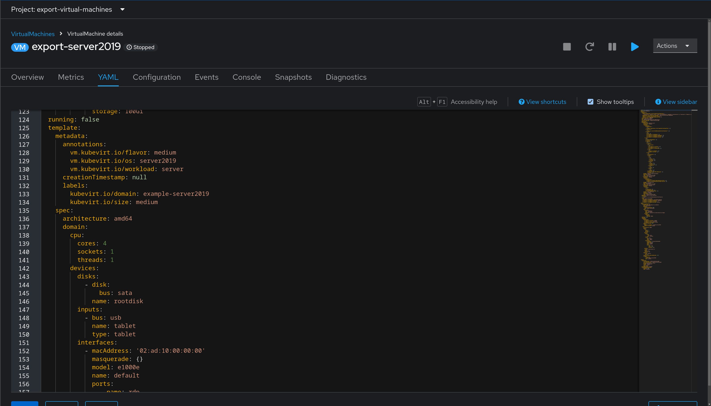

# Workshop Exercise 2.1 - Creating Definitions for Virtual Machines

## Table of Contents

* [Objective](#objective)
* [Guide](#guide)
   * [Your Lab Environment](#your-lab-environment)
   * [Completing the Exercises](#completing-the-exercises)

## Objective

* Understand how to create a virtual machine in OpenShift Virtualization using code

## Step 1 - Investigating Virtual Machines
As with everything else in OpenShift, virtual machines can be created and modified by using code instead of the web interface. This allows for managing them through a gitops flow, instead of manual modifications.

For example, this is a snippet of a virtual machine's definition:

In the screenshot, the virtual machine configuration is shown as code.

In your team namespace, an example virtual machine has been created. To view it in the web interface, navigate to Virtualization > VirtualMachines > example-windows-vm. Select the `YAML` tab to view the yaml definition of the virtual machine. This can be used as a base for building other virtul machine definitions.

## Step 2 - Creating Virtual Machine Definitions

#### Dedicated Services

| Service | Purpose |
| --- | --- |
| Ansible Controller | Automation controller for running Ansible automation |
| Process Control Application | Example application to be deployed to edge devices |
| RHSI (Skupper) | Service Interconnect (Skupper) deployment with router and console |

#### Shared Services

| Service | Purpose |
| --- | --- |
| Gitea Source Control | SCM with a webUI for code storage |
| Student Pages | Web pages containing information and links |
| OS-tree Repo | ostree repository containing files for provisioning devices |

There are additional services deployed for building images, device provisioning, etc, however these will not be interacted with directly in this workshop.

### Completing the Exercises

This entire workshop can be run from a web browser. SSH will be used for some exercies, however the terminal section of cockpit will give you a web-based way to interact with a shell. Accessing this is covered in a later section.

Optionally, feel free to use SSH and an IDE on your personal device.

> **Note**
>
> If you need more information on new Ansible Automation Platform components, bookmark this landing page [https://red.ht/AAP-20](https://red.ht/AAP-20)

---
**Navigation**

[Next Exercise](../1.2-student-pages/)

[Click here to return to the Workshop Homepage](../README.md)
