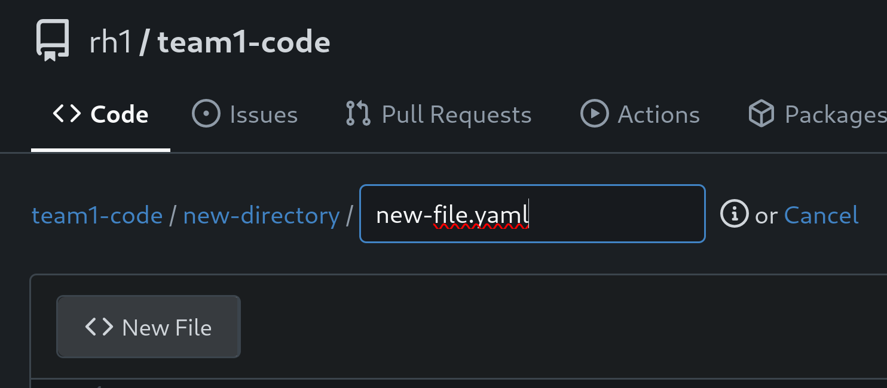
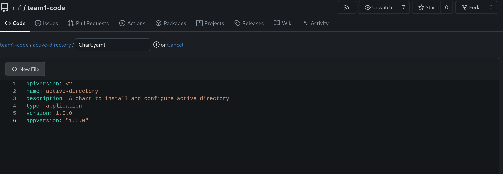

# Workshop Exercise 1.1 - Initializing Helm Chart

## Table of Contents

* [Objective](#objective)
* [Step 1 - Helm Chart Structure](#step-1---helm-chart-structure)
* [Step 2 - Creating Our Chart Structure](#step-2---creating-our-chart-structure)

## Objective

* Understand how to initialize a helm chart
* Push that initial chart to git

## Step 1 - Helm Chart Structure
Helm charts are simply a collection of files that represent definitions which create or modify resources on a kubernetes cluster. They can contain definitions for mostly anything, and usually, contain variables that are templated out when deploying the chart.

The basic structure of a chart is:
```
name-of-chart/
  Chart.yaml
  values.yaml
  templates/
```

To quote the helm website:
```
The templates/ directory is for template files. When Helm evaluates a chart, it will send all of the files in the templates/ directory through the template rendering engine. It then collects the results of those templates and sends them on to Kubernetes.

The values.yaml file is also important to templates. This file contains the default values for a chart. These values may be overridden by users during helm install or helm upgrade.

The Chart.yaml file contains a description of the chart. You can access it from within a template.
```

> Source: https://helm.sh/docs/chart_template_guide/getting_started/

## Step 2 - Creating Our Chart Structure
To get started, we'll create a directory and fill out Chart.yaml.

If you are comfortable with git and have a text editor available to you, feel free to clone your repo and use whatever tools you prefer.

Gitea has a web interface that can also be used for editing files, which will be shown here.

First, let's create a directory to house our chart, and fill out Chart.yaml. In the Gitea web interface, select "New File". To add a directory, simply type the desired name of the directory, then put in a forward slash: `/`.


Then, within that new directory, name the file `Chart.yaml` and enter the following information.

```
apiVersion: v2
name: active-directory
description: A chart to install and configure active directory
type: application
version: 1.0.0
appVersion: "1.0.0"
```


Esure you save the file, or push it to the repo if working within another editor.
---
**Navigation**

[Next Exercise](../1.2-adding-vm-templates/)

[Click here to return to the Workshop Homepage](../../README.md)
