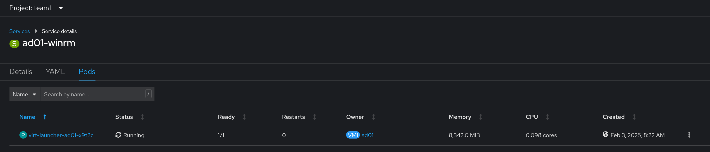
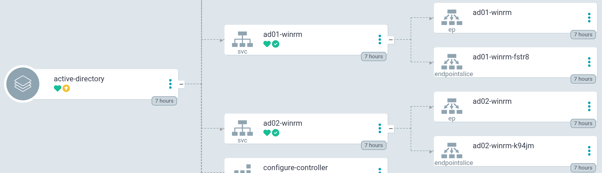
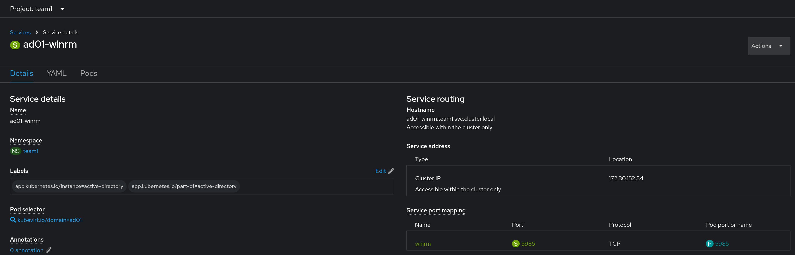
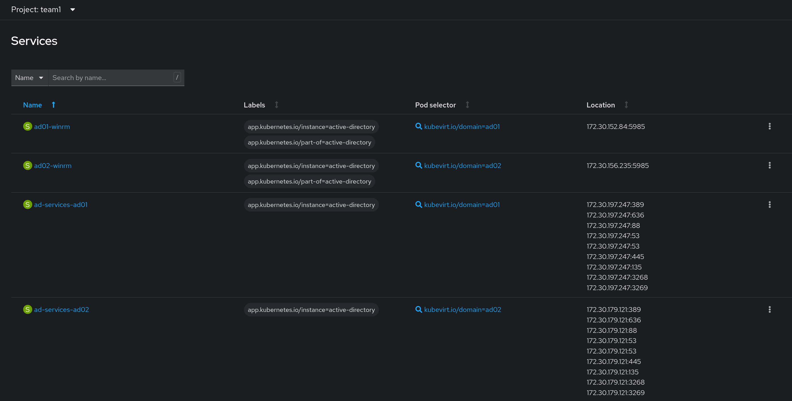
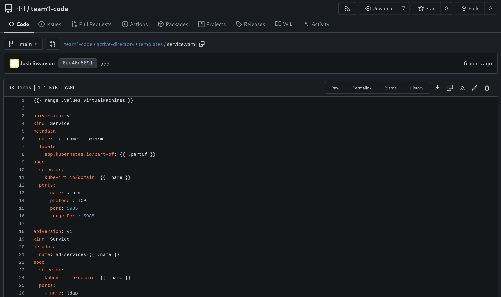

# Workshop Exercise 1.3 - Adding Services for Connectivity

## Table of Contents

* [Objective](#objective)
* [Step 1 - Adding Service Templates to the Chart](#step-1---adding-service-templates-to-the-chart)
* [Step 2 - Adding a Service for AD Services](#step-2---adding-a-service-for-ad-services)
* [Step 3 - Adding the Service Template to the Code Repo](#step-3---adding-the-service-template-to-the-code-repo)

## Objective

* Understand definitions for virtual machines
* Create a template that can be looped

## Step 1 - Adding Service Templates to the Chart
Since our virtual machines exist within the normal OpenShift SDN, we'll need a service to allow things to connect to it, such as Ansible.

We'll want to have the service provide connectivity to the [WinRM](https://en.wikipedia.org/wiki/Windows_Remote_Management) port on the Windows VMs, which is port 5985/tcp.

Within the `active-directory/templates` directory, add a new file named `service.yaml`, and add the following contents:
```yaml
{{- range .Values.virtualMachines }}
---
apiVersion: v1
kind: Service
metadata:
  name: {{ .name }}-winrm
  labels:
    app.kubernetes.io/part-of: {{ .partOf }}
spec:
  selector:
    kubevirt.io/domain: {{ .name }}
  ports:
    - name: winrm
      protocol: TCP
      port: 5985
      targetPort: 5985
{{- end }}
```

What's a bit different in this service is the selector - instead of looking for an app label, the name of the virtual machine is used. This will result in the service attaching to the virt-helper pod of the virtual machine.



In addition, the same looping function is used, so for each VM, a service will be created with the name `$(VM_NAME)-winrm`.



The fully-qualified hostname of the service will later be used by Ansible Controller to communicate to the virtual machine.



## Step 2 - Adding a Service for AD Services
Since Active Directory services work over a network, we'll need to expose them as well for operations such as domain joins, LDAP, and more.

Return to the `service.yaml` file created earlier, as we're going to add a second resource to it. Within the `{{- range }}` loop, after the existing service, add the following:
```yaml
---
apiVersion: v1
kind: Service
metadata:
  name: ad-services-{{ .name }}
spec:
  selector:
    kubevirt.io/domain: {{ .name }}
  ports:
    - name: ldap
      port: 389
      targetPort: 389
      protocol: TCP
    - name: ldaps
      port: 636
      targetPort: 636
      protocol: TCP
    - name: kerberos
      port: 88
      targetPort: 88
      protocol: TCP
    - name: dns
      port: 53
      targetPort: 53
      protocol: TCP
    - name: dns-udp
      port: 53
      targetPort: 53
      protocol: UDP
    - name: smb
      port: 445
      targetPort: 445
      protocol: TCP
    - name: rpc
      port: 135
      targetPort: 135
      protocol: TCP
    - name: gc
      port: 3268
      targetPort: 3268
      protocol: TCP
    - name: gc-ssl
      port: 3269
      targetPort: 3269
      protocol: TCP
```

Your modified `service.yaml` file should now contain:
```yaml
{{- range .Values.virtualMachines }}
---
apiVersion: v1
kind: Service
metadata:
  name: {{ .name }}-winrm
  labels:
    app.kubernetes.io/part-of: {{ .partOf }}
spec:
  selector:
    kubevirt.io/domain: {{ .name }}
  ports:
    - name: winrm
      protocol: TCP
      port: 5985
      targetPort: 5985

---
apiVersion: v1
kind: Service
metadata:
  name: ad-services-{{ .name }}
spec:
  selector:
    kubevirt.io/domain: {{ .name }}
  ports:
    - name: ldap
      port: 389
      targetPort: 389
      protocol: TCP
    - name: ldaps
      port: 636
      targetPort: 636
      protocol: TCP
    - name: kerberos
      port: 88
      targetPort: 88
      protocol: TCP
    - name: dns
      port: 53
      targetPort: 53
      protocol: TCP
    - name: dns-udp
      port: 53
      targetPort: 53
      protocol: UDP
    - name: smb
      port: 445
      targetPort: 445
      protocol: TCP
    - name: rpc
      port: 135
      targetPort: 135
      protocol: TCP
    - name: gc
      port: 3268
      targetPort: 3268
      protocol: TCP
    - name: gc-ssl
      port: 3269
      targetPort: 3269
      protocol: TCP
{{- end }}
```

Same as above, a service will be created for every virtual machine in our list:


## Step 3 - Adding the Service Template to the Code Repo
With the template for the services completed, be sure to commit and push the new code if using an IDE, or hit save if using the Gitea web interface.



---
**Navigation**

[Pervious Exercise](../1.2-adding-vm-templates/) | [Next Exercise](../1.4-adding-chart-to-argocd/)

[Click here to return to the Workshop Homepage](../../README.md)
