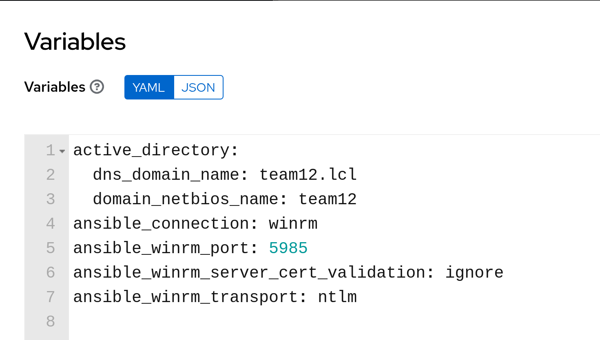

# Workshop Exercise 2.1 - Active Directory Automation Part 1

## Table of Contents

* [Objective](#objective)
* [Step 1 - Wait for Connectivity](#step-1---wait-for-connectivity)
* [Step 2 - Setting the System Hostnames](#step-2---setting-the-system-hostnames)
* [Step 3 - Creating the AD Forest](#step-3---creating-the-ad-forest)

## Objective

* Create automation to setup an AD environment
* Store code in repository

## Step 1 - Wait for Connectivity
The following exercises are going to involve creating playbooks that will configure our new Windows systems, and install Active Directory. Later on, we'll tie them all together using a workflow.

To start, we'll create a playbook that waits for the VMs to be available. Create a new directory in your code repository called `playbooks`, and add a new file called `wait-for-connectivity.yaml` with the following contents:

```yaml
---
- name: Wait for systems to be available
  hosts:
    - all
  gather_facts: false
  tasks:
    - name: Wait for connectivity
      ansible.builtin.wait_for_connection:
        timeout: 600
```

This will ensure the VMs can be contacted before attempting the next steps.

## Step 2 - Setting the System Hostnames
Create a new file in the `playbooks/` directory called `set-base-configs.yaml`, and add the following contents:

```yaml
---
- name: Set some basic system configs
  hosts:
    - all
  tasks:
    - name: Set the system hostname
      ansible.windows.win_hostname:
        name: "{{ inventory_hostname }}"
      notify:
        - reboot

  handlers:
    - name: Reboot system
      ansible.windows.win_reboot:
      listen:
        - reboot
```

This will set the hostname of the systems, and since they're Windows, they'll reboot if a change is made.

## Step 3 - Creating the AD Forest
Create another file in the `playbooks/` directory named `create-ad-forest.yaml`, and add the following contents:

```yaml
---
- name: Create Active Directory forest
  hosts:
    - all
  tasks:
    - name: Create AD forest/domain
      microsoft.ad.domain:
        dns_domain_name: "{{ active_directory.dns_domain_name }}"
        safe_mode_password: "{{ ansible_password }}"
        domain_netbios_name: "{{ active_directory.domain_netbios_name | default(omit) }}"
        reboot: true
```

A few quick notes about this playbook:
- This playbook should only be run against the first domain controller in a forest, however we're not setting a limit on it here, we'll set it in the job template in Controller - this is a best practice, as we don't want to limit the portability of our automation, instead, we want to use Controller for that.
- Some variables are used here, these have been pre-set for you within Controller. To review them, select your team's `Active Directory Infrastructure` inventory and review the `Variables` field.


With these playbooks, we'll have created and configured an Active Directory forest on a single system. In the next exercise, we'll add our secondary domain controller.

---
**Navigation**

[Previous Exercise](../1.4-adding-chart-to-argocd/) | [Next Exercise](../2.2-ad-automation-part-2/)

[Click here to return to the Workshop Homepage](../../README.md)
