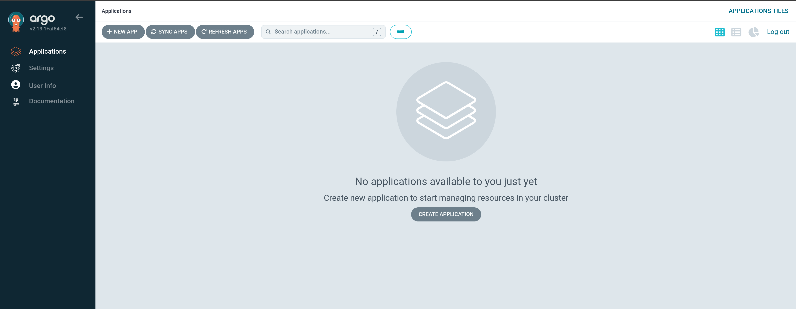
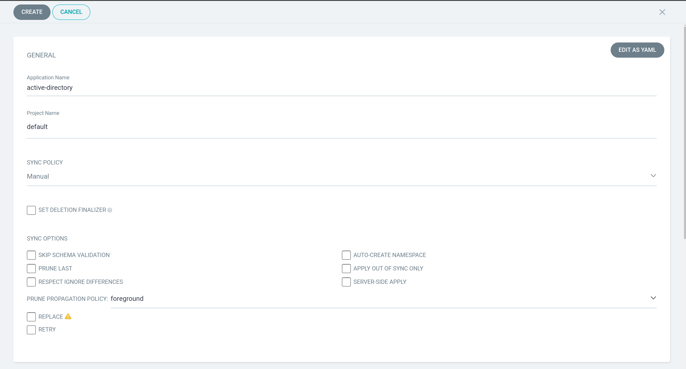
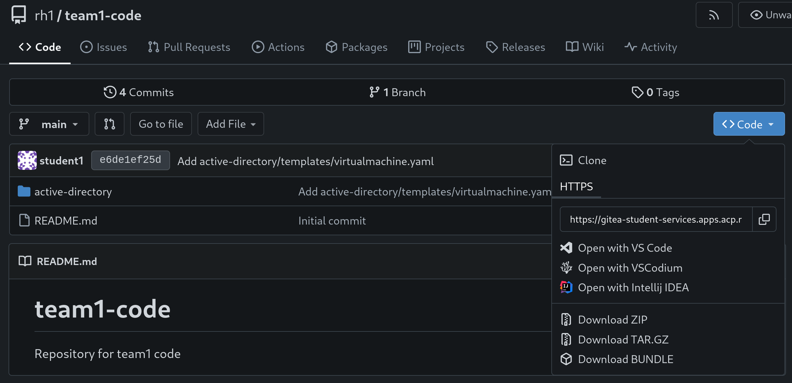
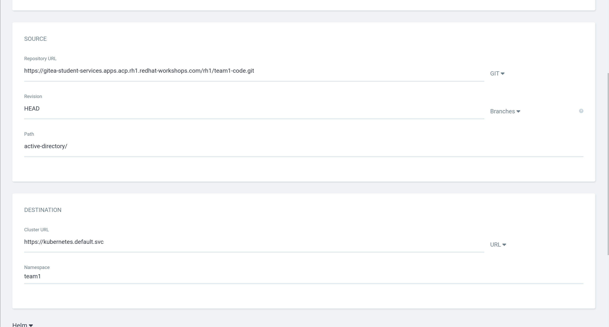
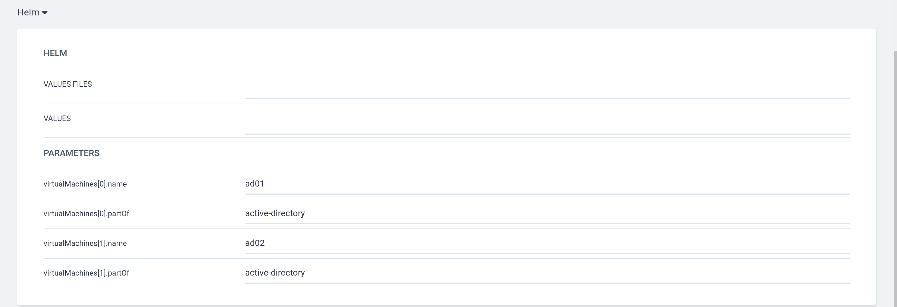
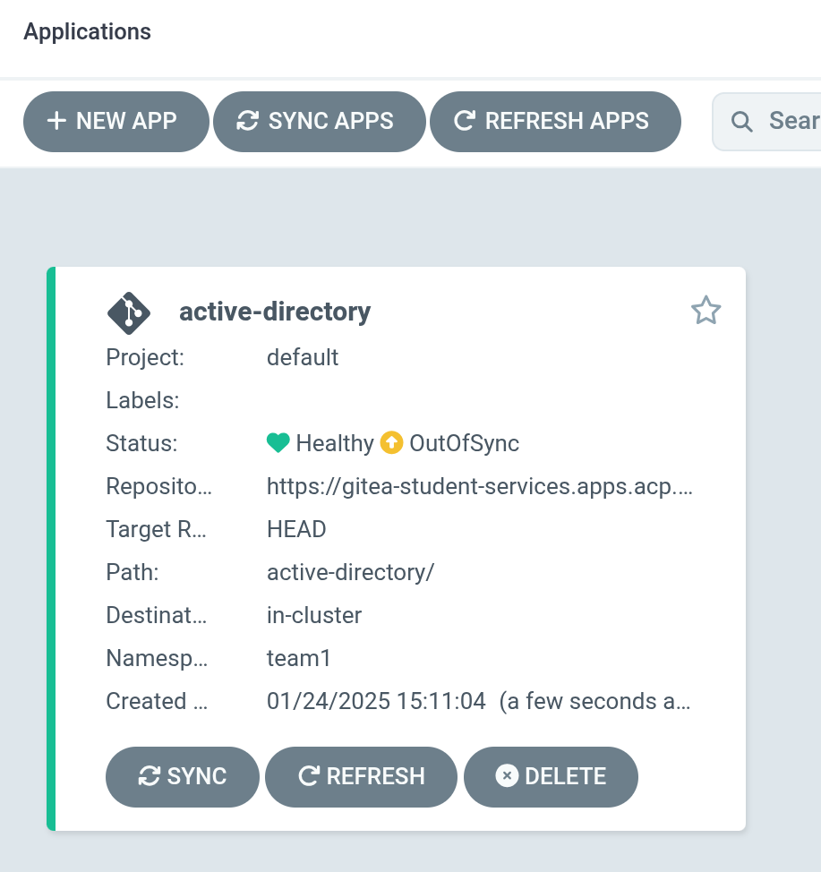
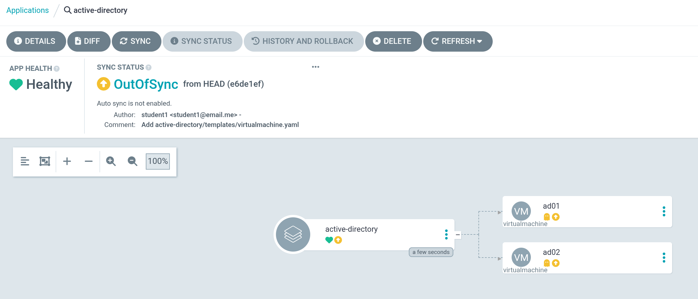

# Workshop Exercise 2.1 - Creating an Application in ArgoCD

## Table of Contents

* [Objective](#objective)
* [Guide](#guide)
   * [Your Lab Environment](#your-lab-environment)
   * [Completing the Exercises](#completing-the-exercises)

## Objective

* Understand definitions for virtual machines
* Create a template that can be looped

## Step 1 - Understanding the Relationship between Helm Charts and ArgoCD
In the previous exercises, we create helm charts that can be used to create resources on kubernetes clusters. 

To level up the experince, we're going to use ArgoCD to deliver that code to our cluster, and have it reconcile resources for us.

Essentially, helm charts define **what** we want to deploy, and ArgoCD is **how** we deploy it. The two working together create a powerful flow for managing resources on clusters.

## Step 2 - Adding an Application to ArgoCD
Refer back to your student page to retrieve the link to access your team's instance of ArgoCD, which will be used to deploy things into your namespace.

Once logged in, you'll probably be greeted with an empty window.


Click on the `+ New App` button to start adding a new application to be deployed.

## Step 3 - Adding New Application Information
In the window pane that appears on the right, we'll need to enter some information about our application, and where to find the code for it.

Start by giving the application a name, such as `active-directory`, and setting the project name to `default` - this is just the namespace where the project definition will live, not where our resources will be deployed.


Scrolling down, add information about the code repository. The URL can be retrieved from the Gitea interface if needed:


Enter this information into the appropriate place under the `Source` header:


Under destination, ensure the cluster IRL is set to the local cluster: `https://kubernetes.devault.svc`, and that the Namespace is set to your team's namespace. In this example, team1's namespace is used.

ArgoCD should pull in some information about the repo, automatically displaying `helm` and the values we put into our `values.yaml` file:


Once finished, hit the `Create` button at the top of the window.

## Step 4 - OPTIONAL - Adding New Application via YAML
The above process can also be done as code, if you like, using the following format:
```yaml
# Note: Team 1 is used as an example here - replace with your team information
apiVersion: argoproj.io/v1alpha1
kind: Application
metadata:
  name: active-directory
spec:
  destination:
    name: ''
    namespace: team1
    server: https://kubernetes.default.svc
  source:
    path: active-directory
    repoURL: >-
      https://gitea-student-services.apps.acp.rh1.redhat-workshops.com/rh1/team1-code.git
    targetRevision: HEAD
  sources: []
  project: default
```

This should appear as so in the web interface:


Once finished, click the `Create` button.

## Step 5 - Investigate New Application
After hitting the create button, a new application tile should appear, with details about the new application:


Clicking on the application tile will show more information, such as the resources that are to be deployed and managed:


As discussed previously, our helm templates have been rendered, showing our two virtual machines as resources. ArgoCD is denoting these resources as "missing" because the application has not yet been synced.

## Step 6 - Syncing Application

---
**Navigation**

[Next Exercise](../1.2-student-pages/)

[Click here to return to the Workshop Homepage](../README.md)
