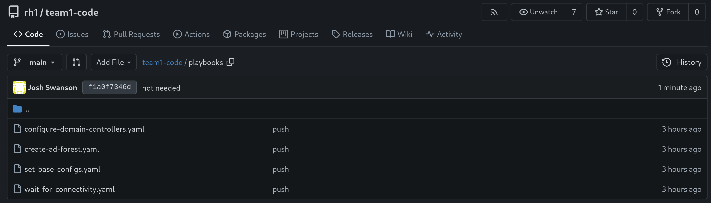

# Workshop Exercise 2.2 - Active Directory Automation Part 2

## Table of Contents

* [Objective](#objective)
* [Step 1 - Ensure Domain Controller Services are Running](#step-1---ensure-domain-controller-services-are-running)
* [Step 2 - Commit and Push Code](#step-2---commit-and-push-code)

## Objective

* Create automation to 
* Store code in repository

## Step 1 - Ensure Domain Controller Services are Running
As a final step to getting our Active Directory environment up and running, we're going to add one last playbook that ensures a few additional services are up and running.

Create a file in the `playbooks` directory named `configure-domain-controllers.yaml`, and paste in the following contents:
```yaml
---
- name: Apply base config to all domain controllers
  hosts:
    - all
  tasks:
    - name: Ensure SSDP/UPnP are started
      ansible.windows.win_service:
        name: "{{ item }}"
        state: started
        start_mode: auto
      loop:
        - SSDPSRV
        - upnphost
```

## Step 2 - Commit and Push Code
If you've been using the web interface to create files, then your new code already ready to start consuming. If you're using an IDE, be sure to commit and push your code, so it can be pulled by Controller later on.



---
**Navigation**

[Previous Exercise](../2.1-ad-automation-part-1/) | [Next Exercise](../3.1-contorller-as-code/)

[Click here to return to the Workshop Homepage](../../README.md)
