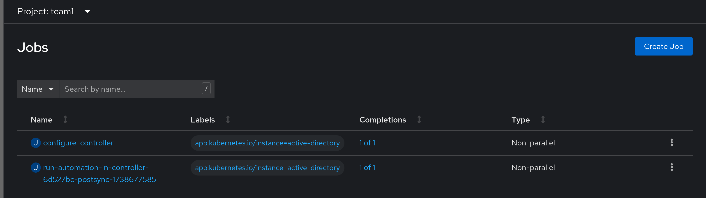
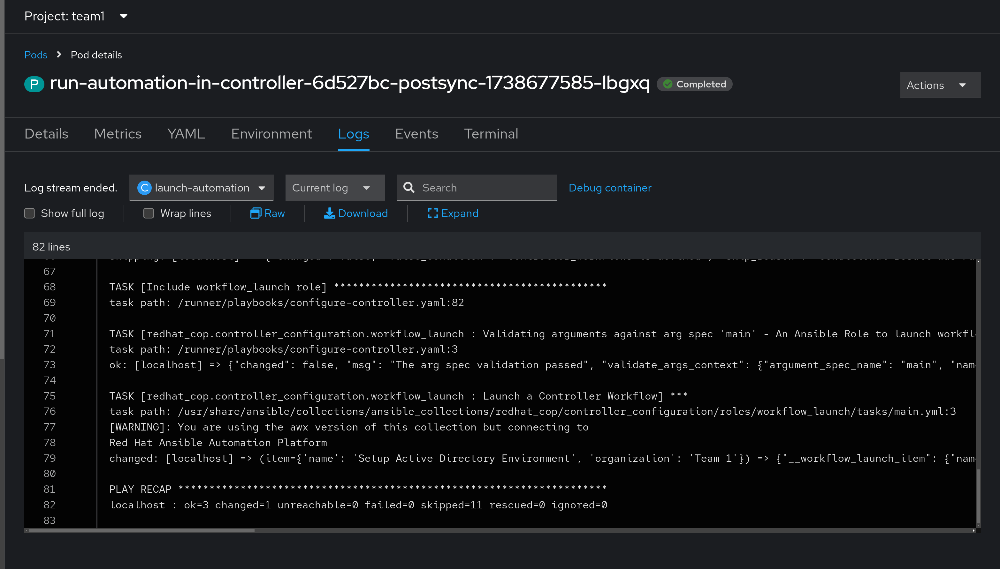
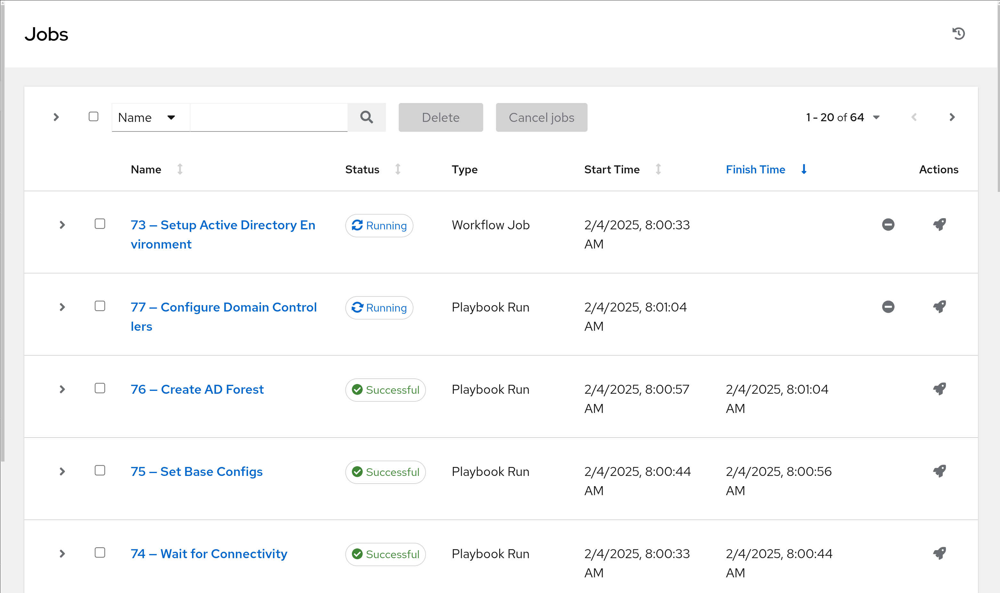
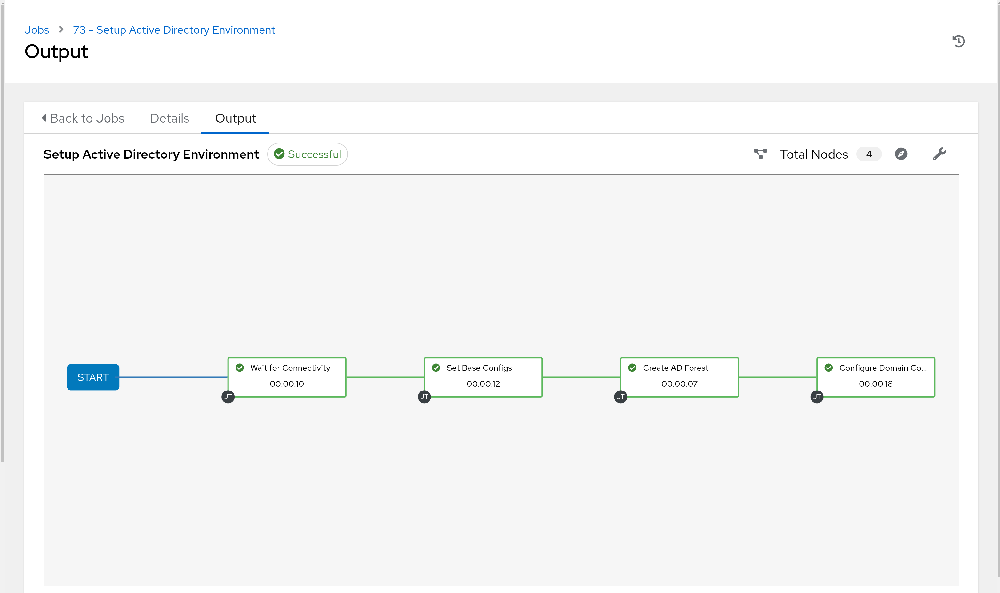
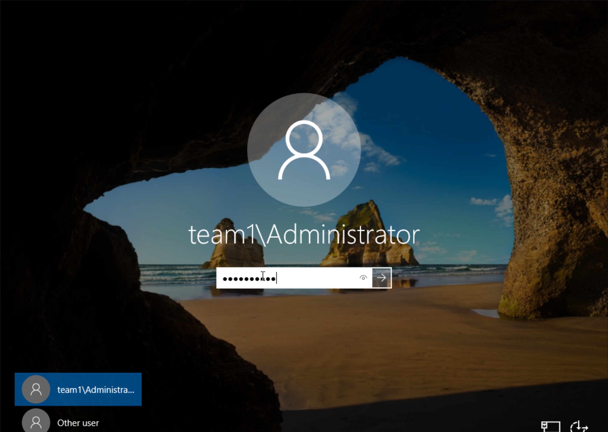
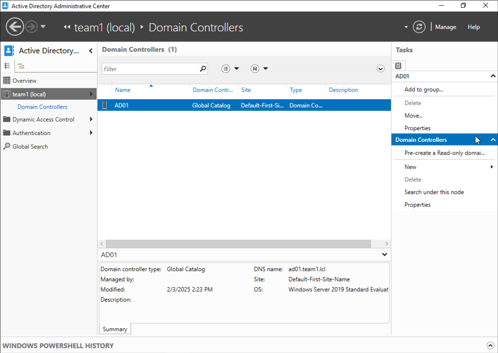

# Workshop Exercise 4.2 - Reviewing End-to-End Deployment

## Table of Contents

* [Objective](#objective)
* [Step 1 - Confirming the PostSync Job Run](#step-1---confirming-the-postsync-job-run)
* [Step 2 - Investigating the Run Automation in Controller](#step-2---investigating-the-run-automation-in-controller)
* [Step 3 - Investigating Virtual Machine](#step-3---investigating-virtual-machine)

## Objective

* Confirm the kickoff of the workflow via postSync job
* Validate that Active Directory was installed

## Step 1 - Confirming the PostSync Job Run
In addition to the `configure-controller` job, we also added a job that happens after all resources are synced. This job will kickoff the workflow we specified in the Controller configuration configMap.

In the OpenShift web console, navigate to **Workloads** > **Jobs**, where a job named `run-automation-in-controller-GENERATED-STRING` will now be present:

The output from the pod should look similar to the `configure-controller` job:

## Step 2 - Investigating the Run Automation in Controller
Back in Controller, under **Views** > **Jobs**, there should be some new jobs that have been launched, driven by the workflow launch:

## Step 3 - Investigating Virtual Machine
To confirm that AD was installed, return to the OpenShift web console, and navigate to **Virtualization** > **VirtualMachines**. visit the **Console** for our virtual machine named **ad01** and log in using domain credentials:

Within the console, wait for the **Server Manager** window to appear, then select **Tools** > **Active Directory Administrative Center**. Then, select **Domain Controllers**:

---
**Navigation**

[Previous Exercise](../4.1-resync-app/)

[Click here to return to the Workshop Homepage](../README.md)
