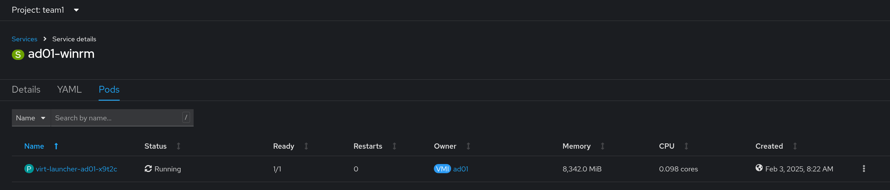

# Workshop Exercise 1.3 - Adding Services for Connectivity

## Table of Contents

* [Objective](#objective)
* [Step 1 - Adding Service Templates to the Chart](#step-1---adding-service-templates-to-the-chart)
* [Step 2 - Adding a Service for AD Services](#step-2---adding-a-service-for-ad-services)
* [Step 3 - Adding the Service Template to the Code Repo](#step-3---adding-the-service-template-to-the-code-repo)

## Objective

* Understand definitions for virtual machines
* Create a template that can be looped

## Step 1 - Adding Service Templates to the Chart
Since our virtual machines exist within the normal OpenShift SDN, we'll need a service to allow things to connect to it, such as Ansible.

We'll want to have the service provide connectivity to the [WinRM](https://en.wikipedia.org/wiki/Windows_Remote_Management) port on the Windows VMs, which is port 5985/tcp.

Within the `factorytalk/templates` directory, add a new file named `service.yaml`, and add the following contents:
```yaml

{{- range .Values.virtualMachines }}
---
apiVersion: v1
kind: Service
metadata:
  name: {{ .name }}-winrm
  labels:
    app.kubernetes.io/part-of: {{ .partOf }}
spec:
  selector:
    kubevirt.io/domain: {{ .name }}
  ports:
    - name: winrm
      protocol: TCP
      port: 5985
      targetPort: 5985
{{- end }}

```

What's a bit different in this service is the selector - instead of looking for an app label, the name of the virtual machine is used. This will result in the service attaching to the virt-helper pod of the virtual machine.



In addition, the same looping function is used, so for each VM, a service will be created with the name `$(VM_NAME)-winrm`.


The fully-qualified hostname of the service will later be used by Ansible Controller to communicate to the virtual machine.


## Step 2 - Adding a Service for FactoryTalk Services
Since the HMI requires services over the network, we'll need to expose them as well or operations such as OPC-UA, Codesys Container Runtimes, and more.

Modify your `service.yaml` file to include the following between the `range` function:
```yaml

---
{{- range $.Values.virtualMachines }}
apiVersion: v1
kind: Service
metadata:
  name: {{ .name }}-winrm
  labels:
    app.kubernetes.io/part-of: {{ .partOf }}
spec:
  selector:
    kubevirt.io/domain: {{ .name }}
  ports:
    - name: winrm
      protocol: TCP
      port: 5985
      targetPort: 5985
---
apiVersion: v1
kind: Service
metadata:
  name: ft-services-{{ .name }}
spec:
  selector:
    kubevirt.io/domain: {{ .name }}
  ports:
    - name: opcua
      port: 4840
      targetPort: 4840
      protocol: TCP
    - name: codesys
      port: 1217
      targetPort: 1217
      protocol: TCP
    - name: kerberos
      port: 88
      targetPort: 88
      protocol: TCP
    - name: dns
      port: 53
      targetPort: 53
      protocol: TCP
    - name: dns-udp
      port: 53
      targetPort: 53
      protocol: UDP
    - name: https
      port: 443
      targetPort: 443
      protocol: TCP
    - name: ssh1
      port: 11740
      targetPort: 11740
      protocol: TCP
    - name: rockwell
      port: 44818
      targetPort: 44818
      protocol: TCP
{{- end }}

```

Same as above we need to create services for the CentOS VM.

```yaml

---
{{- range $.Values.virtualMachinesCentOS }}
apiVersion: v1
kind: Service
metadata:
  name: codesys-services-{{ .name }}
spec:
  selector:
    kubevirt.io/domain: {{ .name }}
  ports:
    - name: opcua
      port: 4840
      targetPort: 4840
      protocol: TCP
    - name: codesys
      port: 1217
      targetPort: 1217
      protocol: TCP
    - name: ssh
      port: 22
      targetPort: 22
      protocol: TCP
{{- end }}

```

Same as above, a service will be created for every virtual machine in our list:


## Step 3 - Adding the Service Template to the Code Repo
With the template for the services completed, be sure to commit and push the new code if using an IDE, or hit save if using the Gitea web interface.


---
**Navigation**

[Pervious Exercise](../1.2-adding-vm-templates/) | [Next Exercise](../1.4-adding-chart-to-argocd/)

[Click here to return to the Workshop Homepage](../../README.md)
