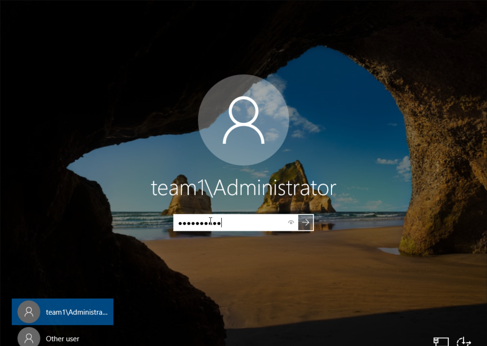

# Workshop Exercise 4.2 - Reviewing End-to-End Deployment

## Table of Contents

* [Objective](#objective)
* [Step 1 - Confirming the PostSync Job Run](#step-1---confirming-the-postsync-job-run)
* [Step 2 - Investigating the Run Automation in Controller](#step-2---investigating-the-run-automation-in-controller)
* [Step 3 - Investigating Virtual Machine](#step-3---investigating-virtual-machine)

## Objective

* Confirm the kickoff of the workflow via postSync job
* Validate that Codesys was installed

## Step 1 - Confirming the PostSync Job Run
In addition to the `configure-controller` job, we also added a job that happens after all resources are synced. This job will kickoff the workflow we specified in the Controller configuration configMap.

In the OpenShift web console, navigate to **Workloads** > **Jobs**, where a job named `run-automation-in-controller-GENERATED-STRING` will now be present:

The output from the pod should look similar to the `configure-controller` job:

## Step 2 - Investigating the Run Automation in Controller
Back in Controller, under **Views** > **Jobs**, there should be some new jobs that have been launched, driven by the workflow launch:

## Step 3 - Investigating Virtual Machine
To confirm that Codesys was install, visit the **Console** for our virtual machine named **cs01** and log in using domain credentials:

You should be able to click around and see multiple applications launched. Start with the Codesys IDE file, picture with a trend, and push the "Start" button, or push the "Stop" botton. If the pictures are "X"d out it's not communicating with the the Controller (Codesys Group). They may not be ready, or maybe there are other issues. 

Next check out the UA Expert application, there you will be able to see how it's communictating with the PLC. 

Finally check out the Codesys IDE deployment. This is the actual program that was created to run the PLC. 

---
**Navigation**

[Previous Exercise](../4.1-resync-app/)

[Click here to return to the Workshop Homepage](../README.md)
