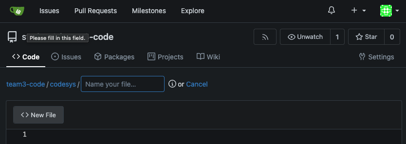
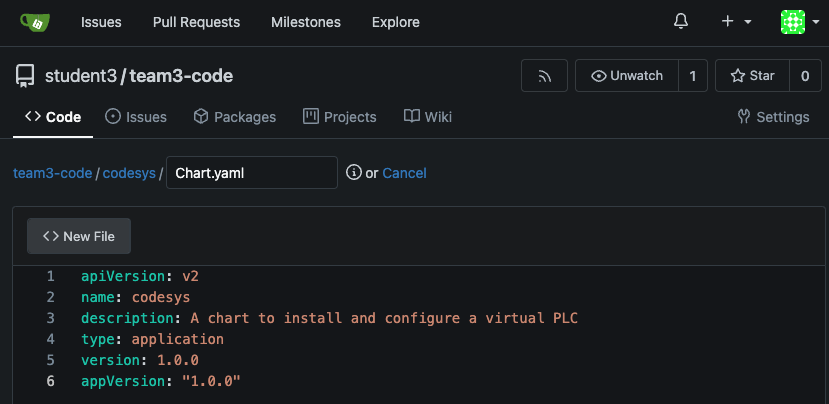

# Workshop Exercise 1.1 - Creating Definitions for Deployments

## Table of Contents

* [Objective](#objective)
* [Step 1 - Helm Chart Structure](#step-1---helm-chart-structure)
* [Step 2 - Creating Our Chart Structure](#step-2---creating-our-chart-structure)

## Objective

* Understand how to initialize a helm chart
* Push that initial chart to git


## Step 1 - Helm Chart Structure
Helm charts are simply a collection of files that represent definitions of resources to create or modify on a kubernetes cluster. They can contain definitions for mostly anything, and usually, contain variables that are templated out when deploying the chart.

The basic structure of a chart is:
```
name-of-chart/
  Chart.yaml
  values.yaml
  templates/
```

To quote the helm website:
```
The templates/ directory is for template files. When Helm evaluates a chart, it will send all of the files in the templates/ directory through the template rendering engine. It then collects the results of those templates and sends them on to Kubernetes.

The values.yaml file is also important to templates. This file contains the default values for a chart. These values may be overridden by users during helm install or helm upgrade.

The Chart.yaml file contains a description of the chart. You can access it from within a template.
```

> Source: https://helm.sh/docs/chart_template_guide/getting_started/


## Step 2 - Creating Our Chart Structure
To get started, we'll create a directory and fill out Chart.yaml.

If you are comfortable with git and have a text editor available to you, feel free to clone your repo and use whatever tools you prefer.

Gitea has a web interface that can also be used for editing files, which will be shown here.

To find the gitea url, refer to your student details page.
Head there and sign in if you have not yet done so.

First, let's create a directory to house our chart, and fill out Chart.yaml. In the Gitea web interface, select "New File". To add a directory, simply type the desired name of the directory, then put in a forward slash: `/`.
For this workstream, add the `codesys/` path before creating your `Chart.yaml` file

For this part of the excersise, create the codesys directory.


Then, within that new directory, name the file `Chart.yaml` and enter the following information.
*Note that the Chart.yaml name is case sensitive as per [Helm convension](https://helm.sh/docs/chart_best_practices/conventions/).

```yaml
apiVersion: v2
name: codesys
description: A chart to install and configure a virtual PLC
type: application
version: 1.0.0
appVersion: "1.0.0"
```


Esure you save the file in the UI, or save and push it to the repo if working within another editor.

In this same folder, let's create the values.yaml file as well with some defaults to get started:

```yaml
---
plcs:
  - name: codesys-plc-1
    partOf: codesys
  - name: another-plc
    partOf: codesys

```
Adding this template will allow us to deploy multiple instances of the PLC base image, and we'll look into defining what actual applications would go into them at a later point.

Since we'll be creating two PLC's that are nearly identical, we can create one template, and use the `range` function with helm to have it template out our PLCs

All values live under the `.Values` key, so the path to our list of plcs is: `.Values.plcs`. Since we have a list, we can use the `range` function to iterate over the items within the list, and helm will render out the template accordingly.

A quick note: when using certain functions within helm, the **scope** of variables can change. Within the range function, we "enter" the specific item, and can then reference the contents using a short notation.

We can think of this like a `for` loop, iterating over the items in the list.

Here's some psudocode with some notes:
```
# Loop over every item in the list
for item in plcs; do
  # Since we're now "in" the first item, our values move from .Values.plcs[0].name to just .name
  echo .name
  # Same idea, from .Values.plcs[0].partOf to just .partOf
  echo .partOf
done
```

---
**Navigation**

[Next Exercise](../1.2-adding-deployment-template/)

[Click here to return to the Workshop Homepage](../../README.md)

