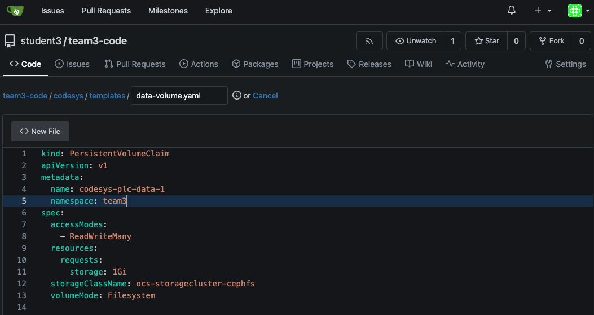

# Workshop Exercise 1.2 - Adding Deployment Templates

## Table of Contents

* [Objective](#objective)
* [Step 1 - Create the templates folder](#step-1---create-the-templates-folder)
* [Step 2 - Create a Storage Clain](#step-2---create-a-storage-claim)
* [Step 3 - Add the deployment](#step-3---add-the-deployment)

## Objective

* Understand definitions for deployments
* Create a template for deploying a pod

Now that we have a chart, we probably want to put something in it.
Let's start by uploading the basic deployment for our PLC service.

## Step 1 - Create the templates folder
Navigate to the codesys folder in your repo, either using the web UI for gitea or your local check-out directory, and create a "templates" folder alongside the Chart.yaml file, if not already done.
This folder will contain all the yaml manifest files that will be deployed as part of the HELM chart for our vPLC application.
If using the UI, you can just add '/templates/' before the next yaml file.gitea


## Step 2 - Create a Storage Claim
In order to persist state as well as internal Application details, the PLC deployment is going to need an object called a persistentVolumeClaim. 
This maps directly to a folder within the PLC pod and allows a new container firing up, whether it's a new container or a restart of one that crashed, to access the same data.

Kubernetes allows us to move these pods between different hosts and storage mechanisms, like Openshift Data Foundation used in this environment, allows access to the data on the host where our vPLC pod will be fired up. 
This is especially useful when redundancy is needed in the case of a node failure.

Since we will be using our gitea repo to contain all configurations and manifests that will be needed by our application, let's start off by creating the manifest for our data storage claim.

Let's head to the templates folder and add a definition for our data storage.


 Notice thatt rather than creating the persistentVolumes directly, we will let Openshift Data Foundations create the persistent volume for us by using the "ocs-storagecluster-cephfs" storage class.

Underneath this will provide us with a filesystem that can be mounted within our container. More details on Openshift storage mechanisms can be found in our [documentation](https://docs.openshift.com/container-platform/4.17/storage/understanding-persistent-storage.html)


```yaml
# Note: Team 1 is used as an example here - replace with your team information for the namespace
kind: PersistentVolumeClaim
apiVersion: v1
metadata:
  name: codesys-plc-data-1
  namespace: team1
spec:
  accessModes:
    - ReadWriteMany
  resources:
    requests:
      storage: 1Gi
  storageClassName: ocs-storagecluster-cephfs
  volumeMode: Filesystem
```

!Remember to commit and push this file to the gitea repo.


## Step 3 - Add the deployment 
For the Codesys application to run, we need somethig to actually do the processing (work). 
In order deploy a pod with the vPLC image, we will create an object in kubernetes called a [Deployment](https://kubernetes.io/docs/concepts/workloads/controllers/deployment/)

Some advantages of using a deployment vs just using a pod is that the deployment will try to ensure that we always have the specified number of instances of a pod running.
For this exercise, we will only need a single replica, but can investigate the effects of the pod going down and automatically being rescheduled.

Add the deployment.yaml file to your group git repository's templates folder:

```yaml
# Note: Team 1 is used as an example here - replace with your team information for the namespace
apiVersion: apps/v1
kind: Deployment
metadata:
  namespace: team1
  name: 'codesys-plc'
spec:
  selector:
    matchLabels:
      app: codesys-plc
  replicas: 1
  template:
    metadata:
      labels:
        app: codesys-plc
    spec:
      volumes:
        - name: data-storage
          persistentVolumeClaim: 
            claimName: codesys-plc-data-1
        - name: config
          configMap:
            name: codesys-user-settings
            items:
            - key: user-config
              path: "CODESYSControl_User.cfg"
      containers:
        - name: codesys-plc
          image: quay.io/rh-ee-hvanniek/codesyscontrol:4.14.0.0
          ports:
            - name: opc-ua
              containerPort: 4840
              protocol: TCP
          volumeMounts:
            - mountPath: "/conf/codesyscontrol/"
              name: config
            - mountPath: "/data/codesyscontrol"
              name: data-storage
```
!Remember to commit and push this file to the gitea repo.

With these templates created we are ready to let ArgoCD start doing its magic.

---
**Navigation**

[Next Exercise](../1.3-ading-chart-to-argocd/)

[Click here to return to the Workshop Homepage](../README.md)
