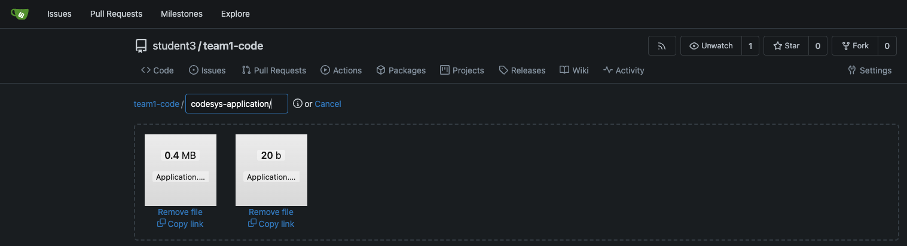

# Workshop Exercise 2.2 -  Deploying the PLC Application

## Table of Contents

* [Objective](#objective)


## Objective

* Understand the concept of InitContainers
* Update our HELM chart to download the PLC application


## Step 1 - Syncing Application
Let's start of by retrieving a pre-compiled application for the PLC.
We have generated one which can be downloaded from this [repo](https://github.com/redhat-manufacturing/device-edge-workshops/tree/3dc6955f38164aecb030e6ff256f07218127059b/exercises/acp_existing_nextgen/codesys/2.1-deploying-plc-application/application)
You can click on the file and select the "download raw file" option

Download both the app and crc files and upload to your team's gitea repo.
In practice, the commit to the repo should be the last step of the build process when publishing new application logic.

Let's create a location within your gitea. In this example a new repository was added specifically for the binaries.


Once uploaded, remember to commit changes.

We will need to update our templates in order to get these files into the PLC container.

Let's start by adding the new URLs to our values.yaml file. For simplicity's sake, we'll add the same one to both.
```yaml
---
plcs:
  - name: codesys-plc-1
    app-url: https://gitea-student-services.apps.acp.rh1.redhat-workshops.com/student3/team1-code/src/commit/8172ee9afe44ffdd59e3c0e61461e1dbd86c4c0c/Application.app
    app-crc: https://gitea-student-services.apps.acp.rh1.redhat-workshops.com/student3/team1-code/src/commit/8172ee9afe44ffdd59e3c0e61461e1dbd86c4c0c/Application.crc
  - name: another-plc
    app-url: https://gitea-student-services.apps.acp.rh1.redhat-workshops.com/student3/team1-code/src/commit/8172ee9afe44ffdd59e3c0e61461e1dbd86c4c0c/Application.app
    app-crc: https://gitea-student-services.apps.acp.rh1.redhat-workshops.com/student3/team1-code/src/commit/8172ee9afe44ffdd59e3c0e61461e1dbd86c4c0c/Application.crc

```


```yaml
...
initContainers:
  - name: init-myservice
    image: busybox:1.28
    command: ['sh', '-c', "until nslookup myservice.$(cat /var/run/secrets/kubernetes.io/serviceaccount/namespace).svc.cluster.local; do echo waiting for myservice; sleep 2; done"]
...
```


---
**Navigation**

[Next Exercise](../2.2-deploying-plc-application/)

[Click here to return to the Workshop Homepage](../../README.md)