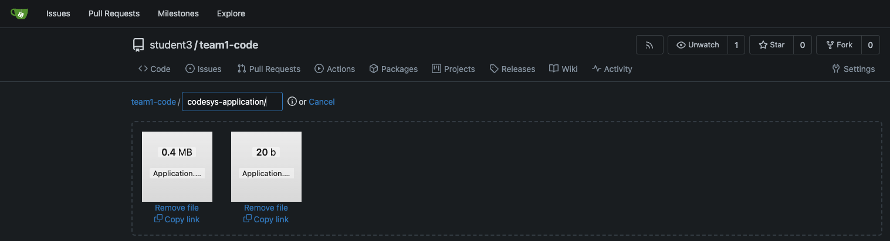
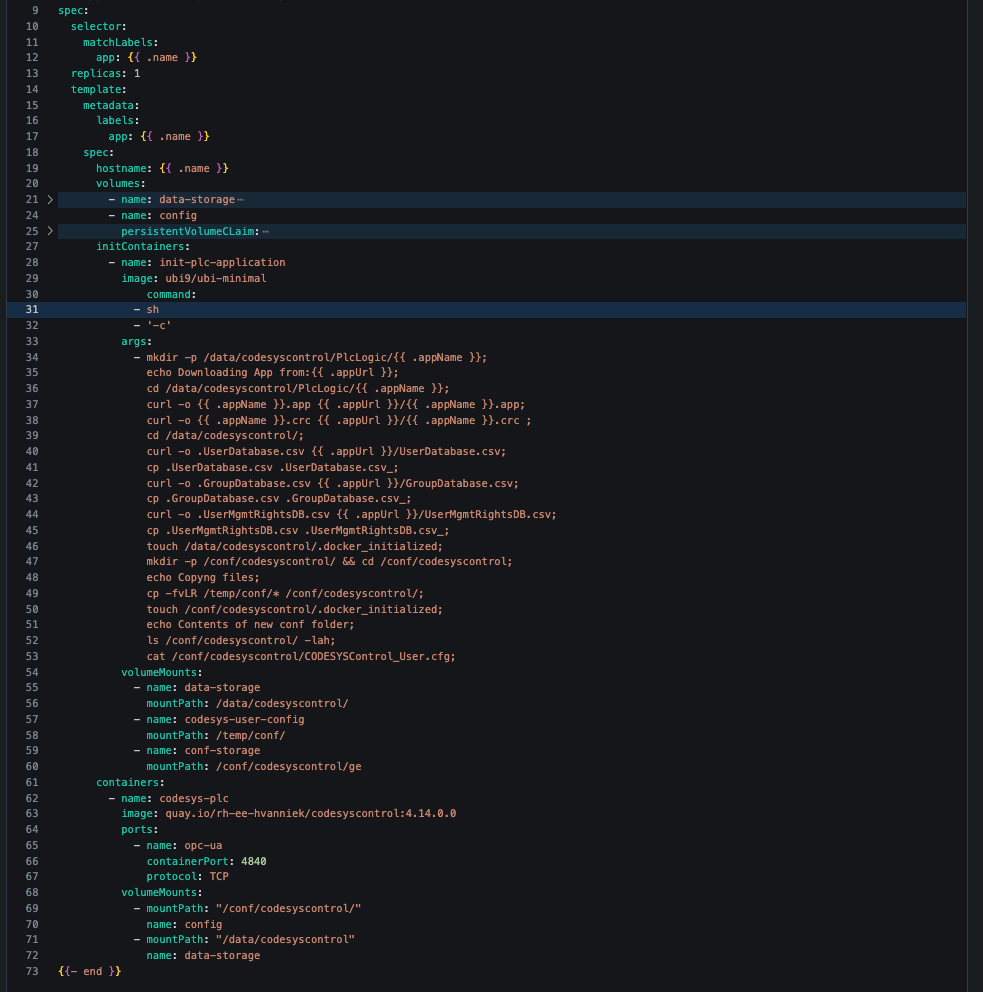

# Workshop Exercise 2.2 -  Deploying the PLC Application

## Table of Contents

* [Objective](#objective)
* [Step 1 - What are initContainers](#step-1---what-are-initcontainers)
* [Step 2 - Update the template](#step-2---update-the-template)


## Objective

* Understand the concept of InitContainers
* Update our HELM chart to download the PLC application


## Step 1 - What are initContainers
Getting additional binary data into a container can be somewhat daunting for those not used to the microservices method of working.

For this scenario, since our PLC controller is a generic image, this makes it handy to deploy multiple different applications and just template out the application parts.

For this exercise, let us use a kubernetes tool called initCOntainers.
These are special containers that can be used to do avariety of tasks before starting our main application container in the deployment.
For instance, in our case we want to copy the needed application file into the correct directory within our PLC's storage directory.
You could also use it to ping a dependent service or verify if prerequisits are available, or just delaying startup by some bit for whatever reason necessary.

For more information, feel free to check out [the docs](https://kubernetes.io/docs/concepts/workloads/pods/init-containers/)

## Step 2 - Update the template
Let's start of by retrieving a pre-compiled application for the PLC.
We have generated one which can be downloaded from this [repo](https://github.com/redhat-manufacturing/device-edge-workshops/tree/rh1-summit-acp-2025/exercises/acp_existing_nextgen/codesys/2.1-deploying-plc-application/application)
You can click on the file and select the "download raw file" option

Download both the app and crc files and upload to your team's gitea repo.
In practice, the commit to the repo should be the last step of the build process when publishing new application logic.

Let's create a location within your gitea. In this example a new repository was added specifically for the binaries.


Once uploaded, remember to commit changes.

We will need to update our templates in order to get these files into the PLC container.

Let's start by adding the new URLs to our values.yaml file. For simplicity's sake, we'll add the same one to both.
Edit the existing values.yaml and update it with the new entries.
```yaml

---
plcs:
  - name: codesys-plc-1
    appUrl: https://github.com/redhat-manufacturing/device-edge-workshops/blob/c31081a2c697d17e9891f1ff3f17ed9457d6b90c/exercises/acp_existing_nextgen/codesys/2.1-deploying-plc-application/application/
    partOf: codesys
    appName: Application
    serialNo: 00000000333a536a
  - name: another-plc
    appUrl: https://github.com/redhat-manufacturing/device-edge-workshops/blob/c31081a2c697d17e9891f1ff3f17ed9457d6b90c/exercises/acp_existing_nextgen/codesys/2.1-deploying-plc-application/application/
    partOf: codesys
    appName: Application
    serialNo: 00000000333a536b

```

With these values and the files available, we can continue to add them to our deployment template before hitting the sync button in argoCD
Edit the templates/deployment.yaml file and add the initContainer section, notice that this container runs a shell script that downloads and creates files in the correct locations within our persistent volumes.

```yaml

...
containers:
...
initContainers:
  - name: init-plc-application
    image: ubi9/ubi-minimal
    command:
      - sh
      - '-c'
    args:
      - mkdir -p /data/codesyscontrol/PlcLogic/{{ .appName }}; 
        echo Downloading App from:{{ .appUrl }}; 
        cd /data/codesyscontrol/PlcLogic/{{ .appName }};
        curl -o {{ .appName }}.app {{ .appUrl }}/{{ .appName }}.app; 
        curl -o {{ .appName }}.crc {{ .appUrl }}/{{ .appName }}.crc ;
        cd /data/codesyscontrol/;
        curl -o .UserDatabase.csv {{ .appUrl }}/UserDatabase.csv;
        curl -o .GroupDatabase.csv {{ .appUrl }}/GroupDatabase.csv;
        curl -o .UserMgmtRightsDB.csv {{ .appUrl }}/UserMgmtRightsDB.csv;
        touch /data/codesyscontrol/.docker_initialized;
    volumeMounts:
      - name: data-storage
        mountPath: /data/codesyscontrol/
...

```




!Remember to commit and push this file to the gitea repo.

Do not sync argoCD yet, as we will be creating the config file for each of our PLC containers in the next section.


---
**Navigation**

[Previous Exercise](../1.3-adding-chart-to-argocd/) | [Next Exercise](../2.2-creating-plc-config/)

[Click here to return to the Workshop Homepage](../../README.md)
