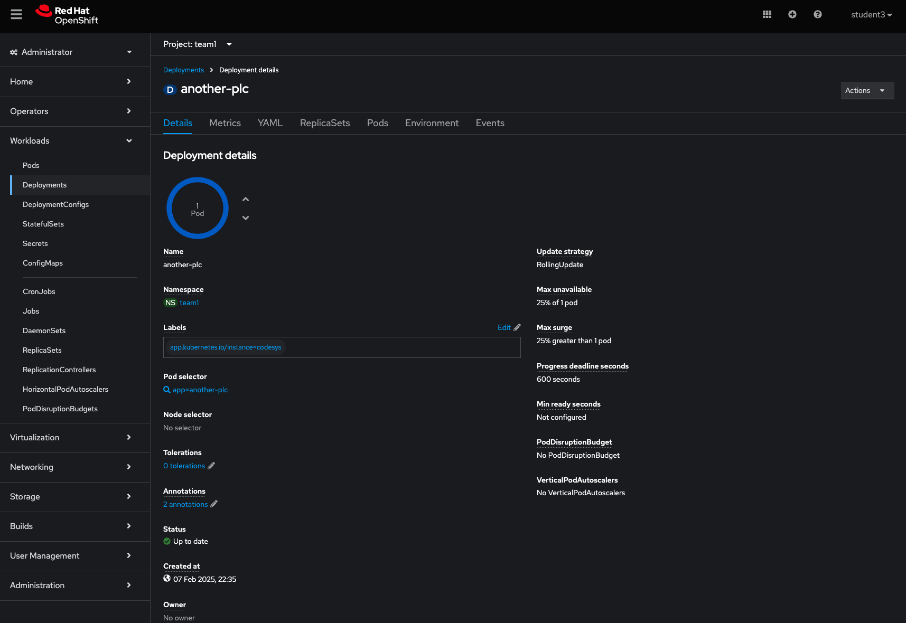

# Workshop Exercise 2.2 -  Creating configuration vPLCs

## Table of Contents

* [Objective](#objective)
* [Step 1 - Helm Chart Structure](#step-1---config-as-configmap)
* [Step 2 - Create the templates folder](#step-2---create-the-configmap)
* [Step 3 - Create the configmap](#step-3---create-the-configmap)

## Objective

* Understand the concept of ConfigMaps
* Update our HELM chart to include configuration for the PLC

## Step 1 - Config as ConfigMap
In Kubernetes having the ability to mount text-based configuration into a pod is a key method in firstly maintaining configuration and secondly having the ability to change configuration for several pods simultaneously.

For the Codesys PLC we deployed in [a previous step](../1.3-adding-deployment-template/), it has several config files located within the pod's "/conf/codesyscontrol/" directory.

Let's view that config by accessing the pod's terminal. Head over to the Openshift console, find the link in your student start page, and navigate to the Workloads->Deployments section. If you see an access denied error, remember to change the Project at the top to your team's namespace. 


Switch to the Pods tab and click on the name of the PLC deployment.


In order to get data into the pod, let's first create the configuration file in our gitea repo and allow ArgoCD to keep it in sync with out primary source of truth.

We will not be too concerned with the contents of this file for the scope of this exercise, so do not worry about changing values within the actual file for now, but it's worth noting that the single configmap does contain the content for several config files used within the application.
Configmaps are handy to keep all configuration in the same place, even though it's spread accross several files. As an alternative we could have created a separate configmap for each file as well, this all would be up to the application design team in the end.


## Step 2 - Create the configmap
Within the templates folder in your gitea repo, let us create a file named configmap.yaml
The contents for this file will look as follows:

```yaml

{{- range $.Values.plcs }}
---
apiVersion: v1
kind: ConfigMap
metadata:
  name: {{ .name }}-user-config
  labels:
    app.kubernetes.io/part-of: {{ .partOf }}
data: 
  user-config: |
      ;virtuallinux
      [CmpLog]
      Logger.0.Filter=0xFFFFFFFF
      Logger.0.MaxEntries=100000000
      Logger.0.MaxFileSize=1000000000
      CmpWebServer.Filter=0xFFFFFFFF
      CmpOPCUAClient.Filter=0xFFFFFFFF

      [ComponentManager]
      Component.1=CmpBACnet
      Component.2=CmpBACnet2
      Component.3=CmpPLCHandler
      Component.4=CmpGwClient
      Component.5=CmpXMLParser
      Component.6=CmpGwClientCommDrvTcp
      ;Component.7=CmpGwClientCommDrvShm ; enable only if necessary, can result in higher cpu load
      ;Component.8=SysPci				; enable when using Hilscher CIFX
      ;Component.9=CmpHilscherCIFX	; enable when using Hilscher CIFX

      [CmpApp]
      Bootproject.RetainMismatch.Init=1
      RetainType.Applications=InSRAM
      Application.1={{ .appName }}

      [CmpRedundancyConnectionIP]

      [CmpRedundancy]

      [CmpSrv]

      [IoDrvEtherCAT]

      [SysTarget]
      SerialNumber=RTS-{{ .serialNo }}

      [CmpSecureChannel]
      SECURITY.CommunicationMode=ONLY_PLAIN

      [CmpUserMgr]
      SECUTITY.UserMgmtEnforce=NO
      SECURITY.UserMgmtAllowAnonymous=YES
      AsymmetricAuthKey=3751f6eaf041e4beba40b63e8e35d90ad2c1125d

      [CmpSecureChannel]
  config: |
      ;virtuallinux
      [SysFile]
      FilePath.1=/etc/codesyscontrol/, 3S.dat
      PlcLogicPrefix=1
      
      [SysTarget]
      TargetVersionMask=0
      TargetVersionCompatibilityMask=0xFFFF0000
      
      [CmpSocketCanDrv]
      ScriptPath=/opt/codesys/scripts/
      ScriptName=rts_set_baud.sh
      
      [CmpSettings]
      IsWriteProtected=1
      FileReference.0=SysFileMap.cfg, SysFileMap
      FileReference.1=/conf/codesyscontrol/CODESYSControl_User.cfg
      
      [SysExcept]
      Linux.DisableFpuOverflowException=1
      Linux.DisableFpuUnderflowException=1
      Linux.DisableFpuInvalidOperationException=1
      
      [CmpLog]
      Logger.0.Name=codesyscontrol.log
      ;Logger.0.Filter=0x0000000F ; moved to CODESYSControl_User.cfg to allow changes by PLCShell command
      Logger.0.Enable=1
      Logger.0.MaxEntries=10000000
      Logger.0.MaxFileSize=100000000
      Logger.0.MaxFiles=1
      Logger.0.Backend.0.ClassId=0x0000010B   ;sends logger messages to SysOut
      Logger.0.Backend.1.ClassId=0x00000104   ;writes logger messages in a file
      
      [SysEthernet]
      Linux.ProtocolFilter=3
      
      [CmpSchedule]
      SchedulerInterval=4000
      ProcessorLoad.Enable=1
      ProcessorLoad.Maximum=95
      ProcessorLoad.Interval=5000
      DisableOmittedCycleWatchdog=1
      
      [CmpCodeMeter]
      EnableNetLicenses=1
      InstallCmActContainer=-1
      InstallLegacyCmActContainer=-1
   
  server-ini: |
      [Backup]
      Interval=24
      Path=/var/lib/CodeMeter/Backup
      UpdateCertifiedTime=0
      
      [General]
      ActionTimeIntervall=10
      ApiCommunicationMode=1
      BindAddress=0.0.0.0
      CleanUpTimeOut=120
      CmInstanceUid=0
      CmWANPort=22351
      EnabledContainerTypes=4294967295
      ExePath=/usr/sbin
      HelpFile=/usr/share/doc/CodeMeter
      IsCmWANServer=0
      IsNetworkServer=0
      LogCleanupTimeout=336
      LogCmActDiag=0
      LogLicenseTracking=0
      LogLicenseTrackingPath=/var/log/CodeMeter
      Logging=0
      LogPath=/var/log/CodeMeter
      MaxMessageLen=67108864
      NetworkAccessFsb=0
      NetworkPort=22350
      NetworkTimeout=40
      ProxyPort=0
      ProxyServer=
      ProxyUser=
      UseSystemProxy=1
      StartDaemon=1
      TimeServerTimeout=20
      TimeServerURL1=cmtime.codemeter.com
      TimeServerURL2=cmtime.codemeter.us
      TimeServerURL3=cmtime.codemeter.de
      UDPCachingTime=20
      UDPWaitingTime=1000
      DiagnoseLevel=2
      
      [BorrowClient]
      
      [BorrowServer]
      
      [BorrowManage]
      
      [CmAct\ErrorLogger]
      
      [CmAct\PSNs]
      
      [HTTP]
      DigestAuthentication=0
      RemoteRead=1
      
      [TripleModeRedundancy]
      TmrEnabled=0
      
      [ServerSearchList]
      UseBroadcast=1
{{- end }}

```

The secion under "user-config:" will be mounted within our codesys runtime pod as a file located at "/conf/codesyscontrol/CODESYSControl_User.cfg"

The key values in here are the SECURITY configurations for the OPC-UA server, as well as the Application.1 line, which specifies the PLC's boot application - the one that will be loaded on startup.

In our application's case, it's very creatively called "Application" and matches the name of the application we copied to the PLC's storage in the [previous step](../2.1-deploying-plc-application/)

Update the deployment.yaml to utilize the config in a similar way to how we have done the Application files.
The Codesys container requires readwrite access to the config directory, so we'll use the initContainer to copy the config over into the right directory, and have that mounted as persisted storage.
The configmap is mounted as a volume, and it's contents created as a read-only file within the initContainer, where it's then placed in a writable location for the application. The reason for that will become clear when connecting the development environment to our container in a later step.

```yaml

    initContainers:
      - name: init-plc-application
        image: 'ubi9/ubi-minimal'
          command:
            - sh
            - '-c'
          args:
            - mkdir -p /data/codesyscontrol/PlcLogic/{{ .appName }}; 
              echo Downloading App from:{{ .appUrl }}; 
              cd /data/codesyscontrol/PlcLogic/{{ .appName }};
              curl -o {{ .appName }}.app {{ .appUrl }}/{{ .appName }}.app; 
              curl -o {{ .appName }}.crc {{ .appUrl }}/{{ .appName }}.crc ;
              cd /data/codesyscontrol/;
              curl -o .UserDatabase.csv {{ .appUrl }}/UserDatabase.csv;
              cp .UserDatabase.csv .UserDatabase.csv_;
              curl -o .GroupDatabase.csv {{ .appUrl }}/GroupDatabase.csv;
              cp .GroupDatabase.csv .GroupDatabase.csv_;
              curl -o .UserMgmtRightsDB.csv {{ .appUrl }}/UserMgmtRightsDB.csv;
              cp .UserMgmtRightsDB.csv .UserMgmtRightsDB.csv_;       
              touch /data/codesyscontrol/.docker_initialized;
              mkdir -p /conf/codesyscontrol/ && cd /conf/codesyscontrol;
              echo Copyng files;
              cp -fvLR /temp/conf/* /conf/codesyscontrol/;       
              touch /conf/codesyscontrol/.docker_initialized;
              echo Contents of new conf folder;
              ls /conf/codesyscontrol/ -lah;
              cat /conf/codesyscontrol/CODESYSControl_User.cfg;
          volumeMounts:
            - name: data-storage
              mountPath: /data/codesyscontrol/
            - name: codesys-user-config
              mountPath: /temp/conf/
            - name: conf-storage
              mountPath: /conf/codesyscontrol/
...
      volumes:
      - name: data-storage
        persistentVolumeClaim: 
          claimName: {{ .name }}-data
      - name: conf-storage
        persistentVolumeClaim:
          claimName: {{ .name }}-config
      - name: codesys-user-config
        configMap:
          name: {{ .name }}-user-config
          items:
            - key: user-config
              path: CODESYSControl_User.cfg
            - key: config
              path: CODESYSControl.cfg
            - key: server-ini
              path: Server.ini


```

Esure you save and commit the file, or push it to the repo if working within another editor.


---
**Navigation**

[Previous Exercise](../2.1-deploying-plc-application/) | [Next Exercise](../3.1-accessing-data-from-plc/)

[Click here to return to the Workshop Homepage](../../README.md)

