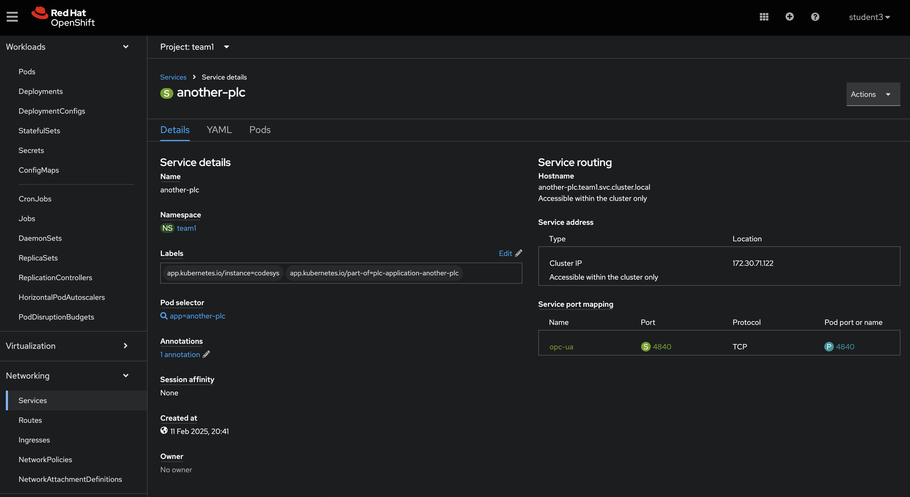

# Workshop Exercise 3.1 Accessing Data from the PLC

## Table of Contents

* [Objective](#objective)
* [Step 1 - Understanding the Relationship between Helm Charts and ArgoCD]


## Objective
* Understand the concept of services
* View data generated by the PLC

## Step 1 - Understand the concept of services
Within Openshift, and kubernetes in general, accessing a pod can be tricky in the sense that each time it gets scheduled it will obtain a new IP address.

Furthermore, you have to investigate each pod to see what ports have been opened.

Objects of type "Service" within kubernetes allow us to locate pods on the cluster and have a consistent access point for getting to an API, wether it be via a service name (similar to a DNS A-record) or a static address.
What's more, these services also lists the ports that are open on the route, similar to how a firewall would open ports in a traditional IT system.


## Step 2 - Add a service for OPC-UA traffic 
In this deployment, we are using a PLC that is generating data based on the [OPC-UA](https://opcfoundation.org/about/opc-technologies/opc-ua/) specification, which means that by default the data is output on port 4840/TCP.

In order to facilitate communication to our PLC pod, we will add a service to the gitea repo and allow ArgoCD to create it for us.

Create a new file in the team's gitea repository/templates folder and call it "service.yaml"

Add the following content:
```yaml

{{- range .Values.plcs }}
apiVersion: v1
kind: Service
metadata:
  name: {{ .name }}
  labels:
    app.kubernetes.io/part-of: {{ .partOf }}
spec:
  selector:
    app: {{ .name }}
  ports:
    - name: opc-ua
      protocol: TCP
      port: 4840
      targetPort: 4840

{{- end }}

```

Save and push the changes.
Head over to the argoCD application and hit sync to get the service deployed into our workspace.

## Step 3 - Investigate the service
We now have a static reference point which we can use for accessing our PLC, we can retrieve the path and IP address for accessing our data from the PLC pod.
One of the important aspects here is that a lot of industrial protocols require the IP address rather than a DNS resolvable name.

Investigate the service and make a note of the IP address listed on it.



---
**Navigation**

[Next Exercise](../3.2-uaexpert-vm/)

[Click here to return to the Workshop Homepage](../../README.md)