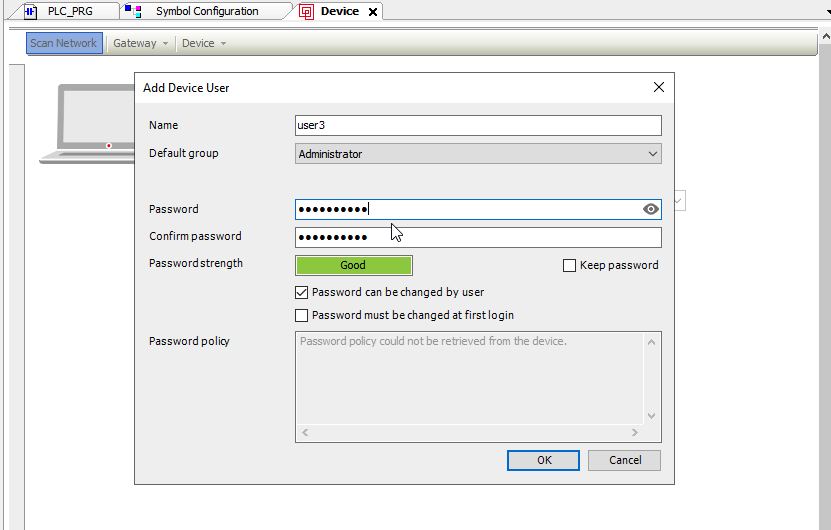

# Workshop Exercise 3.3 Connecting the Codesys IDE to vPLC

## Table of Contents

* [Objective](#objective)
* [Step 1 - Understand the Gateway connection](#step-1---understand-the-gateway-connection)
* [Step 2 - Create the gateway deployment](#step-2---prepare-for-the-gateway-deployment)
* [Step 3 - Create Gateway deployment](#step-3---create-gateway-deployment)
* [Step 4 - Connect the IDE to gateway](#step-4---connect-the-ide-to-gateway)


## Objective
* Understand the concept of services
* View data generated by the PLC

## Step 1 - Understand the Gateway connection
Some applications in the distributed world relay on gateways in order to aggregate connections, similar to what OpenShift does as a platform, providing a single pane of access for any application running on the platform, whether it be the traditional application moved to a vm, or the containerized applications.

Codesys uses a gateway application, running on a specific port ('1281' by default), in order to discover and allow IDE connections into their PLC's runing on the same subnet. 
For this stage we will be deploying a single gateway application that is able to interface with the multiple PLCs we have deployed in the previous step.

## Step 2 - Prepare for the gateway deployment
Firstly, let's provide a section to our values file that will allow us to customize the name and port.


```yaml
---
gateway:
  - name: codesys-gateway
    partOf: codesys
```

We should now have all of the components for our codesys deployment in the `values.yaml` file.


With the template values available, we can start creating the prerequisits for the gateway to run, like persistent storage.
in our `templates` folder, create a `gw-storage.yaml` file:

```yaml

{{- range $.Values.gateway }}
kind: PersistentVolumeClaim
apiVersion: v1
metadata:
  name: {{ .name }}-data
  labels:
    app.kubernetes.io/part-of: {{ .partOf }}
spec:
  accessModes:
    - ReadWriteOnce
  resources:
    requests:
      storage: 1Gi
  storageClassName: ocs-storagecluster-cephfs
  volumeMode: Filesystem
---
kind: PersistentVolumeClaim
apiVersion: v1
metadata:
  name: {{ .name }}-config
  labels:
    app.kubernetes.io/part-of: {{ .partOf }}
spec:
  accessModes:
    - ReadWriteOnce
  resources:
    requests:
      storage: 1Gi
  storageClassName: ocs-storagecluster-cephfs
  volumeMode: Filesystem
{{- end }}

```

## Step 3 - Create Gateway deployment

```yaml

{{- range $.Values.gateway }}
apiVersion: apps/v1
kind: Deployment
metadata:
  name: {{ .name }}
  labels:
    app.kubernetes.io/part-of: {{ .partOf }}
spec:
  selector:
    matchLabels:
      app: {{ .name }}
  replicas: 1
  template:
    metadata:
      labels:
        app: {{ .name }}
    spec:
      hostname: {{ .name }}
      volumes:
        - name: data-storage
          persistentVolumeClaim: 
            claimName: {{ .name }}-data
        - name: conf-storage
          persistentVolumeClaim:
            claimName: {{ .name }}-config
      containers:
        - name: codesys-gateway
          image: quay.io/rh-ee-hvanniek/codesysgw:4.14.0.0
          ports:
            - name: opc-ua
              containerPort: 1217
              protocol: TCP
          volumeMounts:
            - mountPath: "/conf/codesysedge/"
              name: conf-storage
            - mountPath: "/data/codesysedge/"
              name: data-storage
{{- end }}

```

## Step 4 - Connect the IDE to gateway
Before we can connect to the gateway we will again need to provide a service within OpenShift.
This service can be of type NodePort if you wish to expose the gateway to external developer environments that are on the same network as the cluster.
Since this lab is running on a cloud environment, we will stick with a ClusterIP that can be used by the virtual machine defined in [Workshop Exercise 3.2 - Adding Virtual Machine Templates](../3.2-create-uaexpert-vm/) within the cluster.


```yaml

{{- range $.Values.gateway }}
apiVersion: v1
kind: Service
metadata:
  name: {{ .name }}
  labels:
    app.kubernetes.io/part-of: {{ .partOf }}
spec:
  type: ClusterIP
  selector:
    app: {{ .name }}
  ports:
    - name: gateway
      protocol: TCP
      port: 1217
      targetPort: 1217
{{- end }}

```

!Remember to commit and push this file to the gitea repo.
You can view this service in your OpenShift console under Network->Services->codesys-gateway


Now that we have a service pointing to the gateway, we can fire up the Codesys IDE and have it connect to our newly created service.

On the OpenShift console, head over to Virtualization->VirtualMachines and switch over to the `Console` tab in order to get a nice view.


Launch the CODESYS v3.5 Application from the Windows desktop and open the `Red Hat One` project.


Add a new gateway by opening the `Device` tab and heading to gateway->add gateway:


Here we give it a name that makes sense, and for the IP-Address we can provide the name of the service we created in the `gw-service.yaml` file, which should be `codesys-gateway`.
Since the service is in the same namespace as the virtual machine, there is no need to fully qualify the service name.


Click `OK` and select the newly created gateway from the dropdown.
We should see the light going green next to the gateway.

Once the light is green, let's scan the network and confirm that we can see our containerized PLCs:


Select one to connect to and click opn `OK`.
This will prompt for a mandatory activation of user management. Click on `Yes` and proceed to create the credentials needed.
You should be able to login with the user you just created.



It is worth noting that although we can connect the IDE to the application for troubleshooting, once the pod restarts, it will revert back to the stated defined in code within our repository.
This feature of defining the system as code provides a level of protection agains unknown configurations being out in remote locations.


---
**Navigation**

[Previous Exercise](../3.2-create-uaexpert-vm/)  | [Next Exercise](../3.4-connect-uaexpert/)

[Click here to return to the Workshop Homepage](../../README.md)