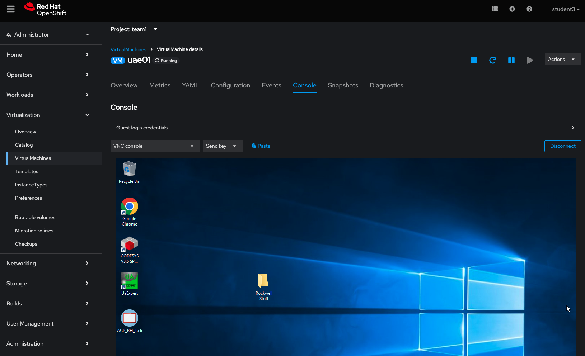
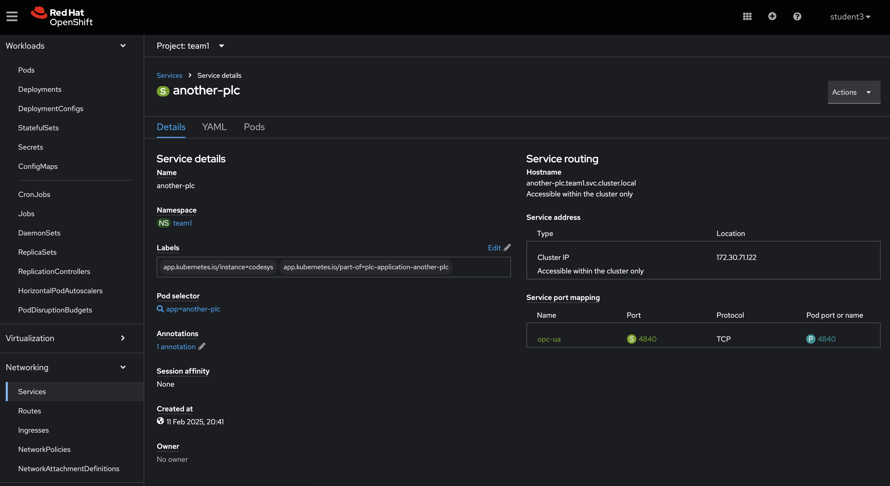

## Table of Contents

* [Objective](#objective)
* [Step 1 - Understand what OPC-UA is](#step-1---understand-what-opc-ua-is)
* [Step 2 - Connect OPC-UA client to PLC](#step-2---connect-opc-ua-client-to-plc)

## Objective

* Understand a bit about OPC-UA
* Connect an OPC-UA client to the PLC

## Step 1 - Understand what OPC-UA is

According to the [OPC Foundation](https://opcfoundation.org/about/opc-technologies/opc-ua/):
"The OPC Unified Architecture (UA), released in 2008, is a platform independent service-oriented architecture that integrates all the functionality of the individual OPC Classic specifications into one extensible framework."

In short, it is an architecture to allow various vendors and manufacturers to put their applications in the same system and be able to talk to one another in some way. Like HTTP for industry.

## Step 2 - Connect OPC-UA client to PLC

Now that we know what it is, let's use a common OPC-UA client, called UAExpert to connect to our existing PLCs and see what data they are producing.

On the virtual machine created within our project in [Workshop Exercise 3.2 - Adding Virtual Machine Templates](../3.2-create-uaexpert-vm/) and run the UaExpert application, which can be found on the desktop.

Once opened, we can add a new server by clicking on the blue + sign at the top:

For the connection, use the service name created in [Step 3.1](../3.1-accessing-data-from-plc/), pointing it to opc.tcp://<service-name>:4840.

Once connected, we should be able to click on the plug and view variables exposed on the PLC's OPC server.

This concludes this workshop stream.
What we have managed to do:
* Define a containerized workload in a GitOps approach
* Create connections between different applications on OpenShift using services
* Fire up Virtual Machines based on code definitions
* Connect workloads in containers to workloads on a virtual machine

---
**Navigation**

[Previous Exercise](../3.3-connecting-ide/) 

[Click here to return to the Workshop Homepage](../../README.md)