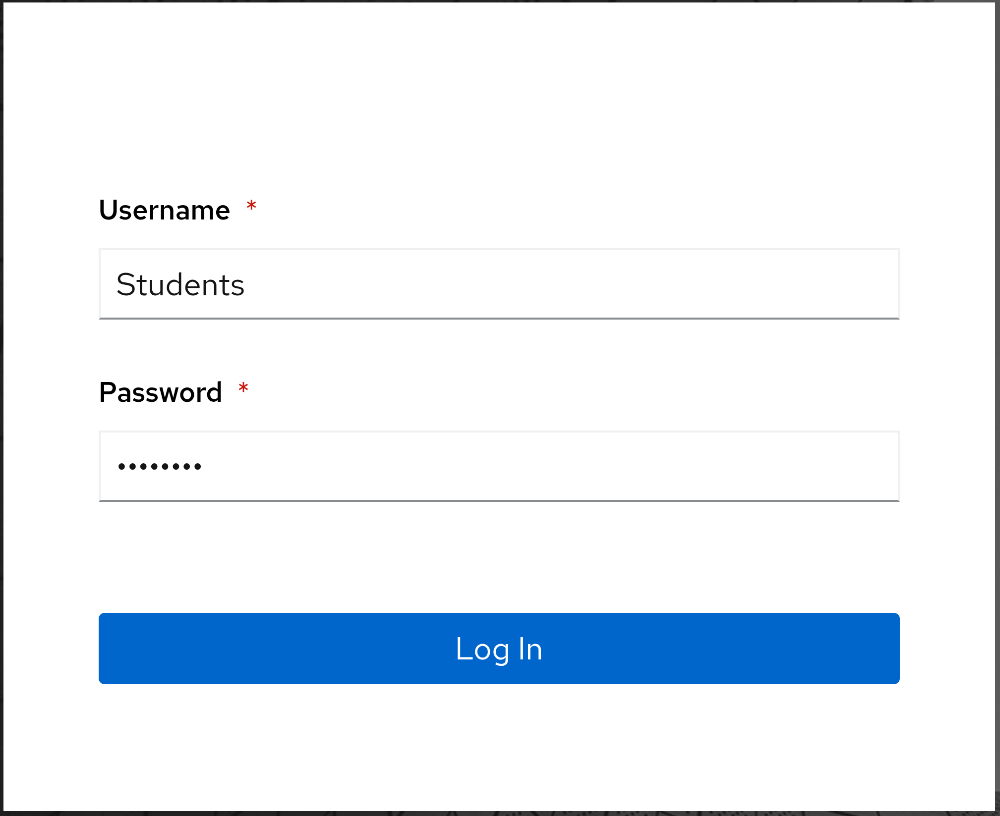
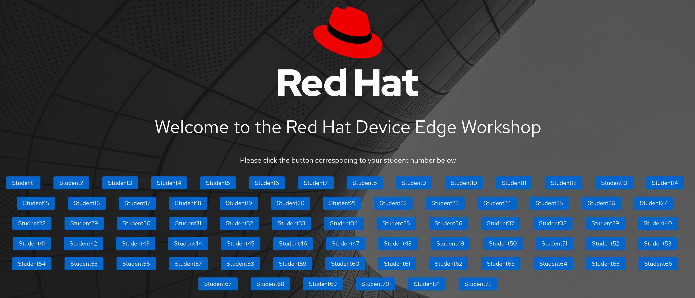
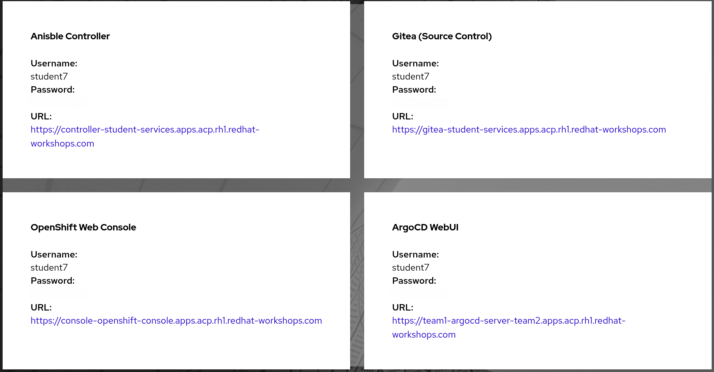
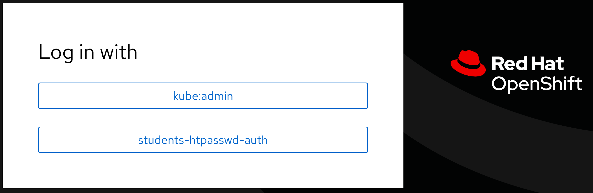
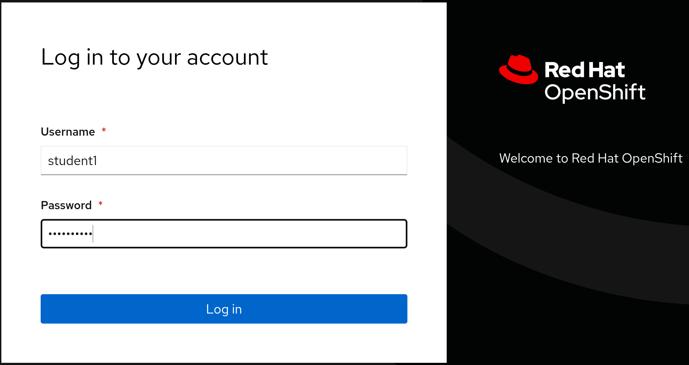

# Workshop Exercise 0.1 - Introductions

## Table of Contents

* [Objective](#objective)
* [Step 1 - Getting Logged In](#step-1---getting-logged-in)
* [Step 2 - OpenShift Web Console Login](#step-2---openshift-web-console-login)
* [Step 3 - Selecting a Student Experience](#step-3---selecting-a-student-experience)

## Objective

* Understand how to log in to the workshop resources
* Select a student experience

## Step 1 - Getting Logged In
Your instructor will have a link and a password to the student landing page for the workshop displayed for you. Ensure you can access the student page by entering the link. You'll be greeted with a simple login box:

The username is: `Students`

Retrieve the password from your instructor.

Once logged in, you'll be presented with a list of student numbers to choose from:

Ensure you select the page that corresponds to your student number.

Once you've selected your student page, you'll be presented with a set of boxes with links to important resources for the workshop:

## Step 2 - OpenShift Web Console Login
When logging in to OpenShift, select the `students-htpasswd-auth` option:

Then enter your username and password from the student page:

## Step 3 - Selecting a Student Experience
This workshop has teams of 6 students working together to build a small-scale system on a shared platform. Thus, not every student will complete every exercise.

Below are the experiences that can be completed. In coordination with your team, select who will be responsible for what component.

| Component | Required Knowledge | Exercises Link |
| --- | --- | --- |
| Active Directory | GitOps, Ansible Automation for Windows | [Link](../active-directory/1.1-initializing-chart/README.md) |
| Network Automation | Ansible Automation for Networking | [Link](../network-automation/1.1-initialize-appliance/README.md) |
| System Dashboard | Basics of Kubernetes | [Link](../system-dashboard/1.1-initializing-chart/README.md) |
| UA Expert | Ansible Automation for Windows | [Link](../rockwell-hmi-vm/1.1-initializing-chart/README.md)
| Codesys Virtual Control Runtime | GitOps, Basics of Kubernetes | [Link](../codesys/1.1-initializing-chart/README.md)
| Codesys IDE | Ansible for Windows | [Link](../codesys-ide/1.1-initializing-chart/README.md)

---
**Navigation**

[Click here to return to the Workshop Homepage](../README.md)
