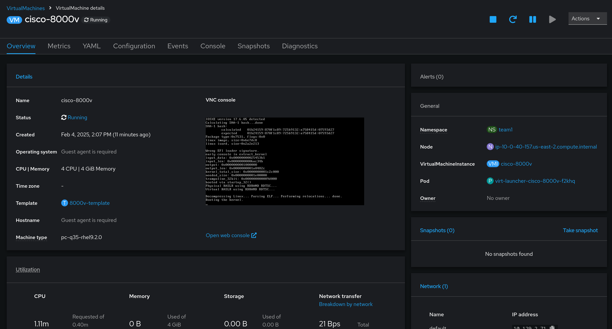
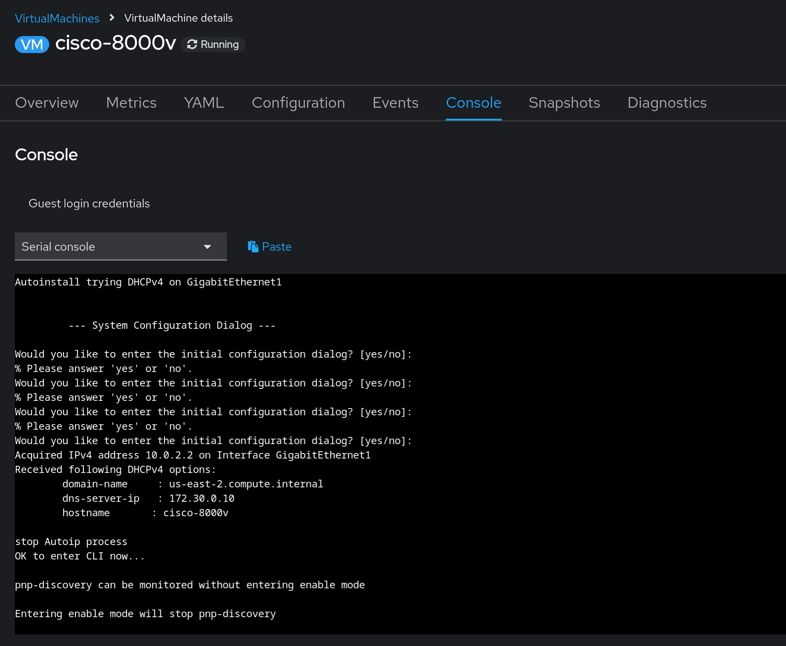
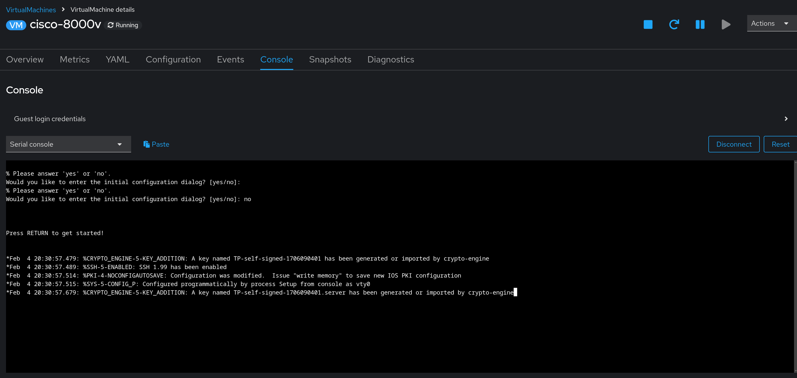
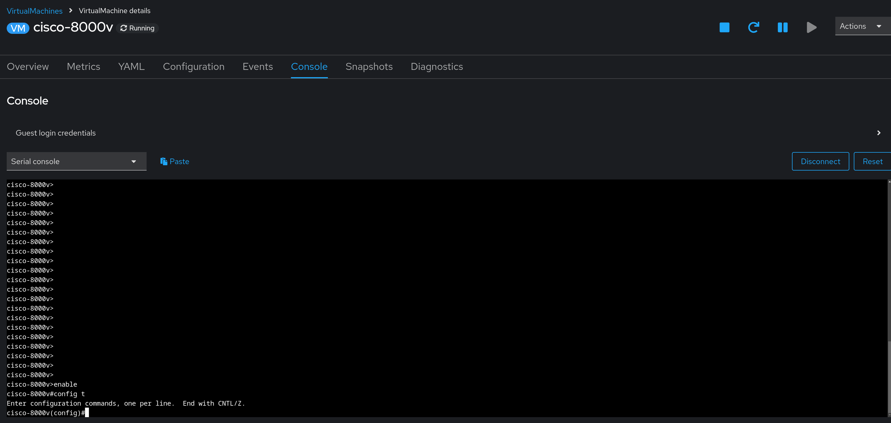
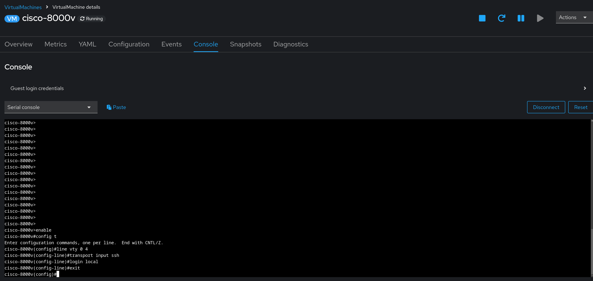
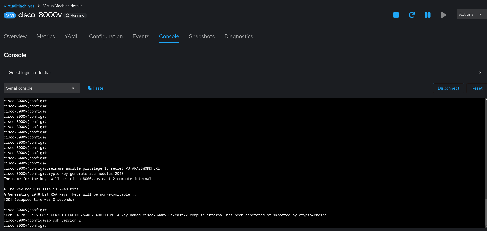
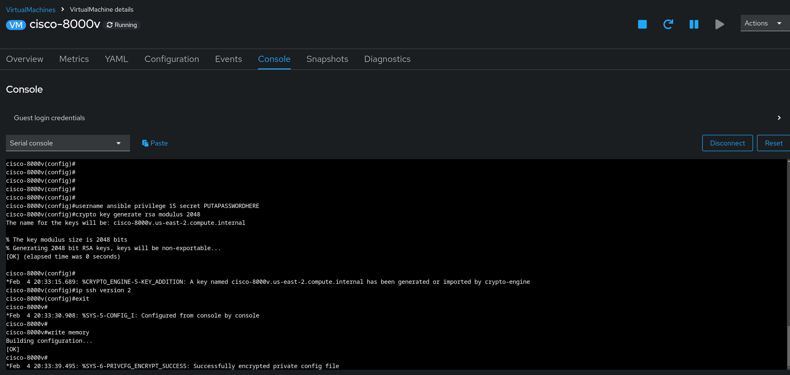

# Workshop Exercise 1.1 - Initializing Network Appliance

## Table of Contents

* [Objective](#objective)
* [Step 1 - Accessing the Serial Console](#step-1---accessing-the-serial-console)
* [Step 2 - Cancel Initial Setup](#step-2---cancel-initial-setup)
* [Step 3 - Enable and Enter Configuration Mode](#step-3---enable-and-enter-configuration-mode)
* [Step 4 - Setup Transport and Local Auth](#step-4---setup-transport-and-local-auth)
* [Step 5 - Setup User for Ansible and Generate Key](#step-5---setup-user-for-ansible-and-generate-key)
* [Step 6 - Write Memory](#step-6---write-memory)

## Objective

* Understand how to initialize the network appliance
* Setup initial connection credentials

## Step 1 - Accessing the Serial Console
Before starting on automating our network appliance, we first need to initialize it and allow remote connections over SSH.

Open the OpenShift Web Console, then navigate to **Virtualization** > **VirtualMachines**, and select the virtual machine named **cisco-8000v**.



Select the **Console** tab, and switch from the VNC console to the Serial console. You may need to hit enter in the box a few times to see output



## Step 2 - Cancel Initial Setup
Within the serial console, we'll execute a few steps to allow SSH access to the network appliance from Ansible Controller.

First, type `no` to canel the intial configuration dialog:


## Step 3 - Enable and Enter Configuration Mode
Next, type `enable` and `config t` to begin configuring the appliance. You will not be prompted for an enable password.

```
enable
config t
```



## Step 4 - Setup Transport and Local Auth
While in config mode, enter the following to allow for configuration and authentication over SSH:

```
line vty 0 4
 transport input ssh
 login local
exit
```



## Step 5 - Setup User for Ansible and Generate Key
Next, we'll set up a user that Ansible can use later on to authenticate to the appliance. In addition, we'll generate a keypair, and enable SSH version 2.

In the serial console, enter the following commands:

```
username ansible privilege 15 secret ENTERAPASSWORDHERE
crypto key generate rsa modulus 2048
ip ssh version 2
```

Ensure to replace `ENTERAPASSWORDHERE` with a password of your choosing. It may make sense to use the same password as your credentials for the OpenShift Web UI, just for consistency.



## Step 6 - Write Memory
Finally, once complete, exit out of config mode, and save the running configuration to memory:
```
exit
write memory
```



Once the process is complete, the console should print out `[OK]`.

Going forward, we can now manage the appliance over SSH using Ansible.
---
**Navigation**

[Next Exercise](../2.1-network-automation-part-1/)

[Click here to return to the Workshop Homepage](../../README.md)
