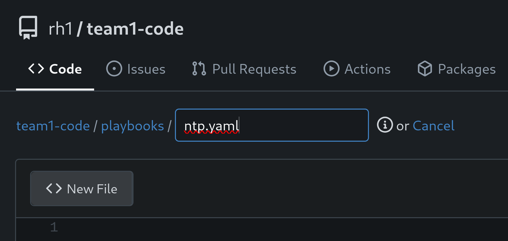
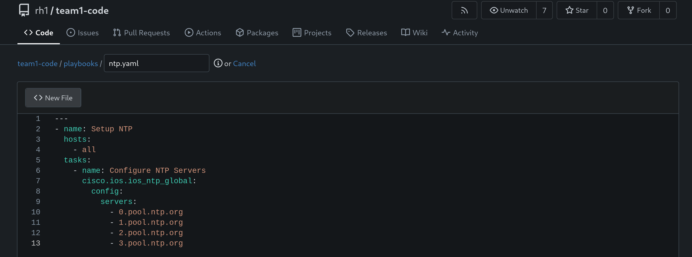
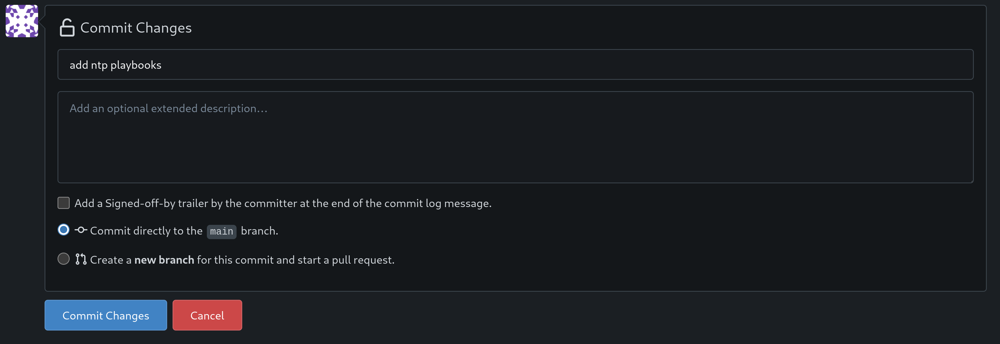

# Workshop Exercise 2.1 - Network Automation Part 1

## Table of Contents

* [Objective](#objective)
* [Step 1 - NTP Playbook](#step-1---ntp-playbook)
* [Step 2 - SNMPv2 Playbook](#step-2---snmpv2-playbook)
* [Step 3 - Set the System Hostname](#step-3---set-the-system-hostname)
* [Step 4 - Save and Commit Code](#step-4---save-and-commit-code)

## Objective

* Create initial network automation playbooks
* Store automation in code repository

## Step 1 - NTP Playbook
First, let's create a directory to house our playbooks, and start crafting some automation to run against our network appliance.



In our code repository, create a new directory named `playbooks` and add a new file called `ntp.yaml`. Paste in the following contents:
```yaml
---
- name: Setup NTP
  hosts:
    - all
  tasks:
    - name: Configure NTP Servers
      cisco.ios.ios_ntp_global:
        config:
          servers:
            - server: 0.pool.ntp.org
            - server: 1.pool.ntp.org
            - server: 2.pool.ntp.org
            - server: 3.pool.ntp.org
```

> Note:
>
> The playbook directory may already exist in your code repository, depending on how far your teammates have gotten. If it does already exist, simply place this playbook in it.

This playbook will setup NTP on our network appliance, and point it at a pool of NTP servers.




## Step 2 - SNMPv2 Playbook
We'll also configure SNMPv2, with a generic community string of `ansible`. Add another file to the `playbooks` directory named `snmpv2.yaml` with the folling content:

```yaml
---
- name: Setup SNMPv2
  hosts:
    - all
  tasks:
    - name: Configure SNMPv2 read-only
      cisco.ios.ios_snmp_server:
        config:
          communities:
            - name: ansible
              ro: true
```

## Step 3 - Set the System Hostname
Finally, we'll add a playbook to set the name of the network appliance. Add another file to the `playbooks` directory named `hostname.yaml`, and add the following contents:
```yaml
---
- name: Set the system hostname
  hosts:
    - all
  tasks:
    - name: Set hostname
      cisco.ios.ios_hostname:
        config:
          hostname: team1-router
```

> Note:
>
> team1 is used as an example here. Replace with your team number.

## Step 4 - Save and Commit Code
Once you've finished editing the playbooks in the previous steps, be sure they've been saved into your code repository. If you're using the web UI, ensure you're hitting the `Commit Changes` button.



If you're using an IDE, ensure you've committed/pushed your new code.


---
**Navigation**

[Previous Exercise](../1.1-initialize-appliance/) | [Next Exercise](../2.2-network-automation-part-2/)

[Click here to return to the Workshop Homepage](../../README.md)
