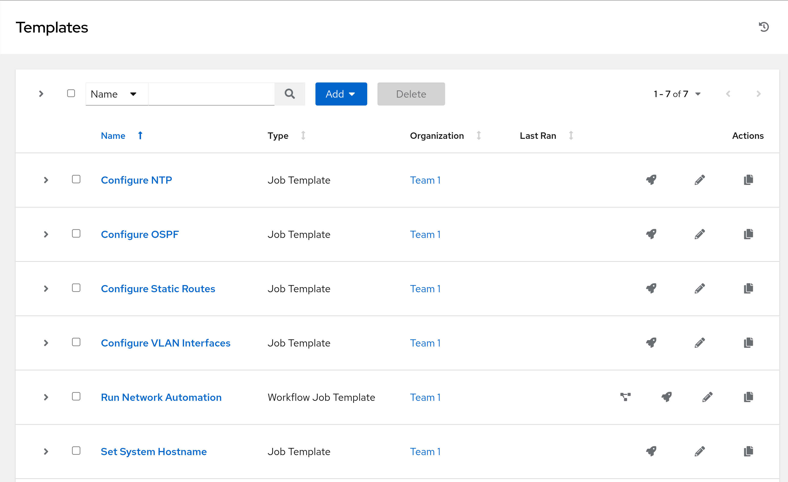
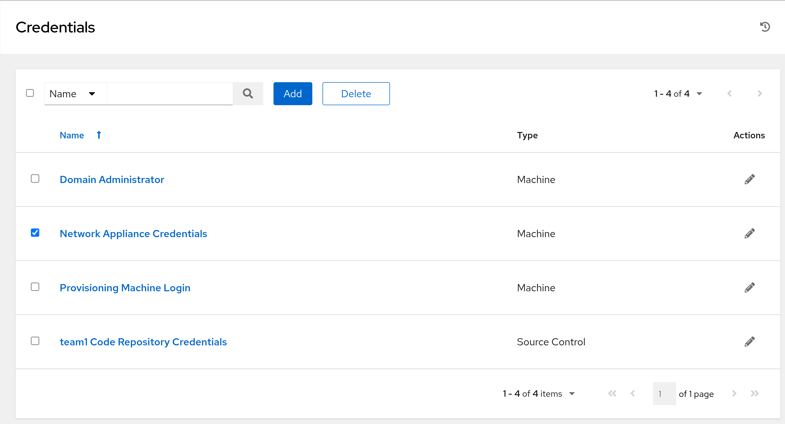
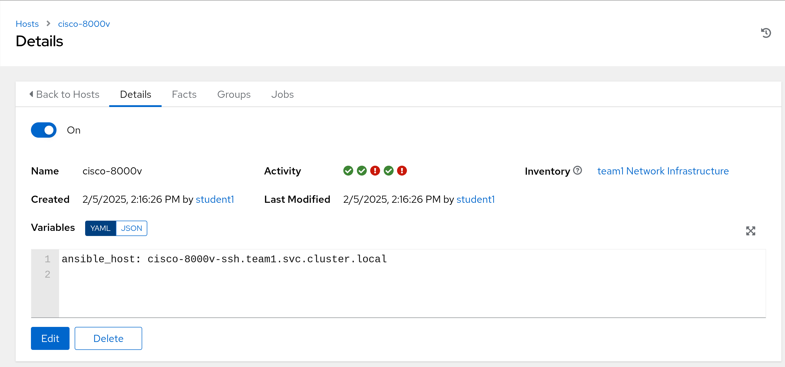
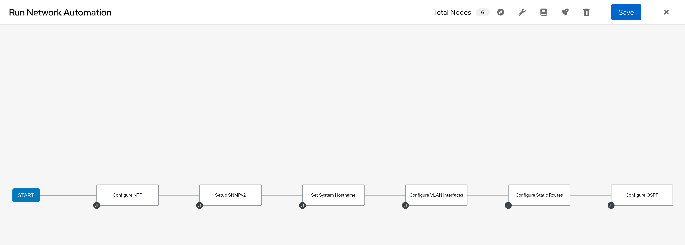

# Workshop Exercise 5.1 - Validating Controller Config

## Table of Contents

* [Objective](#objective)
* [Step 1 - Understanding the Relationship between Helm Charts and ArgoCD](#step-1---understanding-the-relationship-between-helm-charts-and-argocd)
* [Step 2 - Adding an Application to ArgoCD](#step-2---adding-an-application-to-argocd)
* [Step 3 - Adding New Application Information](#step-3---adding-new-application-information)
* [Step 4 - OPTIONAL - Adding New Application via YAML](#step-4---optional---adding-new-application-via-yaml)
* [Step 5 - Investigate New Application](#step-5---investigate-new-application)
* [Step 6 - Syncing Application](#step-6---syncing-application)

## Objective

* Confirm Controller configuration was applied
* Review applied configuration

## Step 1 - Reviewing Applied Controller Configuration
In the Ansible Controller web interface, we should now see our stated configuration applied.

For example, job templates:

And our new credential:

The host that corresponds to our network appliance:

And a workflow with nodes for our job templates:

This confirms our integration between procedural and declarative tooling.

---
**Navigation**

[Pervious Exercise](../4.2-appling-config-to-controller/)  [Next Exercise](../2.1-ad-automation-part-1/)

[Click here to return to the Workshop Homepage](../../README.md)
