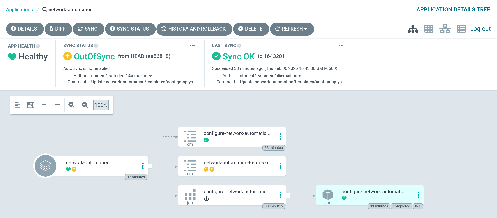
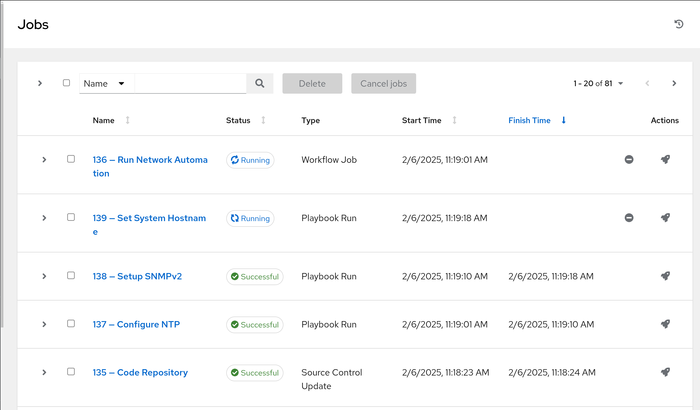
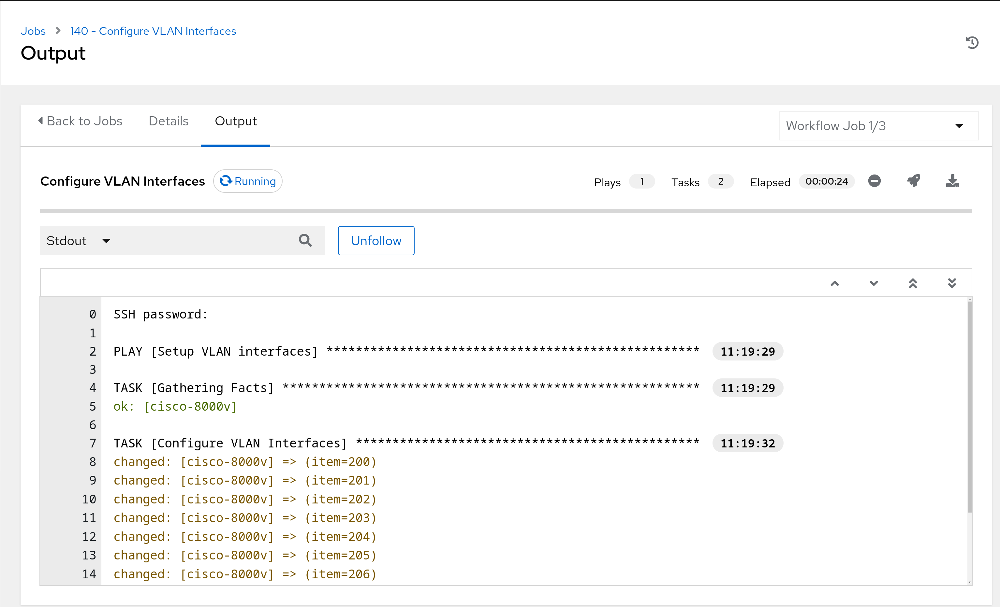
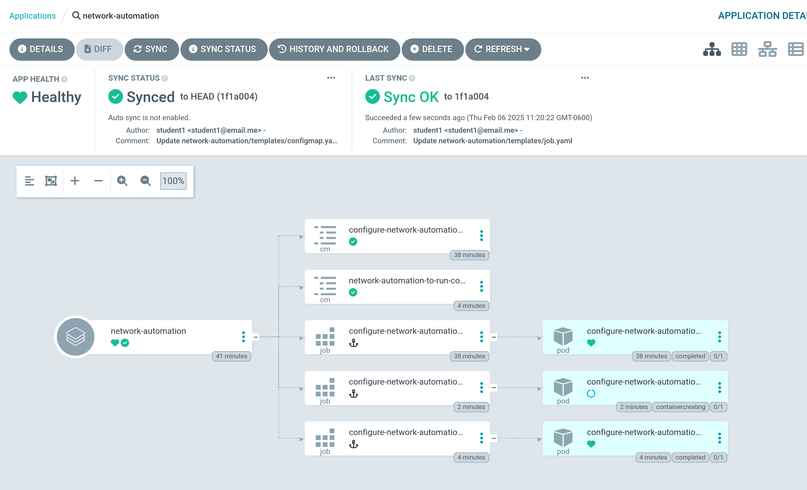
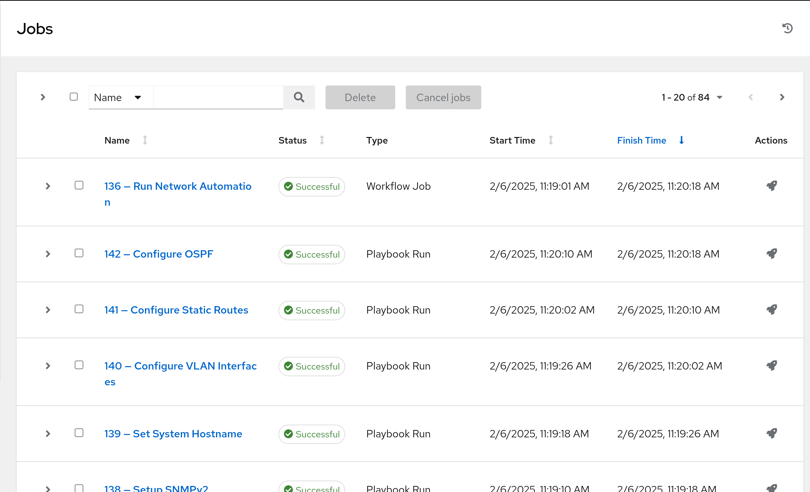

# Workshop Exercise 5.2 - Resyncing Application

## Table of Contents

* [Objective](#objective)
* [Step 1 - Resyncing the Application in ArgoCD](#step-1---resyncing-the-application-in-argocd)
* [Step 2 - Investigating the Running Automation](#step-2---investigating-the-running-automation)
* [Step 3 - Confirming Completion](#step-3---confirming-completion)

## Objective

* Confirm the configuration of Ansible Controller is initiated
* Validate the configured resources

## Step 1 - Resyncing the Application in ArgoCD
Return to the web interface in ArgoCD, and select the `network-automation` application tile. Click on the `Refresh` button, and give the application a few minutes to update. Then, click on the `Sync` button.

Our new configmaps and jobs should now be created, and will run during the sync, and be triggered after everything else syncs for the postSync job.

## Step 2 - Investigating the Running Automation
In the Ansible Controller Web Inteface, select **Views** > **Jobs**, and review the jobs list. Ideally, a workflow will be running, and various jobs will be kicked off:

Review a running job and confirm the output looks sane:

## Step 3 - Confirming Completion
After a few minutes, both Ansible Controller and ArgoCD will display completed states:

This means the end-to-end configuration of our network appliance has been completed.

---
**Navigation**

[Previous Exercise](../5.1-adding-postsync-job/) | [Next Exercise](../5.3-investigating-appliance/)

[Click here to return to the Workshop Homepage](../README.md)
