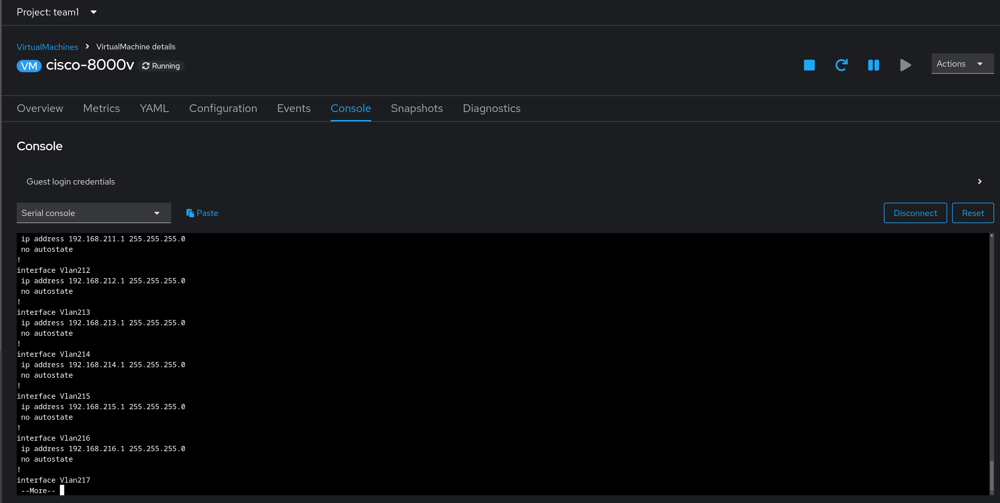

# Workshop Exercise 5.3 - Investigating Configured Network Appliance

## Table of Contents

* [Objective](#objective)
* [Step 1 - Understanding the Relationship between Helm Charts and ArgoCD](#step-1---understanding-the-relationship-between-helm-charts-and-argocd)
* [Step 2 - Adding an Application to ArgoCD](#step-2---adding-an-application-to-argocd)
* [Step 3 - Adding New Application Information](#step-3---adding-new-application-information)
* [Step 4 - OPTIONAL - Adding New Application via YAML](#step-4---optional---adding-new-application-via-yaml)
* [Step 5 - Investigate New Application](#step-5---investigate-new-application)
* [Step 6 - Syncing Application](#step-6---syncing-application)

## Objective

* Confirm configurations have been applied to the network appliance

## Step 1 - Understanding the Relationship between Helm Charts and ArgoCD
Return to the OpenShift Web Console, then navigate to **Virtualization** > **VirtualMachines**. Select the virtual machine named **cisco-8000v**, and return to the serial console.

To confirm our configuration has been applied, type `enable` and then `show run`, and review the running configuration, with our applied changes:

---
**Navigation**

[Pervious Exercise](../5.2-resyncing-app/)

[Click here to return to the Workshop Homepage](../../README.md)
