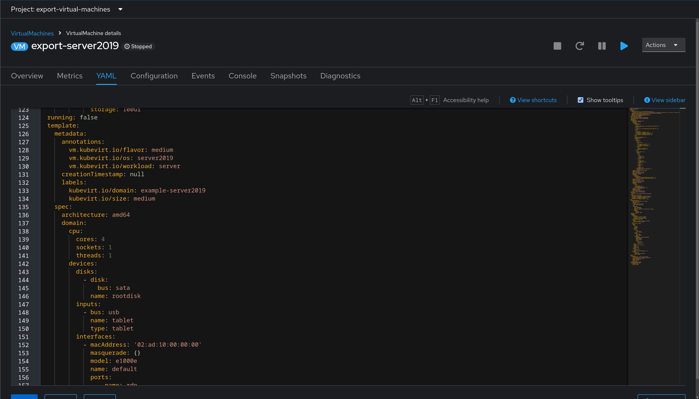

# Workshop Exercise 1.2 - Adding Virtual Machine Templates

## Table of Contents

* [Objective](#objective)
* [Step 1 - Investigating Virtual Machines](#step-1---investigating-virtual-machines)
* [Step 2 - Creating a Base Values.yaml File](#step-2---creating-a-base-valuesyaml-file)
* [Step 3 - Creating Virtual Machine Definition Templates](#step-3---creating-virtual-machine-definition-templates)
* [Step 4 - Default Values within Templates](#step-4---default-values-within-templates)

## Objective

* Understand definitions for virtual machines
* Create a template that can be looped

## Step 1 - Investigating Virtual Machines
As with everything else in OpenShift, virtual machines can be created and modified by using code instead of the web interface. This allows for managing them through a gitops flow, instead of manual modifications.

For example, this is a snippet of a virtual machine's definition:


In the screenshot, the virtual machine configuration is shown as code.

An example virtual machine has been created for you, and is located in your team namespace. To begin reviewing it, access the OpenShift web console using the URL and credentials from your student page. Then, navigate to Virtualization > VirtualMachines > example-server2019. Select the YAML tab to view the yaml definition of the virtual machine. This can be used as a base for building other virtual machine definitions.

## Step 2 - Creating a Base Values.yaml File
Values that are used by templates can be placed into a file called `values.yaml` within the chart directory, which helm will automatically look for and use. These can be overriden if needed, but for our purposes, a simple values file will work.

Within the `factorytalk` directory in our code repo, create a new file named `values.yaml`, and add the following content:

```yaml
---
virtualMachines:
  - name: ft01
    partOf: factory-talk
    operatingSystem: server2019
```


These values will be used by the template in the next step to create the specified virtual machines.

Once complete, be sure to save the file, or if working within an IDE, commit and push.


## Step 3 - Creating Virtual Machine Definition Templates
Since we'll be creating two virtual machines that are nearly identical, we can create one template, and use the `range` function with helm to have it template out 1 virtual machines.

All values live under the `.Values` key, so the path to our list of virtual machines is: `.Values.virtualMachines`. Since we have a list, we can use the `range` function to iterate over the items within the list, and helm will render out the template accordingly.

Create a new directory within the chart directory called `templates`, and within it create a new file called `virtualmachines.yaml`.

The following combines the example virtual machine definition from earlier, along with the templating functions and values from our `values.yaml` file.

A quick note: when using certain functions within helm, the **scope** of variables can change. Wthin the range function, we "enter" the specific item, and can then reference the contents using a short notation.

We can think of this like a `for` loop, iterating over the items in the list.

Here's some psudocode with some notes:
```
# Loop over every item in the list
for item in virtualMachines; do
  # Since we're now "in" the first item, our values move from .Values.virtualMachines[0].name to just .name
  echo .name
  # Same idea, from .Values.virtualMachines[0].partOf to just .partOf
  echo .partOf
done
```


To put that into practice, here's our virtual machine definition combined with the `range` function, based on what's in our `values.yaml` file from earlier:
```yaml
{{- range $.Values.virtualMachines }}
---
apiVersion: kubevirt.io/v1
kind: VirtualMachine
metadata:
  name: {{ .name }}
  finalizers:
    - kubevirt.io/virtualMachineControllerFinalize
  labels:
    vm.kubevirt.io/template: rockwell-software-template
    vm.kubevirt.io/template.namespace: openshift
    vm.kubevirt.io/template.revision: '1'
    vm.kubevirt.io/template.version: v0.26.0
  annotations:
    argocd.argoproj.io/sync-wave: "1"
spec:
  dataVolumeTemplates:
    - apiVersion: cdi.kubevirt.io/v1beta1
      kind: DataVolume
      metadata:
        creationTimestamp: null
        name: {{ .name }}-boot0
      spec:
        sourceRef:
          kind: DataSource
          name: rockwell-software
          namespace: openshift-virtualization-os-images
        storage:
          resources:
            requests:
              storage: 100Gi
  running: true
  template:
    metadata:
      annotations:
        vm.kubevirt.io/flavor: medium
        vm.kubevirt.io/os: {{ .operatingSystem }}
        vm.kubevirt.io/workload: server
      labels:
        kubevirt.io/domain: {{ .name }}
        kubevirt.io/size: medium
        app.kubernetes.io/name: {{ .name }}
        app.kubernetes.io/part-of: {{ .partOf }}
    spec:
      architecture: amd64
      domain:
        cpu:
          cores: 1
          sockets: {{ .cpuCores | default "4" }}
          threads: 1
        devices:
          disks:
            - disk:
                bus: sata
              name: rootdisk
          inputs:
            - bus: usb
              name: tablet
              type: tablet
          interfaces:
            - name: default
              masquerade: {}
              model: e1000e
              ports:
                - name: winrm
                  port: 5985
        machine:
          type: pc-q35-rhel9.2.0
        memory:
          guest: {{ .memory | default "8Gi" }}
      networks:
        - name: default
          pod: {}
      terminationGracePeriodSeconds: 3600
      volumes:
        - dataVolume:
            name: {{ .name }}-boot0
          name: rootdisk
{{- end }}

```

Be sure to save this file once done editing, or if working within an code editor, commit and push.


## Step 4 - Default Values within Templates
You may have noticed a few lines in the virtual machine template earlier that appear to be referencing values that weren't defined in our `values.yaml` file, and had a pipe after them.

```yaml
sockets: {{ .cpuCores | default "4" }}
guest: {{ .memory | default "8Gi" }}
```

Another feature within helm templates is the ability to transform inputs, or to assign default values if nothing is specified. Here, defaults of 4 sockets and 8Gi of memory are set as defaults, and since our `values.yaml` file does not specify these values, the defaults will be applied.

Should we want to override these values, we simply need to define them in our `values.yaml` file. For example, to have our first virtual machine have more resources and let the second use the defaults, we could modify our `values.yaml` file accordingly:
```yaml

---
virtualMachines:
  - name: ft01
    partOf: factorytalk
    operatingSystem: server2019
    cpuCores: 8
    memory: 16Gi

```

This is not required for our use case, but feel free to modify your `values.yaml` file if desired.

---
**Navigation**

[Previous Exercise](../1.1-initializing-chart/) | [Next Exercise](../1.3-adding-services-for-connectivity/)

[Click here to return to the Workshop Homepage](../../README.md)
