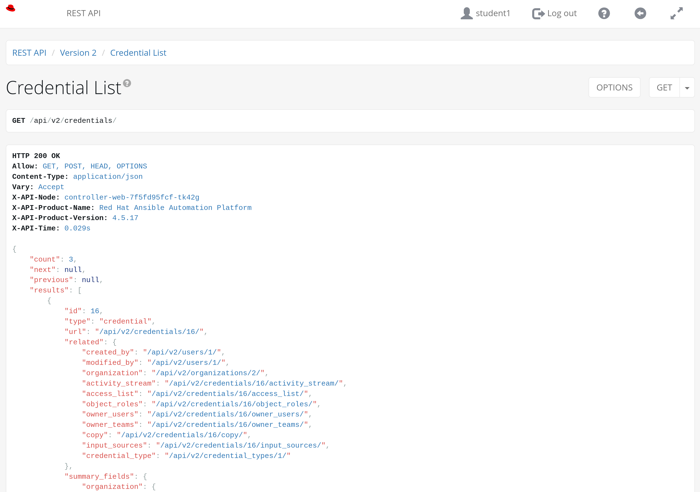
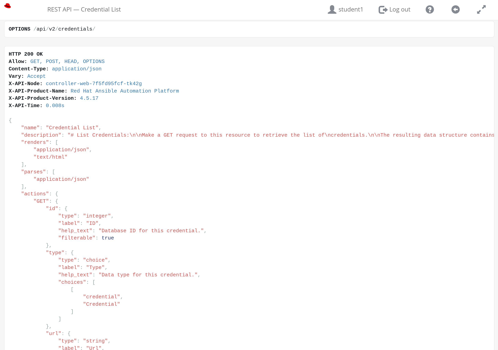
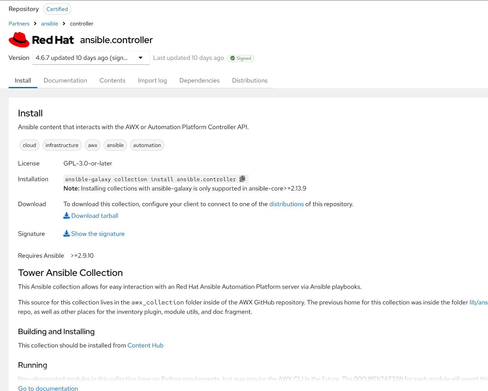
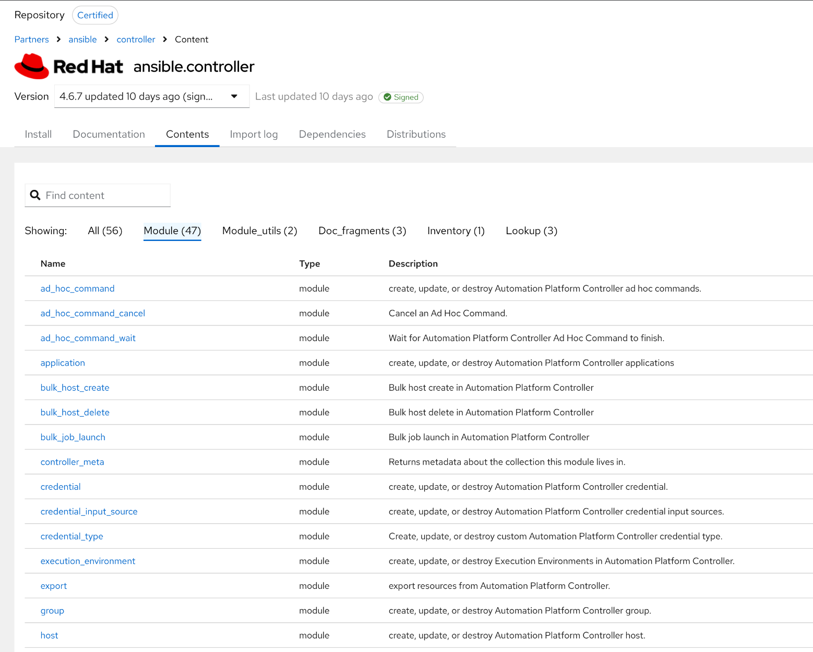
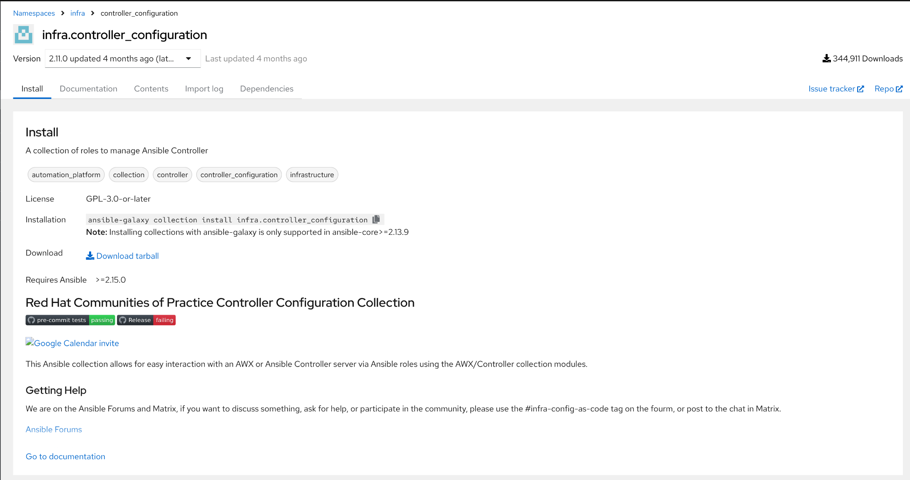
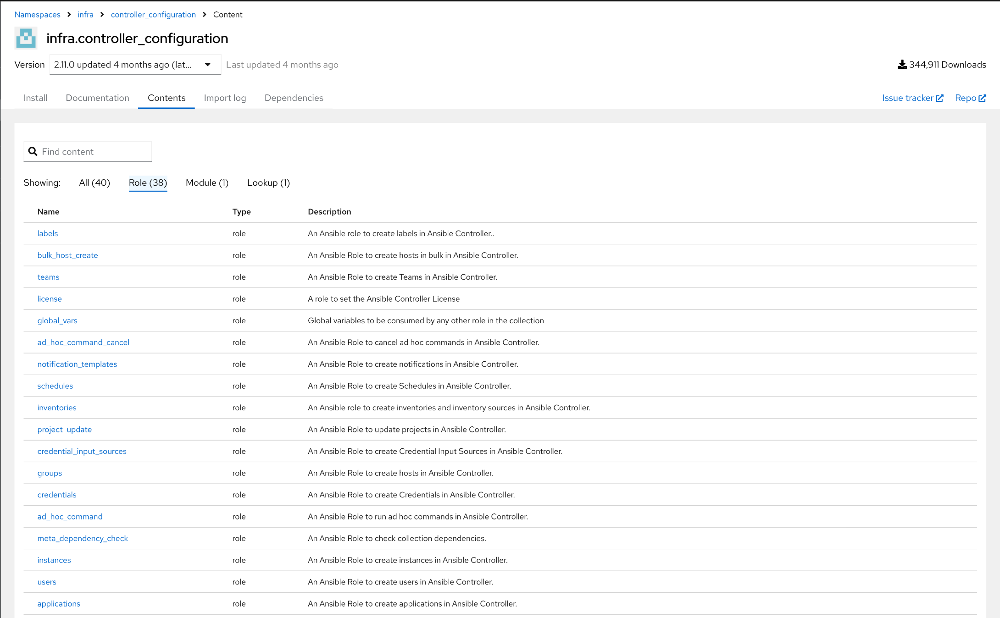
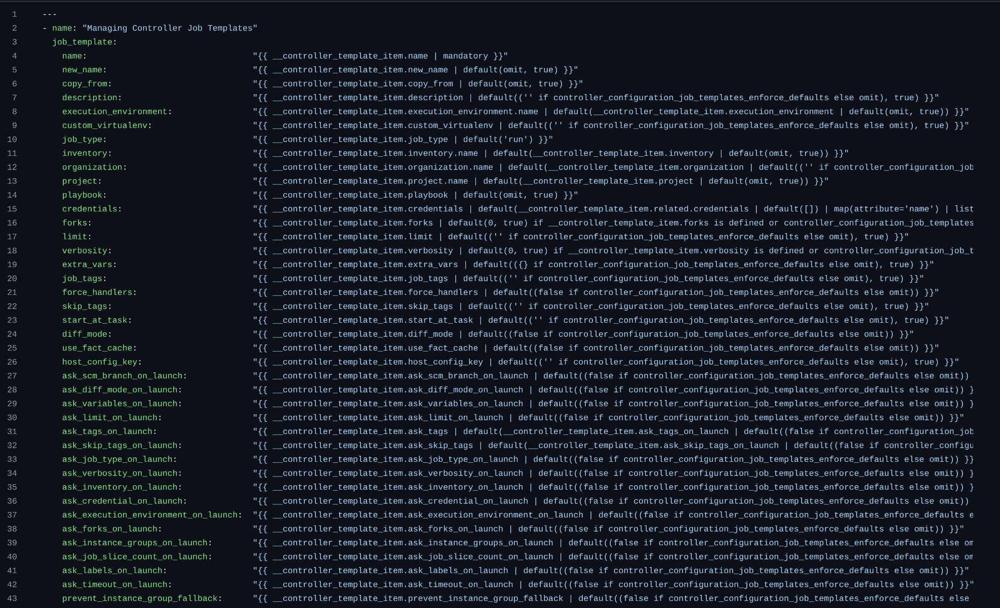

# Workshop Exercise 3.1 - Ansible Controller as Code

## Table of Contents

* [Objective](#objective)
* [Step 1 - Ansible Controller as Code Idea](#step-1---ansible-controller-as-code-idea)
* [Step 2 - The ansible.controller Collection](#step-2---the-ansiblecontroller-collection)
* [Step 3 - Using an Overlay Collection](#step-3---using-an-overlay-collection)

## Objective

* Understand how configuration elements can be captured as code
* Understand overlay collections that make automating Controller easier

## Step 1 - Ansible Controller as Code Idea
Within Ansible Controller, various configurations are made to enable the running of automation, things such as projects, credentials, inventories, job templates, and more.

While these configurations can be made using the WebUI, they also can be managed using the API of controller. For example, when browsing the API, the credential endpoint looks like such:

In addition, the API can be asked for options that can be used when interacting with it for various configuration items:

This allows for the entire configuration of Controller to be defined as code, and programatically applied to Controller - which is a best practice for running Controller at scale, in production.

## Step 2 - The ansible.controller Collection
Instead of crafting json payloads and using curl to interact with the controller API, Ansible engine itself can be used to interact with Controller's API, and allows for resources to be defined in a more straightforward format: as simple variables.

To facilitate this, an ansible collection, [ansible.controller](https://console.redhat.com/ansible/automation-hub/repo/published/ansible/controller/), can be leveraged with Ansible engine.

This collection provides modules that correspond to the various components of Controller to configure:

## Step 3 - Using an Overlay Collection
While the ansible.controller collection provides a more simplified mechanism for interacting with Controller, various "overlay" collections exist that further simplify how various Controller configuration elements can be defined, and how the automation playbooks themselves can be more simple.

Once such collection is the [infra.controller_configuration](https://galaxy.ansible.com/ui/repo/published/infra/controller_configuration/content/?showing=role) collection, which depends on the ansible.controller collection, and provides roles that wrap the individual modules within the ansible.controller collection.

Leveraging this overlay collection provides a few key benefits:
- Roles can be specified in a simplified playbook, over writing tasks that call the modules individually.

- Not all options need to specified when managing resources, allowing for a more simplified data structure overall:

- The collection will automatically loop over elements in a list, attempting to apply many at once, speeding up configuration.

---
**Navigation**

[Previous Exercise](../2.2-ad-automation-part-2/) | [Next Exercise](../3.2-creating-hosts-and-groups/)

"You're doing great!!"

[Click here to return to the Workshop Homepage](../../README.md)
