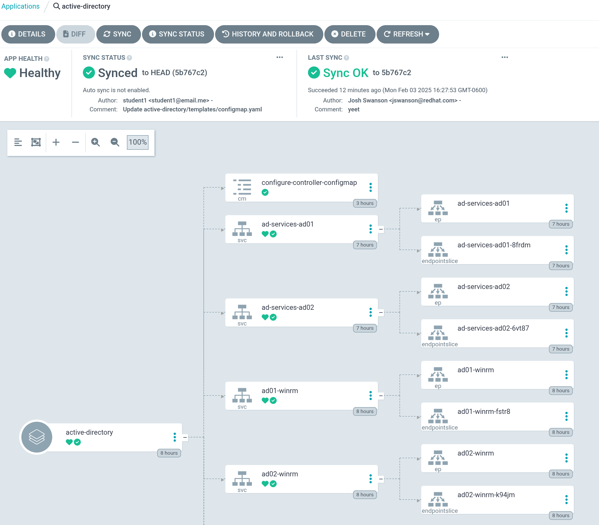
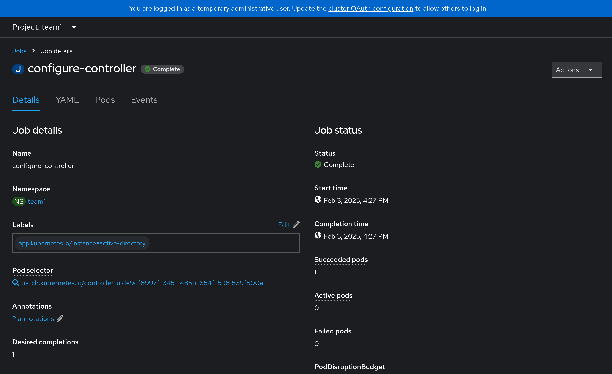
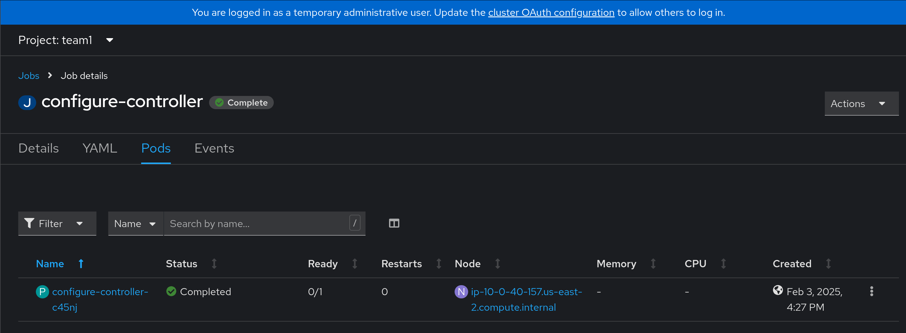
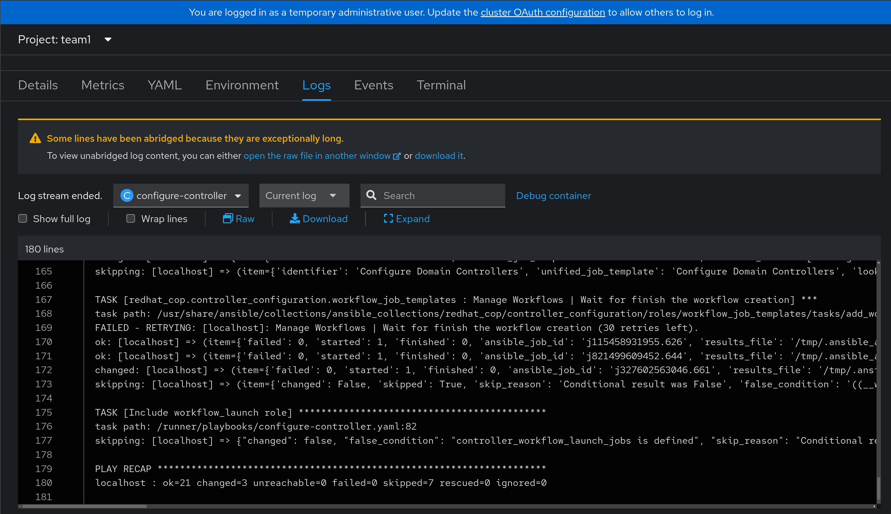
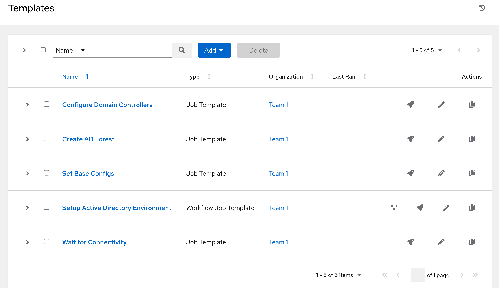
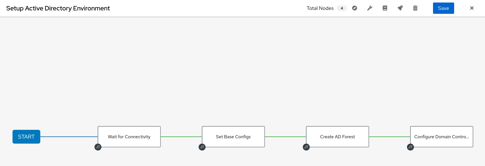

# Workshop Exercise 4.1 - Resyncing Application

## Table of Contents

* [Objective](#objective)
* [Step 1 - Resyncing the Application in ArgoCD](#step-1---resyncing-the-application-in-argocd)
* [Step 2 - Investigating the Configure Controller Job](#step-2---investigating-the-configure-controller-job)
* [Step 3 - Investigating Ansible Controller](#step-3---investigating-ansible-controller)

## Objective

* Confirm the configuration of Ansible Controller is initiated
* Validate the configured resources

## Step 1 - Resyncing the Application in ArgoCD
Return to the web interface in ArgoCD, and select the `factorytalk` application tile. Click on the `Refresh` button, and give the application a few minutes to update. Then, click on the `Sync` button.

Our new configmaps and jobs should now be created, and will run during the sync, and be triggered after everything else syncs for the postSync job.

## Step 2 - Investigating the Configure Controller Job
In the OpenShift Web Console, select **Workloads** > **Jobs**, then select the job named `configure-controller`. The job may still be running, but if everything is successful, the job and corresponding pod will denote success.

For information, the logs from the pod will display the actual automation running, configuring Controller:

## Step 3 - Investigating Ansible Controller
With the completion of the `configure-controller` job, Ansible Controller should now be showing job templates, workflows, and hosts that weren't previously configured:

This shows that our integration of declarative and procedural tooling has worked, and we're now ready for a true end-to-end application deployment.

---
**Navigation**

[Previous Exercise](../3.4-appling-config-to-controller/) | [Next Exercise](../4.2-end-to-end/)

[Click here to return to the Workshop Homepage](../README.md)
