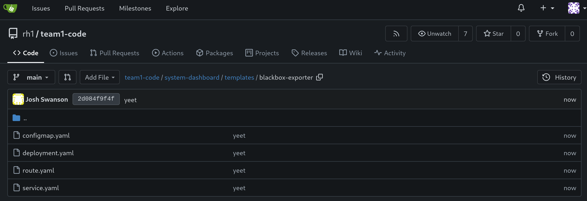

# Workshop Exercise 2.1 - Setting Up Blackbox Exporter

## Table of Contents

* [Objective](#objective)
* [Step 1 - Introduction to Blackbox Exporter](#step-1---introduction-to-blackbox-exporter)
* [Step 2 - Creating a ConfigMap](#step-2---creating-a-configmap)
* [Step 3 - Creating a Deployment](#step-3---creating-a-deployment)
* [Step 4 - Adding a Service](#step-4---adding-a-service)
* [Step 5 - Adding a Route](#step-5---adding-a-route)
* [Step 6 - Save and Commit Code](#step-6---save-and-commit-code)

## Objective

* Get a brief introduction to blackbox exporter
* Setup a configuration for blackbox exporter
* Create deployment resources for an instance of blackbox exporter

## Step 1 - Introduction to Blackbox Exporter
Blackbox exporter is a tool that allows for monitoring of enpoints over various protocols such as HTTP, HTTPS, DNS, Ping, TCP, and more.

Within our system, various services are exposed (over services) so their functionality can be consumed. We're going to configure blackbox exporter to watch some URLs over HTTP(S), check certain ports over TCP, and check if SSH is working.

Here's a table of what we'll want to monitor within the system:
| Name | Endpoint | Protocol | Port |
| --- | --- | --- | --- |
| OpenShift Web Console | `console.openshift-console.svc.cluster.local` | HTTPS | 443 |
| Ansible Controller Web UI | `controller-service.student-services.svc.cluster.local` | HTTP | 80 |
| Gitea Web Interface | `gitea.student-services.svc.cluster.local` | HTTP | 3000 |
| Student Pages Website | `student-pages-service.student-services.svc.cluster.local` | HTTP | 3000 |
| ArgoCD Web Interace | `argocd-server.team1.svc.cluster.local` | HTTP | 80 |
| AD01 WinRM | `ad01-winrm.team1.svc.cluster.local` | TCP | 5985 |
| AD02 WinRM | `ad02-winrm.team1.svc.cluster.local` | TCP | 5985 |
| Cisco 8000v SSH | `cisco-8000v-ssh.team1.svc.cluster.local` | SSH | 22 |

> Note:
>
> Team 1 is used as an example here, later we'll create templates to replace the information with yours.

## Step 2 - Creating a ConfigMap
To get started, we'll create a ConfigMap that sets the configuration of blackbox exporter.

Within your chart directory, create a new directory named `templates`, then another under that directory named `blackbox-exporter`, then create a file named `configmap.yaml`. Add the following contents:
```yaml
---
apiVersion: v1
kind: ConfigMap
metadata:
  name: blackbox-config
  labels:
    app.kubernetes.io/name: blackbox-exporter
    app.kubernetes.io/part-of: system-dashboard
data:
  config.yml: |
    modules:
      http_2xx:
        prober: http
        timeout: 5s
        http:
          method: GET
          tls_config:
            insecure_skip_verify: true
          preferred_ip_protocol: "ip4"
      tcp_5985:
        prober: tcp
        timeout: 5s
        tcp:
          query_response: []
          tls: false
      tcp_22:
        prober: tcp
        tcp:
          query_response:
          - expect: "^SSH-2.0-"
          - send: "SSH-2.0-blackbox-ssh-check"
```

This configmap configures what modules we want to have enabled. Specifically, we want an http module for checking web pages, a tcp_5985 module to check if TCP/5985 is open, and a tcp_22 module that initiates an SSH collection and looks for SSH2 to be enabled.

> Note:
>
> _Technically_ we don't need to specify ports for TCP probes, however for clarity they're called out explicitly.

Be sure to save/commit/push your new code.

## Step 3 - Creating a Deployment
Next, we'll want a deployment for blackbox exporter. Within the `templates/blackbox-exporter/` directory, add a new file named `deployment.yaml` with the following contents:
```yaml
---
apiVersion: apps/v1
kind: Deployment
metadata:
  name: blackbox-exporter
  labels:
    app.kubernetes.io/name: blackbox-exporter
    app.kubernetes.io/part-of: system-dashboard
spec:
  replicas: 1
  selector:
    matchLabels:
    app.kubernetes.io/name: blackbox-exporter
  template:
    metadata:
      labels:
        app.kubernetes.io/name: blackbox-exporter
        app.kubernetes.io/part-of: system-dashboard
    spec:
      containers:
        - name: blackbox-exporter
          image: prom/blackbox-exporter:latest
          ports:
            - containerPort: 9115
          volumeMounts:
            - name: config-volume
              mountPath: /etc/blackbox_exporter/config.yml
              subPath: config.yml
      volumes:
        - name: config-volume
          configMap:
            name: blackbox-config
```

Within this deployment, our configmap will be mounted into the container at `/etc/blackbox_exporter/config.yaml`, allowing for what we've specified above to be automatically picked up when the container starts.

## Step 4 - Adding a Service
Now, to enable communication with the blackbox exporter application, we'll create a service. Create a new file named `service.yaml` within the `templates/blackbox-exporter` directory with the following contents:

```yaml
---
apiVersion: v1
kind: Service
metadata:
  name: blackbox-exporter
  labels:
    app.kubernetes.io/name: blackbox-exporter
    app.kubernetes.io/part-of: system-dashboard
spec:
  ports:
    - port: 9115
      targetPort: 9115
      protocol: TCP
  selector:
    app.kubernetes.io/name: blackbox-exporter
```

The `.spec.selector` field ensures the service will attach to the correct pods.

## Step 5 - Adding a Route
While there isn't a huge need to interact directly with blackbox exporter, for troubleshooting we can expose its web interface through a route.

Add a new file named `route.yaml` to the `templates/blackbox-exporter/` directory with the following content:
```yaml
---
apiVersion: route.openshift.io/v1
kind: Route
metadata:
  name: blackbox-exporter
  labels:
    app.kubernetes.io/name: blackbox-exporter
    app.kubernetes.io/part-of: system-dashboard
spec:
  to:
    kind: Service
    name: blackbox-exporter
  tls:
    termination: edge
    insecureEdgeTerminationPolicy: Redirect
  port:
    targetPort: 9115
```

## Step 6 - Save and Commit Code

Ensure you've saved your edits if using the Gitea web interface, or committed/pushed if using an IDE.



---
**Navigation**

[Previous Exercise](../1.1-initializing-chart/) | [Next Exercise](../2.2-setup-prometheus/)

[Click here to return to the Workshop Homepage](../../README.md)
