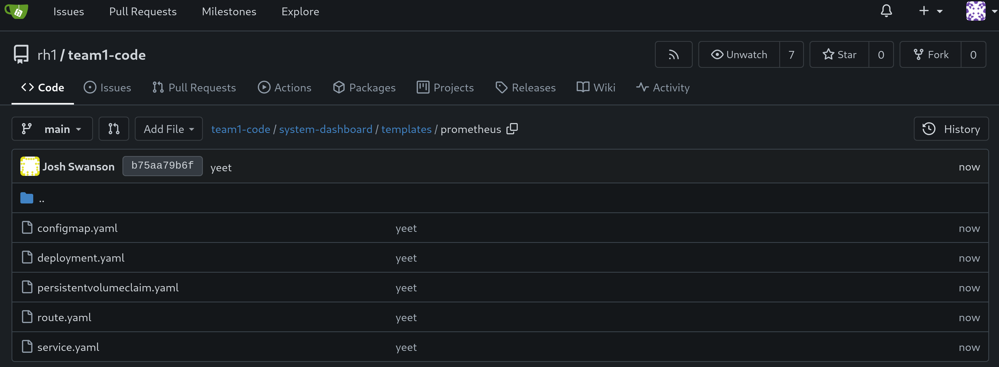

# Workshop Exercise 2.2 - Setting up Prometheus

## Table of Contents

* [Objective](#objective)
* [Step 1 - Introduction to Blackbox Exporter](#step-1---introduction-to-blackbox-exporter)
* [Step 2 - Setting up a Loop-able Data Structure](#step-2---setting-up-a-loop-able-data-structure)
* [Step 3 - Creating a ConfigMap](#step-3---creating-a-configmap)
* [Step 4 - Creating a Deployment](#step-4---creating-a-deployment)
* [Step 5 - Adding a Service](#step-5---adding-a-service)
* [Step 6 - Adding a Route](#step-6---adding-a-route)
* [Step 7 - Adding a PersistentVolumeClaim](#step-7---adding-a-persistentvolumeclaim)
* [Step 8 - Save and Commit Code](#step-8---save-and-commit-code)

## Objective

* Get a brief introduction to prometheus
* Setup a configuration for prometheus
* Create deployment resources for an instance of prometheus

## Step 1 - Introduction to Prometheus
Prometheus is a applicatoin used for event monitoring and alerting, storing data in a time series database. Metrics are stored in key:value pairs with labels.

Essentially, Prometheus acts as the "central brain" of our monitoring stack, where metrics will be gathered and stored, then retrieved later for use in building a dashboard.

As a quick review, here's what we care about monitoring in our system:
| Name | Endpoint | Protocol | Port |
| --- | --- | --- | --- |
| OpenShift Web Console | `console.openshift-console.svc.cluster.local` | HTTPS | 443 |
| Ansible Controller Web UI | `controller-service.student-services.svc.cluster.local` | HTTP | 80 |
| Gitea Web Interface | `gitea.student-services.svc.cluster.local` | HTTP | 3000 |
| Student Pages Website | `student-pages-service.student-services.svc.cluster.local` | HTTP | 3000 |
| ArgoCD Web Interace | `argocd-server.team1.svc.cluster.local` | HTTP | 80 |
| AD01 WinRM | `ad01-winrm.team1.svc.cluster.local` | TCP | 5985 |
| AD02 WinRM | `ad02-winrm.team1.svc.cluster.local` | TCP | 5985 |
| Cisco 8000v SSH | `cisco-8000v-ssh.team1.svc.cluster.local` | SSH | 22 |

> Note:
>
> Team 1 is used as an example here, later we'll create templates to replace the information with yours.

## Step 2 - Setting up a Loop-able Data Structure
Helm allows us to loop over ranges and template output for each item. This can be done for lines within a template, or entire resources if desired.

Within the `system-dashbaord` directory, create a file named `values.yaml`, with the following contents:
```yaml
httpProbes:
  - url: console.openshift-console.svc.cluster.local
    protocol: https
    port: '443'
  - url: controller-service.student-services.svc.cluster.local
    protocol: http
    port: '80'
  - url: gitea.student-services.svc.cluster.local
    protocol: http
    port: '3000'
  - url: student-pages-service.student-services.svc.cluster.local
    protocol: http
    port: '3000'
  - url: argocd-server.team1.svc.cluster.local
    protocol: http
    port: '80'

winrmProbes:
  - host: ad01-winrm.team1.svc.cluster.local
  - host: ad02-winrm.team1.svc.cluster.local

sshProbes:
  - host: cisco-8000v-ssh.team1.svc.cluster.local
```

> Note:
>
> Team 1 is used as an example, replace with your team number where appropriate.

These values will be used in our ConfigMap for prometheus, and allow for dynamic rendering if endpoints are added or removed.

## Step 3 - Creating a ConfigMap
Next, we'll create a ConfigMap that sets the configuration of prometheus.

Within your chart directory, under the directory named `templates`, create a new directory named `prometheus`, then create a file named `configmap.yaml`. Add the following contents:
```yaml
---
apiVersion: v1
kind: ConfigMap
metadata:
  name: prometheus-config
data:
  prometheus.yml: |
    global:
      scrape_interval: 5s
    scrape_configs:
      - job_name: 'prometheus'
        scrape_interval: 10s
        static_configs:
          - targets: ['prometheus:9090']
      - job_name: 'pushgateway'
        honor_labels: true
        static_configs:
          - targets: ['pushgateway:9091']
      - job_name: 'blackbox_exporter'
        static_configs:
          - targets: ['blackbox-exporter:9115']
      - job_name: 'http_probes'
        metrics_path: /probe
        scrape_interval: 1s
        params:
          module: [http_2xx]
        static_configs:
          - targets:
{{- range .Values.httpProbes }}
            - {{ .protocol }}://{{ .url }}:{{ .port }}
{{- end }}
        relabel_configs:
          - source_labels: [__address__]
            target_label: __param_target
          - source_labels: [__param_target]
            target_label: instance
          - target_label: __address__
            replacement: blackbox-exporter:9115
      - job_name: 'winrm'
        metrics_path: /probe
        scrape_interval: 1s
        params:
          module: [tcp_5985]
        static_configs:
          - targets:
{{- range .Values.winrmProbes }}
            - {{ .host }}:5985
{{- end }}
        relabel_configs:
          - source_labels: [__address__]
            target_label: __param_target
          - source_labels: [__param_target]
            target_label: instance
          - target_label: __address__
            replacement: blackbox-exporter:9115
      - job_name: 'ssh'
        metrics_path: /probe
        scrape_interval: 1s
        params:
          module: [tcp_22]
        static_configs:
          - targets:
{{- range .Values.sshProbes }}
            - {{ .host }}:22
{{- end }}
        relabel_configs:
          - source_labels: [__address__]
            target_label: __param_target
          - source_labels: [__param_target]
            target_label: instance
          - target_label: __address__
            replacement: blackbox-exporter:9115
```

This configmap will be templated out by Helm, looping over the relevant parts with values from our `values.yaml` file.

## Step 4 - Creating a Deployment
Next, we'll want a deployment for prometheus. Within the `templates/prometheus/` directory, add a new file named `deployment.yaml` with the following contents:
```yaml
---
apiVersion: apps/v1
kind: Deployment
metadata:
  name: prometheus-deployment
  labels:
    app.kubernetes.io/name: prometheus
    app.kubernetes.io/part-of: system-dashboard
spec:
  replicas: 1
  selector:
    matchLabels:
    app.kubernetes.io/name: prometheus
  template:
    metadata:
      labels:
        app.kubernetes.io/name: prometheus
    app.kubernetes.io/part-of: system-dashboard
    spec:
      containers:
      - name: prometheus
        image: quay.io/prometheus/prometheus
        resources:
          limits:
            memory: 512Mi
            cpu: 1000m
        ports:
          - name: port-9090
            containerPort: 9090
        volumeMounts:
          - name: prometheus-config
            mountPath: /etc/prometheus/prometheus.yml
            subPath: prometheus.yml
            readOnly: true
          - name: prometheus-data
            mountPath: /prometheus
      volumes:
      - name: prometheus-config
        configMap:
          name: prometheus-config
      - name: prometheus-data
        persistentVolumeClaim:
          claimName: prometheus-data-pvc
```

Within this deployment, our configmap will be mounted into the container at `/etc/prometheus/prometheus.yaml`, allowing for our rendered configmap to be automatically picked up when prometheus starts.

## Step 5 - Adding a Service
Now, to enable communication with prometheus, we'll create a service. Create a new file named `service.yaml` within the `templates/prometheus` directory with the following contents:

```yaml
---
apiVersion: v1
kind: Service
metadata:
  name: prometheus
  labels:
    app.kubernetes.io/name: prometheus
    app.kubernetes.io/part-of: system-dashboard
spec:
  selector:
    app.kubernetes.io/name: prometheus
  ports:
    - protocol: TCP
      port: 9090
      targetPort: 9090
```

The `.spec.selector` field ensures the service will attach to the correct pods.

## Step 6 - Adding a Route
While there isn't a huge need to interact directly with prometheus since Grafana will handle visualizations, for troubleshooting we can expose its web interface through a route.

Add a new file named `route.yaml` to the `templates/prometheus/` directory with the following content:
```yaml
---
kind: Route
apiVersion: route.openshift.io/v1
metadata:
  name: prometheus
  labels:
    app.kubernetes.io/name: prometheus
    app.kubernetes.io/part-of: system-dashboard
spec:
  host: 
  to:
    kind: Service
    name: prometheus
  port:
    targetPort: 9090
  tls:
    termination: edge
```

## Step 7 - Adding a PersistentVolumeClaim
Since prometheus will be storing our metrics, we'll want to back it with some persistent storage. Within the `templates/prometheus/` directory, create a file named `persistentvolumeclaim.yaml` and add the following contents:
```yaml
---
apiVersion: v1
kind: PersistentVolumeClaim
metadata:
  name: prometheus-data-pvc
  labels:
    app.kubernetes.io/name: prometheus
    app.kubernetes.io/part-of: system-dashboard
spec:
  accessModes:
    - ReadWriteOnce
  resources:
    requests:
      storage: 1Gi
```

## Step 8 - Save and Commit Code

Ensure you've saved your edits if using the Gitea web interface, or committed/pushed if using an IDE.



---
**Navigation**

[Previous Exercise](../2.1-setup-blackbox-exporter/) | [Next Exercise](../2.3-setup-grafana/)

[Click here to return to the Workshop Homepage](../../README.md)
