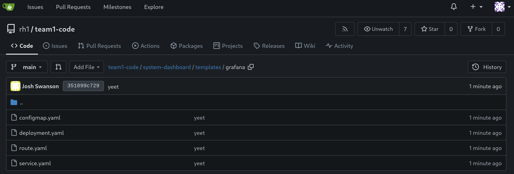

# Workshop Exercise 2.3 - Setting up Grafana

## Table of Contents

* [Objective](#objective)
* [Step 1 - Introduction to Grafana](#step-1---introduction-to-grafana)
* [Step 2 - Creating a ConfigMap](#step-2---creating-a-configmap)
* [Step 3 - Creating a Deployment](#step-3---creating-a-deployment)
* [Step 4 - Adding a Service](#step-4---adding-a-service)
* [Step 5 - Adding a Route](#step-5---adding-a-route)
* [Step 6 - Save and Commit Code](#step-6---save-and-commit-code)

## Objective

* Get a brief introduction to grafana
* Setup a configuration for grafana
* Create deployment resources for an instance of grafana

## Step 1 - Introduction to Grafana
Grafana is a visualization tool that can gather data from multiple sources and display it on dashboards. What makes it powerful is the flexibility of the system-dashboards themeselves, along with the ability to combine different types of data on a single system-dashboard.

Wer're going to have grafana pull metrics our of our instance of prometheus, allowing us to craft a dashbaord that can be used to monitor the system.

## Step 2 - Creating a ConfigMap
To setup grafana with some base configuration for our datasource from promtheus and to set the initial login credentials, we'll need a configmap.

Similar to earlier exercises, create a new directory named `grafana` within our chart's templates directory `templates/`, then add a file into the `grafana` directory named `configmap.yaml` with the following contents:
```yaml
---
apiVersion: v1
kind: ConfigMap
metadata:
  name: grafana-config
  labels:
    app.kubernetes.io/name: grafana
    app.kubernetes.io/part-of: system-dashboard
data:
  GF_SECURITY_ADMIN_USER: PICKAUSERNAME
  GF_SECURITY_ADMIN_PASSWORD: PICKAPASSWORD
  GF_DEFAULT_THEME: light
---
apiVersion: v1
kind: ConfigMap
metadata:
  name: datasource-config
  labels:
    app.kubernetes.io/name: grafana
    app.kubernetes.io/part-of: system-dashboard
data:
  prometheus.yml: |
    ---
    apiVersion: 1
    deleteDatasources:
      - name: Prometheus
        orgId: 1
    datasources:
      - name: Prometheus
        type: prometheus
        access: proxy
        orgId: 1
        url: http://prometheus:9090
        isDefault: true
        version: 1
        editable: true
```

> Note:
>
> Be sure to replace the username and password values with something memorable.

These two configmaps will set the initial credentials, as well as set up our instances of prometheus as a datasource.

## Step 3 - Creating a Deployment
Next, we'll want a deployment for grafana. Within the `templates/grafana/` directory, add a new file named `deployment.yaml` with the following contents:
```yaml
---
apiVersion: apps/v1
kind: Deployment
metadata:
  name: grafana-deployment
  labels:
    app.kubernetes.io/name: grafana
    app.kubernetes.io/part-of: system-dashboard
spec:
  replicas: 1
  selector:
    matchLabels:
      app.kubernetes.io/name: grafana
  template:
    metadata:
      labels:
        app.kubernetes.io/name: grafana
        app.kubernetes.io/part-of: system-dashboard
    spec:
      containers:
      - name: grafana
        image: grafana/grafana-enterprise
        resources:
          limits:
            memory: 256Mi
            cpu: 500m
        ports:
          - name: port-3000
            containerPort: 3000
        envFrom:
          - configMapRef:
              name: grafana-config
        volumeMounts:
          - name: datasource-config
            mountPath: /etc/grafana/provisioning/datasources
            readOnly: true
      volumes:
      - name: datasource-config
        configMap:
          name: datasource-config
```

Within this deployment, our configmap will be mounted into the container where grafana will read it in on startup.

## Step 4 - Adding a Service
Now, to enable communication with grafana, we'll create a service. Create a new file named `service.yaml` within the `templates/grafana` directory with the following contents:

```yaml
---
apiVersion: v1
kind: Service
metadata:
  name: grafana
  labels:
    app.kubernetes.io/name: grafana
    app.kubernetes.io/part-of: system-dashboard
spec:
  selector:
    app.kubernetes.io/name: grafana
  ports:
    - protocol: TCP
      port: 3000
      targetPort: 3000
```

The `.spec.selector` field ensures the service will attach to the correct pods.

## Step 5 - Adding a Route
Since we'll want to interact directory with Grafana, we'll need a route to expose it from outside the cluster.

Add a new file named `route.yaml` to the `templates/grafana/` directory with the following content:
```yaml
---
kind: Route
apiVersion: route.openshift.io/v1
metadata:
  name: grafana
  labels:
    app.kubernetes.io/name: grafana
    app.kubernetes.io/part-of: system-dashboard
spec:
  to:
    kind: Service
    name: grafana
  port:
    targetPort: 3000
  tls:
    termination: edge
```

## Step 6 - Save and Commit Code

Ensure you've saved your edits if using the Gitea web interface, or committed/pushed if using an IDE.



---
**Navigation**

[Previous Exercise](../2.2-setup-prometheus/) | [Next Exercise](../3.1-adding-chart-to-argocd/)

[Click here to return to the Workshop Homepage](../../README.md)
