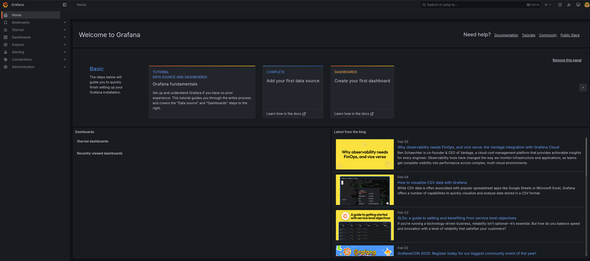

# Workshop Exercise 3.2 - Investigating Resources

## Table of Contents

* [Objective](#objective)
* [Step 1 - Investigating Blackbox Exporter](#step-1---investigating-blackbox-exporter)
* [Step 2 - Investigating Prometheus](#step-2---investigating-prometheus)
* [Step 3 - Investigating Grafana](#step-3---investigating-grafana)

## Objective

* Ensure the system-dashboard components are available
* Ensure access to the grafana WebUI

## Step 1 - Investigating Blackbox Exporter
To confirm blackbox exporter was deployed correctly, return to the OpenShift Web Console, and navigate to **Networking** > **Routes**. Take note of the routes for blackbox exporter, prometheus, and grafana.

Click on the Blackbox Exporter route, and you should be taken to a simple web UI that's tracking what metrics are being gathered:

Since this is just a tool within our stack, we won't need to interact with it further.

## Step 2 - Investigating Prometheus
Back on the **Routes** page, select the prometheus route, and confirm the web UI is accessable:

Feel free to investigate the metrics by using the search bar at the top.

We'll be using Grafana to visualize the metrics, so there's no need to leverage the graph functionality in this web interface.

## Step 3 - Investigating Grafana
Back on the **Routes** page, select the grafana route, and ensure you're greeted with a login page:

Enter the credentials you specified earlier in the `grafana-config` configmap, at which point you should be greeted with the Grafana welcome page:

Lastly, confirm that the prometheus datasource has been automatically configured by navigating to **Connections** > **Data Sources**:

Assuming everything is correct, we're now ready to start building a dashboard.

---
**Navigation**

[Pervious Exercise](../3.1-adding-chart-to-argocd/)  [Next Exercise](../4.1-dashboard-design/)

[Click here to return to the Workshop Homepage](../../README.md)
