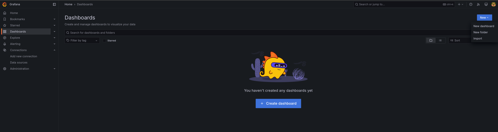
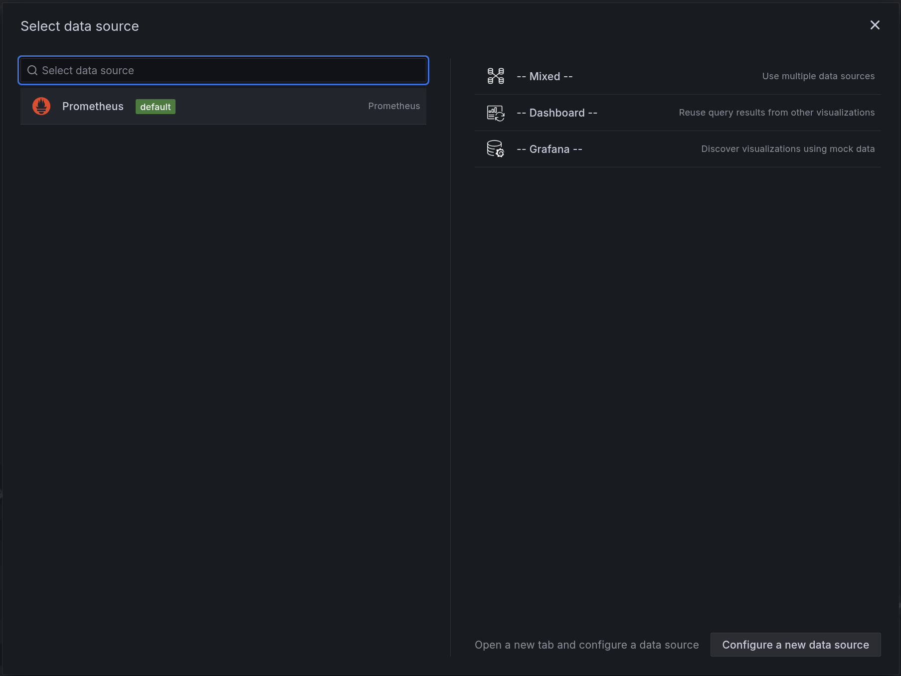
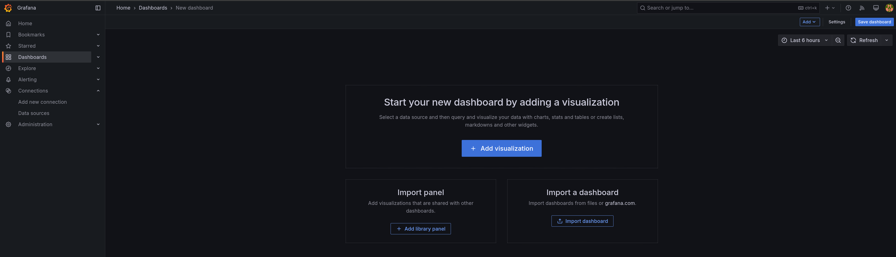
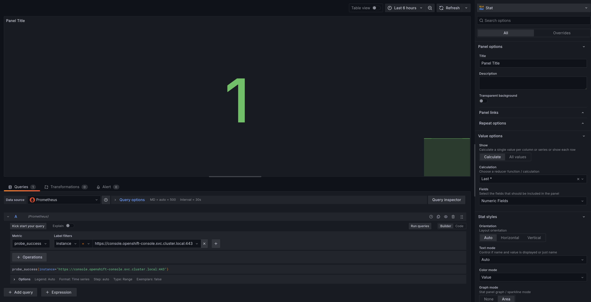
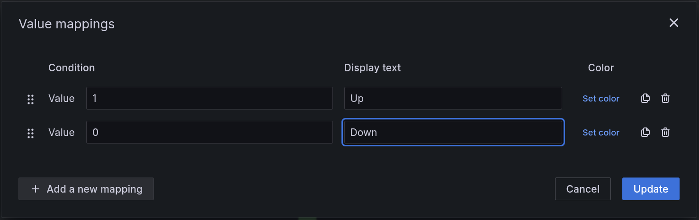
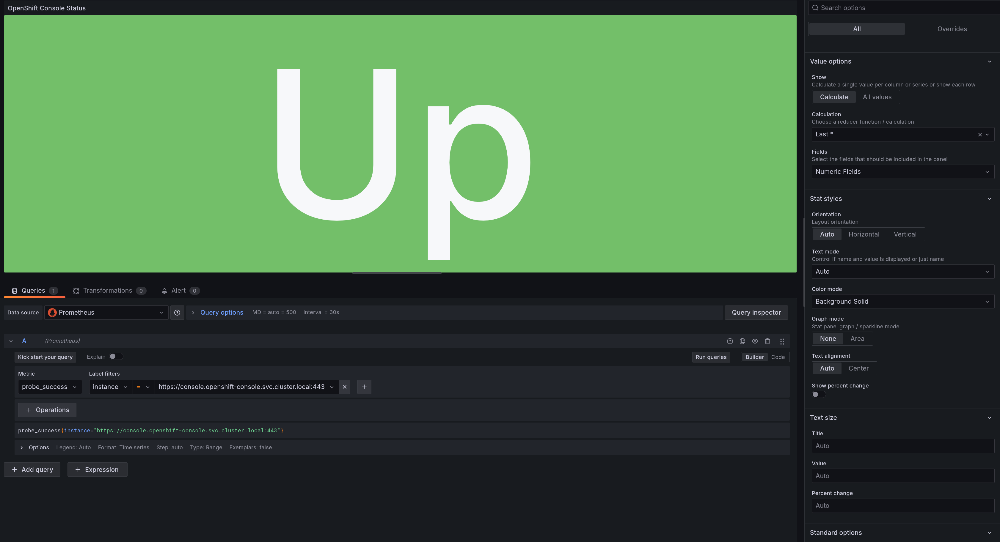
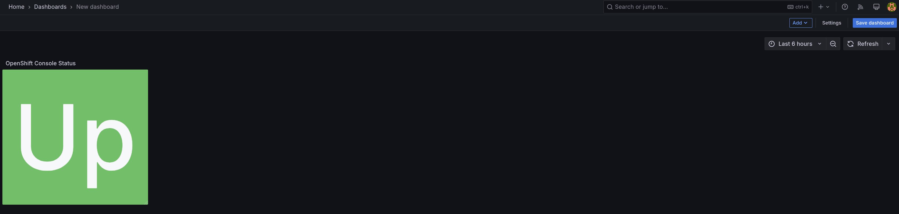
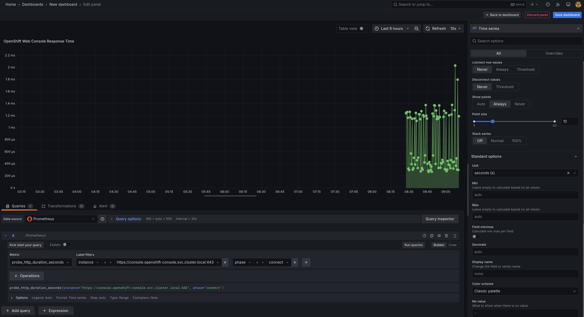
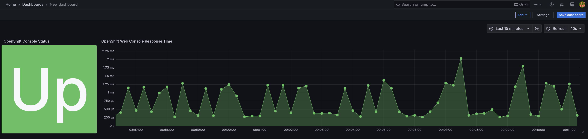
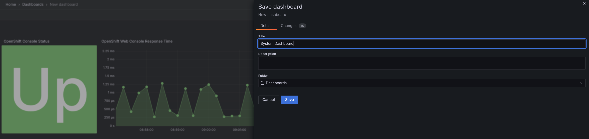

# Workshop Exercise 4.1 - Dashboard Design

## Table of Contents

* [Objective](#objective)
* [Step 1 - Investigating Blackbox Exporter](#step-1---investigating-blackbox-exporter)
* [Step 2 - Investigating Prometheus](#step-2---investigating-prometheus)
* [Step 3 - Investigating Grafana](#step-3---investigating-grafana)

## Objective

* Begin building the system dashboard
* Encourage collaboration with team

## Step 1 - Creating a New Dashboard
With our stack ready to go, we can now start building a dashboard to display metrics about our system.

In the Grafana webUI, click on **Dashboards** and then the `+ Create Dashboard` button in the middle of the screen.


In the pop-up window, select `Prometheus` as the primary data source for the dashboard.


This will create a new dashboard.

## Step 2 - Up-Down Panels
On the new dashbaord, select the `+ Add Visualization` button to begin building a panel for the dashboard.



A common panel for dashboard is a simple Up/Down panel, which is built off the `probe_success` metric.

In the top left corner, change the panel type to `Stat`, then fill in the first query with:

`probe_success{instance="https://console.openshift-console.svc.cluster.local:443"}`

Remember - Prometheus metrics are key:value pairs with tags, so to find the metrics for a specific instance, such as the OpenShift web console, add a filter with the key:value pair of `instance:https://console-openshift-console.svc.cluster.local:443`

Hit rhe `Run Queries` button to see the latest value for your query:


Now, we can map our values to 'Up' and 'Down' using a value mapping. In the right-hand menu, scroll down to the `Value mappings` section and edit the value mappings:


Feel free to play around with other options in the right-hand menu until the panel has a look/feel you like. Here's an example:


When finished, select the `Back to Dashboard` button at the top right. Resize your panel as you'd like, then save your dashboard with the `Save dashboard` button.



## Step 3 - Time Series Data
Another common panel on a dashboard is displaying time-series data, such as response times. Add a new panel of type `Time series`, with the following query:
```
probe_http_duration_seconds{instance="https://console.openshift-console.svc.cluster.local:443", phase="connect"}
```

Feel free to modify options in the right hand panel, however it is recommended to set the unit to **Time (seconds)**.

For example:


Once complete, return to the dashboard, resize the panel to your liking, and save your dashboard.

## Step 4 - Collaborate with your Team
Continue to build out the dashboard according to your and your team's preferences. There is no set right or wrong here - feel free to experiment and modify as you'd like.



The `Kick start your query` fuction in grafana can help you discover metrics and get them displayed on a panel.

Once done editing, ensure you save your dashboard.



---
**Navigation**

[Pervious Exercise](../3.2-investigate-resources/)  [Next Exercise](../4.2-exporting-dashboards/)

[Click here to return to the Workshop Homepage](../../README.md)
