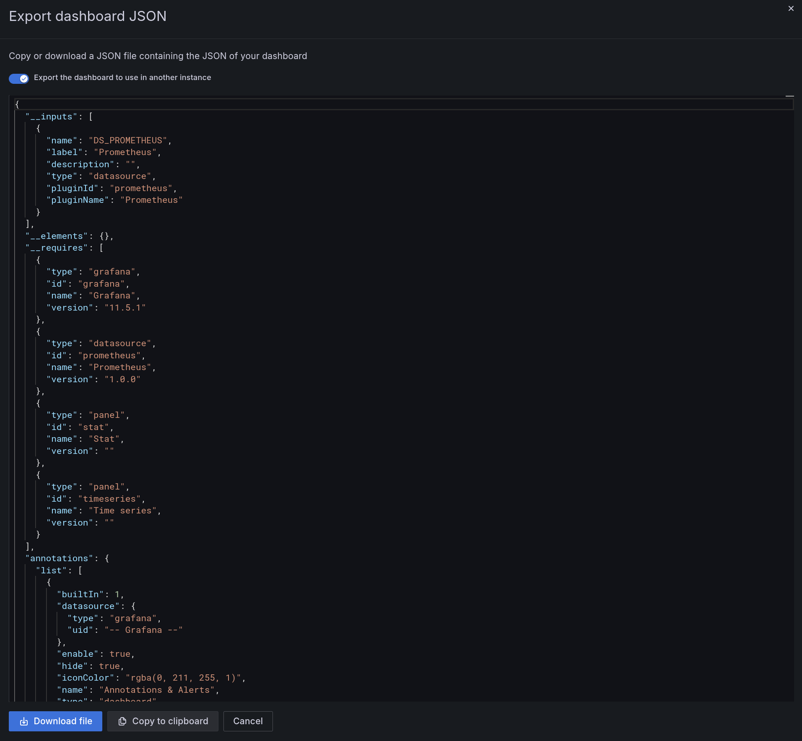
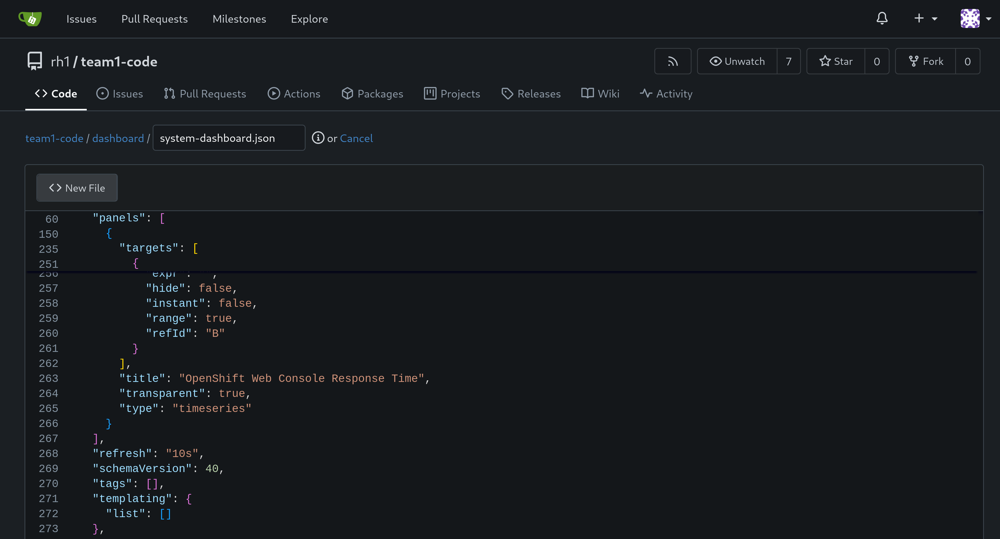
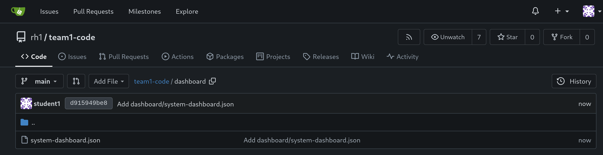

# Workshop Exercise 4.2 - Exporting Dashboards

## Table of Contents

* [Objective](#objective)
* [Step 1 - Exporting your Dashboard](#step-1---exporting-your-dashboard)
* [Step 2 - Committing your Dashboard](#step-2---committing-your-dashboard)

## Objective

* Export your dashboard to json
* Store the dashboard in your code repo

## Step 1 - Exporting your Dashboard
The last step is to capture your dashboard as JSON so it's portable.

In the Grafana web UI, click on the **Export** button in the top right corner, then select **Export as JSON**. Ensure the `Export the dashboard to use in another instance` is toggled on, then copy the JSON out of the window.

## Step 2 - Committing your Dashboard

Finally, create a new directory in your code repository named `dashboard`, then a new file named `system-dashboard.json`, and enter the contents from the Grafana window:

Be sure to hit **Save**, or commit/push if using an IDE.

---
**Navigation**

[Previous Exercise](../4.1-dashboard-design/)

[Click here to return to the Workshop Homepage](../../README.md)
