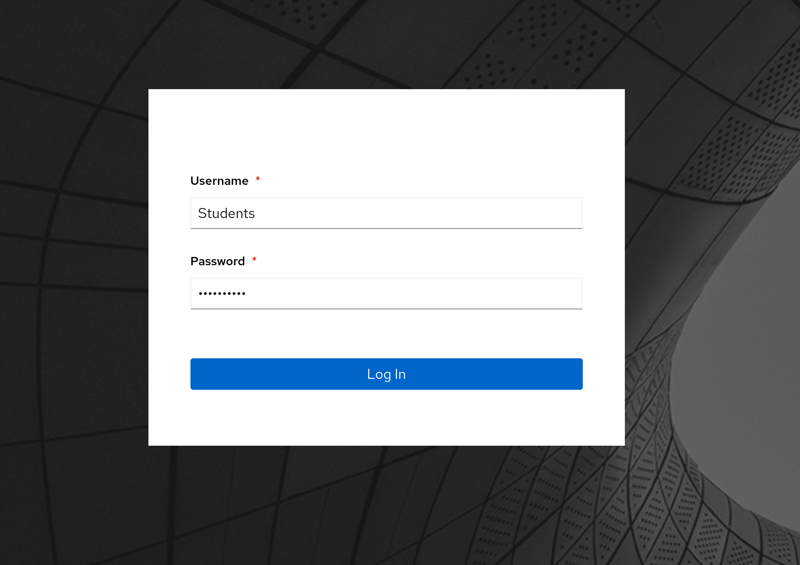
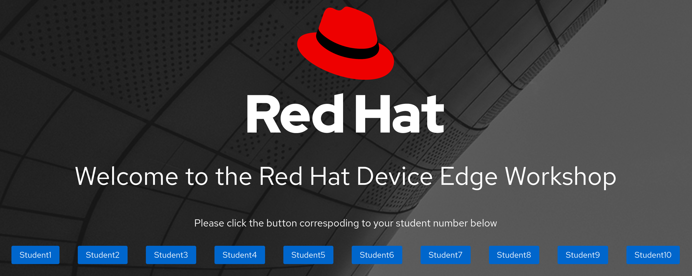
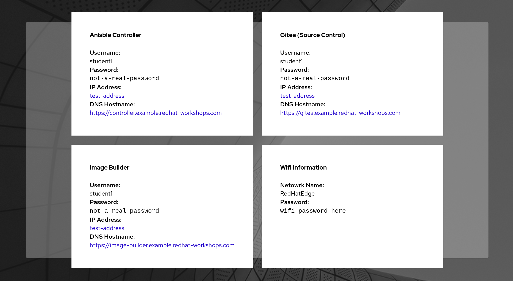

# Workshop Exercise 1.2 - Accessing the Student Pages

## Table of Contents

* [Objective](#objective)
* [Step 1 - Accessing the Student Pages](#step-1---accessing-the-student-pages)
* [Step 2 - Logging In to the Student Pages](#step-2---logging-in-to-the-student-pages)
* [Step 3 - Selecting your Student Page](#step-3---selecting-your-student-page)
* [Step 4 - Investigating Available Links](#step-4---investigating-available-links)

## Objective

In this exercise, we are going to access the student pages provisioned for this workshop.

### Step 1 - Accessing the Student Pages

Your instructor will be providing access to the student pages. This url should be displayed throughout the workshop. Should it not be readily available, let your instructor know.

### Step 2 - Logging In to the Student Pages

Upon accessing the URL, a login page will greet you. The username and password fields will be pre-populated. The username of `Students` is correct, however the password will need to be entered correctly. Your instructor should be displaying the password throughout the workshop.

### Step 3 - Selecting your Student Page

Once logged in, a selection of student pages will be available. Your instructor will assign you a number that corresponds to the student page to leverage throughout the workshop. The URLs may be specific to you, so ensure you've selected the correct student page.

### Step 4 - Investigating Available Links

On your student page, you'll find useful links, logins, and general information about the workshop environment. As you progress through the workshop, some exercises may ask you to leverage information from this student page, so it's recommended to keep it up in a tab in your browser.

> Note:
>
> This is a generic screenshot, your information will be different.

---
**Navigation**

[Previous Excercise](../1.1-preflight/) | [Next Exercise](../1.3-edge-device-intro)

[Click here to return to the Workshop Homepage](../README.md)
