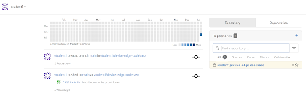

# Workshop Exercise 1.6 - Gitea Source Control Introduction

## Table of Contents

* [Objective](#objective)
* [Step 1 - Logging In](#step-1---logging-in)
* [Step 2 - The Gitea Dasbhoard](#step-2---the-gitea-dashboard)
* [Step 3 - The Device Edge Codebase Repo](#step-3---the-device-edge-codebase-repo)

## Objective

In this exercise, we are going to get logged into Gitea and explore the content of your instance.

This exercise will cover:

* Logging into Gitea
* Exploring the pre-populated repo

### Step 1 - Logging In

We'll be using Gitea, a lightweight and open source git service to store the code we'll create in this workshop. Gitea has been pre-deployed and pre-populated, and is accessable via the URL provided on your student page.

After entering the URL in a browser, you will be greeted with the Gitea login page. To log in, the username will be "student$(your_student_number)", such as `student1`, and the password located on your student page.

 
### Step 2 - The Gitea Dashboard

Gitea features a lightweight dashboard that shows an activity stream and lists your repos on the right hand side. There should be information about the workshop provisioner creating and performing an initial push of some code:

### Step 3 - The Device Edge Codebase Repo

On the right-hand side of the Gitea dashboard is a link to a repository called `device-edge-codebase` which will be used to contain code for this workshop. Take a look at the pre-populated playbook in the `playbooks/` directory, and take note of the http(s)/git addresses used to push and pull from this repository in the top right of the repository landing page.

> **Note**
>
> If you are not comfortable with git, feel free to use Gitea's web interface to add and modify files without needing to use a CLI or IDE.

---
**Navigation**

[Previous Excercise](../1.5-controller-intro/) | [Next Exercise](../1.7-ocp-login)

[Click here to return to the Workshop Homepage](../README.md)
