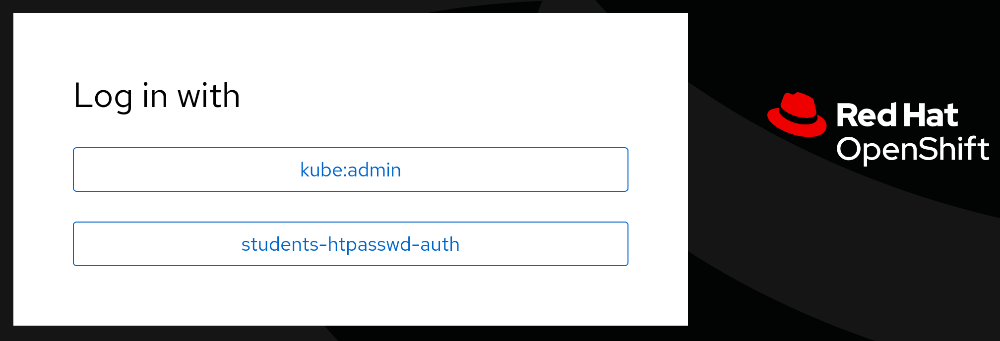
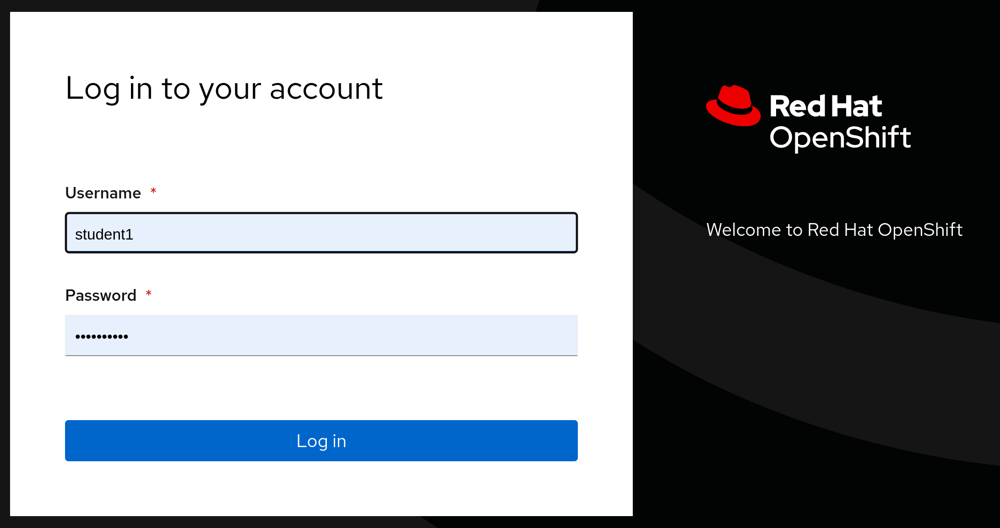
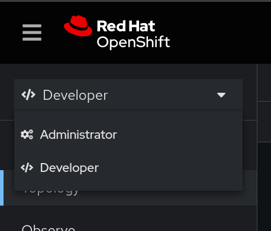
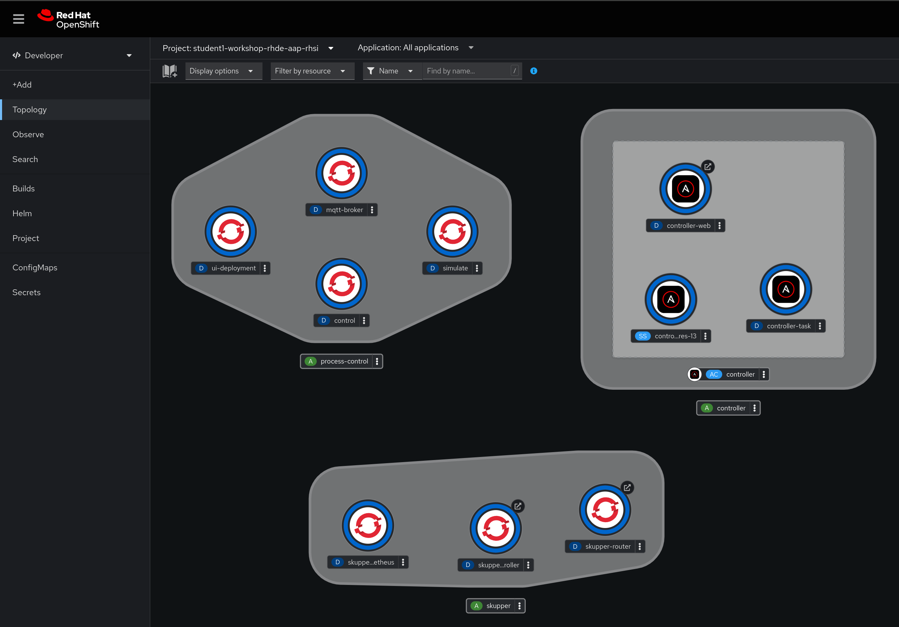
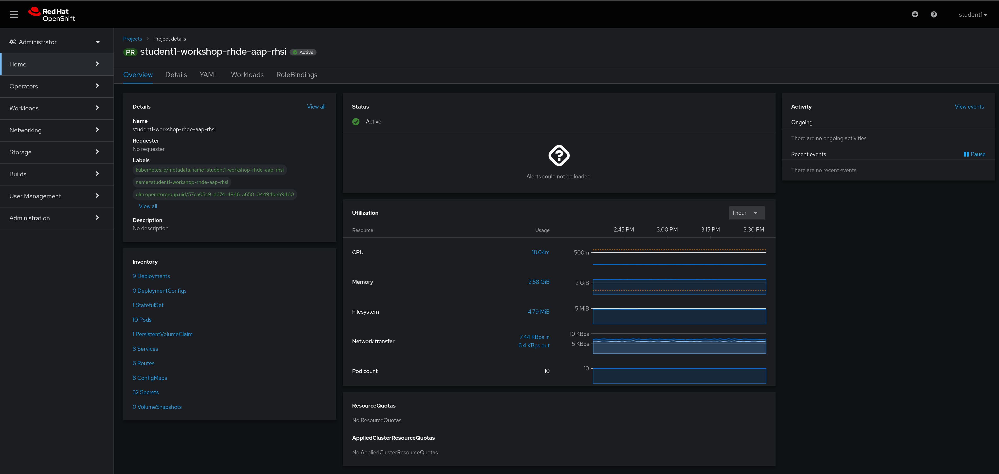

# Workshop Exercise 1.8 - Getting Logged In to OpenShift

## Table of Contents

* [Objective](#objective)
* [Step 1 - Authenticating to the Cluster](#step-1---reviewing-the-code-repo-location)
* [Step 2 - Investigating the Console](#step-2---cloning-your-code-repo)

## Objective

In this exercise, we are going to get logged in to the OpenShift console. While it's preferred to interact with OpenShift over the API, the console gives us a quick glance into what applications we have deployed, their components, and even lets us add and modify if desired.

Feel free to use the console throughout this workshop. In addition, the `oc` command is available on your edge device, and is available for a wide array of operating systems if you'd like to use your personal device.

### Step 1 - Authenticating to the Cluster

The web console link for OpenShift can be found on your student page. Once entered into a web browser, you'll be greeted with the option to choose an authentication source:

For this workshop, select `students-htpassword-auth`.

On the next screen, enter the login information from your student page. For example:

Once your information is entered, click on the `Log in` button.

### Step 2 - Investigating the Console

Once logged in, you'll be dropped into a namespace created specifically for you. This namespace will already have some workloads running, and is isolated away from the other students in the workshop. In addition, you've been granted permission to deploy new workloads into this namespace.

There are two main views for the web console: Developer and Administrator. To change views, use the dropdown menu in the top left corner of the console:

The developer view is focused on what applications are currently running, and includes menu options for deploying more applications:

Conversely, the administrator view is more infrastructure and operations focused, with a dashboard that tracks things like resource utilization and events:

Remember: you'll only see resource utilization and information for your namespace, not for the entire cluster.

---
**Navigation**

[Previous Exercise](../1.7-coding-intro/) | [Next Exercise](../1.9-rhsi-console-intro/)

[Click here to return to the Workshop Homepage](../README.md)
