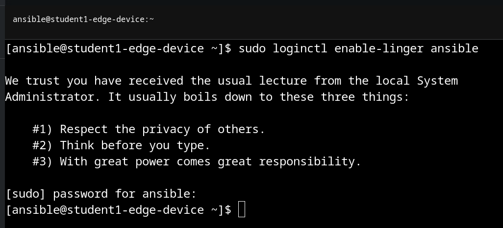
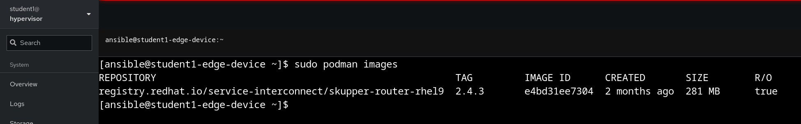
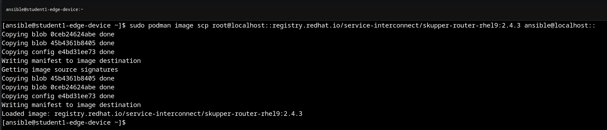

# Workshop Exercise 2.2 - Setup for RHSI

## Table of Contents

* [Objective](#objective)
* [Step 1 - Enable Lingering for our User Account](#step-1---reviewing-the-code-repo-location)
* [Step 2 - Copy the RHSI Image to our User Account](#step-2---cloning-your-code-repo)

## Objective

In this exercise, we're going to perform a few setup tasks needed to prepare for RHSI startup.

In a production environment, it'd be recommended to either include these tasks as part of the provisioning workflow, or handle them through automation. We're completing them here manually for eduational purposes.

### Step 1 - Enable Lingering for our User Account

To allow non-root containers to run after a session has been closed, lingering must be enabled for that user. 

To enable it for our user, we'll use `loginctl`:
```
sudo loginctl enable-linger $(YOUR-USER-HERE)
```

If prompted to authenticate, use the password provided on your student page.



### Step 2 - Copy the RHSI Image to our User

To save on bandwidth, the RHSI router image has been built into our RHDE image, and is available under the `root` user:



To copy the image over to our user, we'll use the `podman scp` command. For reference on copying images without a registry, this [blog post](https://www.redhat.com/sysadmin/podman-transfer-container-images-without-registry) can be used.

For our purposes, the command will look like the below:



Here is the command: 
```
sudo podman image scp root@localhost::registry.redhat.io/service-interconnect/skupper-router-rhel9:2.4.3 ansible@localhost::
```

Once complete, the image should now be available under our user:


---
**Navigation**

[Previous Exercise](../2.1-ocp-auth/) | [Next Exercise](../2.3-link-rhsi/)

[Click here to return to the Workshop Homepage](../README.md)
