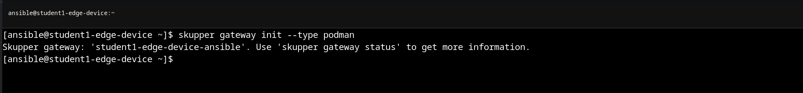
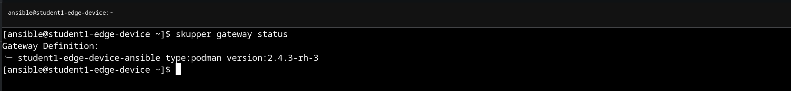
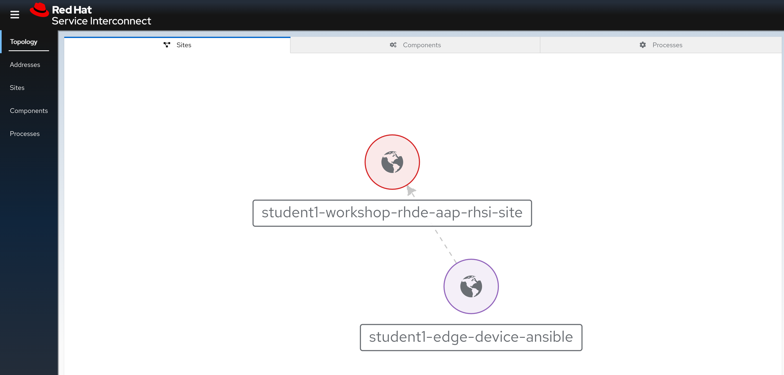

# Workshop Exercise 2.3 - Link RHSI Back to Cluster

## Table of Contents

* [Objective](#objective)
* [Step 1 - Create Local Router Linked to Cluster](#step-1---reviewing-the-code-repo-location)
* [Step 2 - Validate Link](#step-2---cloning-your-code-repo)

## Objective

In this exercise, we're going to link our edge devices back to the RHSI instance on our OpenShift cluster in AWS. This is done by deploying a local router on the edge device, using the image copied previously.

> Note:
>
> The RHSI (skupper) CLI tooling has been built into our RHDE image as part of the workshop provisioning.

### Step 1 - Create Local Router Linked to Cluster

To link RHSI on our edge device back to RHSI on the OpenShift cluster, we need to create a local router. The RHSI CLI tooling will handle this for us with the following command: `skupper gateway init --type podman`

This command may take a moment to complete.

> Note:
>
> RHSI uses context and authentication information saved on the local system from the `oc` tool, which is how it knew what cluster to contact, what endpoints to use, and what workspace on the cluster that RHSI was deployed into. In this setup, RHSI is actually deployed into every student's workspace, providing for isolation of services and traffic.

### Step 2 - Validate Link

Once the command in the previous step completes, RHSI on the edge device is linked back to RHSI on the edge device. There are a few ways to confirm this.

First, we can get the router status from the CLI tooling on the edge device:

In addition, we can confirm in the RHSI web console, on the `Sites` tab:

> Note:
>
> Since we instantiated the connection _from_ our edge device, the arrow should point from the site corresponding to our edge device back RHSI on the OpenShift cluster.

---
**Navigation**

[Previous Exercise](../2.1-ocp-auth/) | [Next Exercise](../2.3-link-rhsi/)

[Click here to return to the Workshop Homepage](../README.md)
