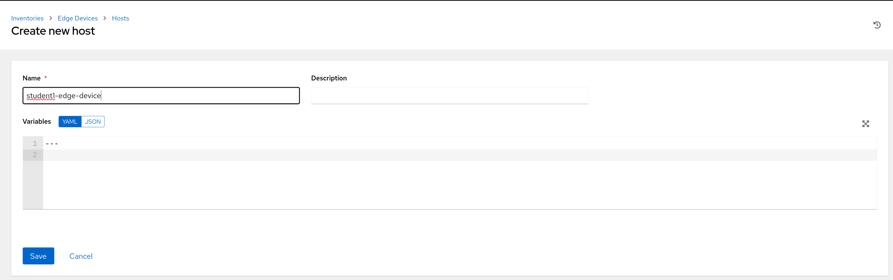
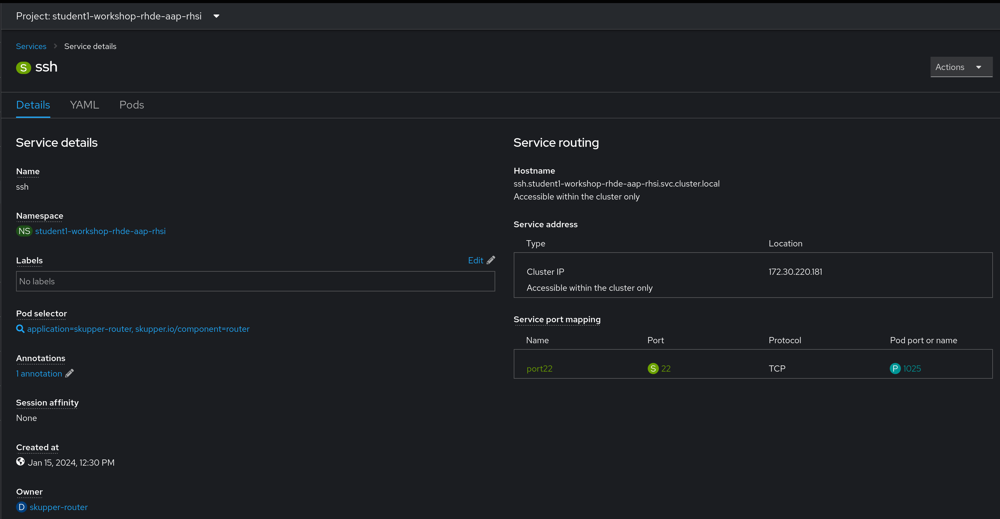
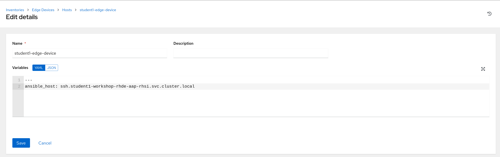

# Workshop Exercise 2.5 - Creating a Host in Controller

## Table of Contents

* [Objective](#objective)
* [Step 1 - Creating a Host in Ansible Controller](#step-1---creating-a-host-in-ansible-controller)
* [Step 2 - Setting the Appropriate Vars](#step-2---setting-the-appropriate-vars)

## Objective

In this exercise, we're going to create a host entry in Ansible Controller for our edge device. Instead of pointing to a specific IP address or hostname, we'll leverage the ssh service that we created using the RHSI CLI.

For a refresher on how to access Ansible Controller, review [exercise 1.5](../1.5-controller-intro/).

### Step 1 - Creating a Host in Ansible Controller

Access the web interface of Ansible Controller, and navigate to Resources > Inventories, where two inventories have been pre-populated. Select the `Edge Devices` inventory, and on the `Hosts` tab, click `Add`.

Give the host a descriptive name, such as: `student$(YOUR-STUDENT-NUMBER)-edge-device`. When complete, hit the `Save` button.



### Step 2 - Setting the Appropriate Vars

By default, Controller will attempt to resolve the name of the host and connect to the resolved IP address. Normally, that would be a sane way to contact hosts, however our connectivity is run through RHSI.

To force controller to establish a connection over the RHSI link, we'll need to grab the service DNS name from OpenShift:



The `Hostname` under `Service routing` on the right hand side is the information we need. Copy this to your clipboard.

Now, back in Ansible Controller, the `Host details` page for our newly created host should be displayed. Select the `Edit` button, and in the `Variables` box, enter the following information:
```yaml
---
ansible_host: PASTE-IN-SERVICE-HOSTNAME
```

For example:



Click `Save` when done.

A few notes:
1. `ansible_host` is a "magic" variable that Ansible uses as what to connect to. When this isn't defined, it attempts to resolve the name of the host, or in ansible vars: `inventory_host`.
2. Since Ansible Controller is deployed in the same namespace as the service created by RHSI, the execution environment container will be able to resolve what we've entered for the variable and make the appropriate connection.

---
**Navigation**

[Previous Exercise](../2.4/expose-ssh-cockpit/) | [Next Exercise](../2.6-test-connectivity/)

[Click here to return to the Workshop Homepage](../README.md)
