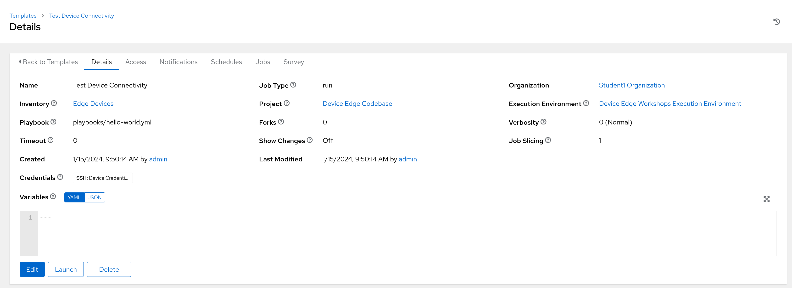
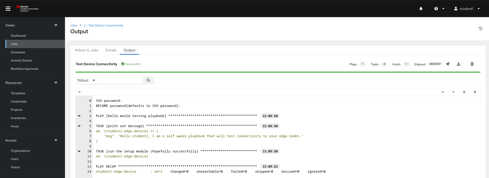
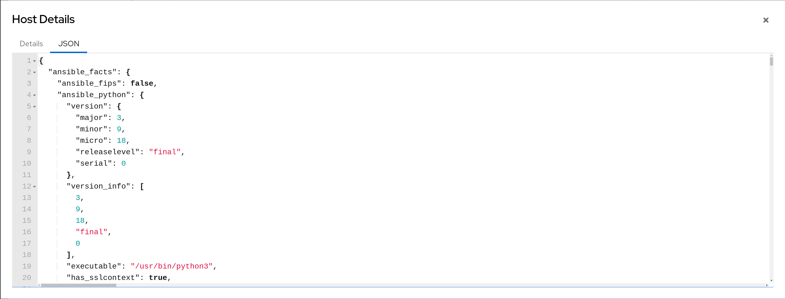
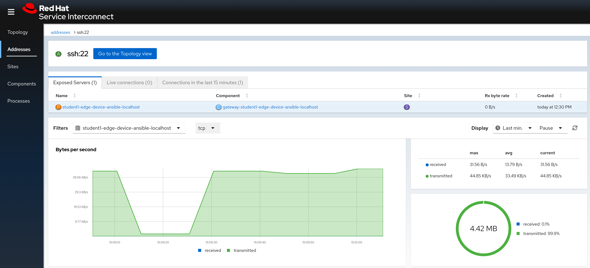

# Workshop Exercise 2.6 - Test Edge Device Connectivity

## Table of Contents

* [Objective](#objective)
* [Step 1 - Running the Test Device Connectivity Job Template](#step-1---running-the-test-device-connectivity-job-template)
* [Step 2 - Reviewing the Job Output](#step-2---reviewing-the-job-output)
* [Step 3 - Confirming in the RHSI Web Interface](#step-3---confirming-in-the-rhsi-web-interface)

## Objective

In this exercise, we'll validate that the configuration we've done so far is correct, and that our edge devices are now accessible from within our namespace in OpenShift.

Should everything work as expected, the edge devices will now be managable using Ansible, providing a consistent experience, even though we can't directly SSH to the systems.

### Step 1 - Running the Test Device Connectivity Job Template

In the Ansible Controller webUI, navigate to Resources > Templates. A job template has been pre-provisioned for you named `Test Device Connectivity`.

This job template is pointed at the `Edge Devices` inventory, where we added our edge host, and has a set of machine credentials that will allow authentication to the device. In addition, it's set to use the `hello-world.yml` playbook in our code repository, which simply runs the setup module against the target systems.

There's no need to modify this job template, simply hit the `Launch` button.

### Step 2 - Reviewing the Job Output

Normally, Controller will automatically direct you to the output page of a job after hitting `Launch` on a job template. If it does not, navigate to Views > Jobs in the web interface, and select the job named `Test Device Connectivity`.

Here, the job should have been successful, with an output similar to:

Clicking on the line under the `Run the setup module` task header will expose more information about the specific task. On the `JSON` tab, the ansible facts should be displayed in json format:

If the job template ran successfully, then the host can be contacted by Ansible Controller and is ready for management.

### Step 3 - Confirming in the RHSI Web Interface

As an extra layer of confirmation, we can revisit the RHSI web interface and look at the details of the ssh service we created earlier. After the job has run and complete, we should have some traffic statistics:

---
**Navigation**

[Previous Exercise](../2.5-controller-host/) | [Next Exercise](../3.1-containerized-app-automation/)

[Click here to return to the Workshop Homepage](../README.md)
