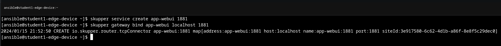
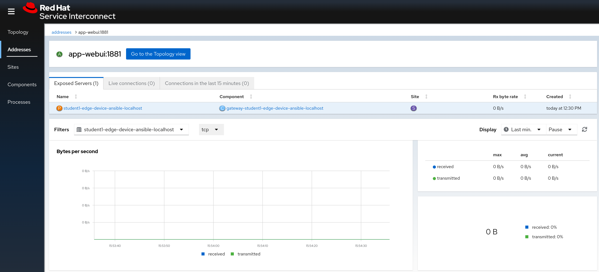
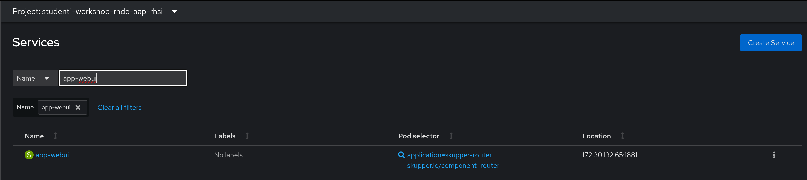

# Workshop Exercise 4.1 - Exposing the Web Interface via RHSI

## Table of Contents

* [Objective](#objective)
* [Step 1 - Exposing the Application Web Interface](#step-1---exposing-the-application-web-interface)
* [Step 2 - Confirming in the Web Consoles](#step-2---confirming-in-the-web-consoles)

## Objective

Previously, we exposed SSH and (optionally) the Cockpit web interface via RHSI into our namespace. We're going to do the exact same thing here, with the only difference being what we're exposing. As opposed to SSH, we're going to expose the web interface of our newly deployed application.

### Step 1 - Exposing the Application Web Interface

Return to the edge device console, and run the following commands:
```
skupper service create app-webui 1881
skupper gateway bind app-webui localhost 1881
```



### Step 2 - Confirming in the Web Consoles

We can confirm the service was exposed both in the RHSI web console, and under the `services` tab of the OpenShift web console Administrator view:





---
**Navigation**

[Previous Exercise](../3.2-deploying-the-app/) | [Next Exercise](../4.2-create-route-for-app-webui/)

[Click here to return to the Workshop Homepage](../README.md)
