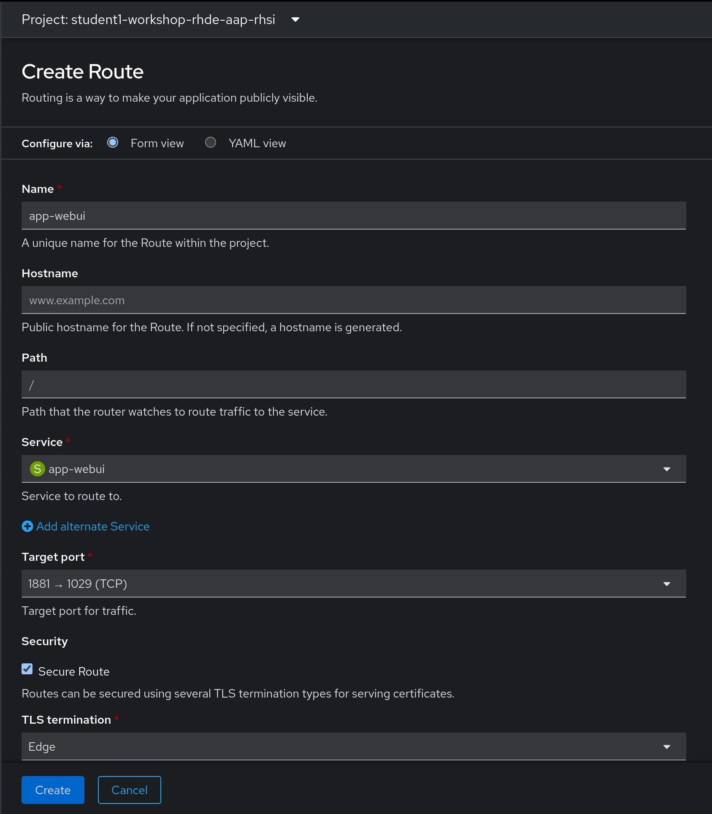
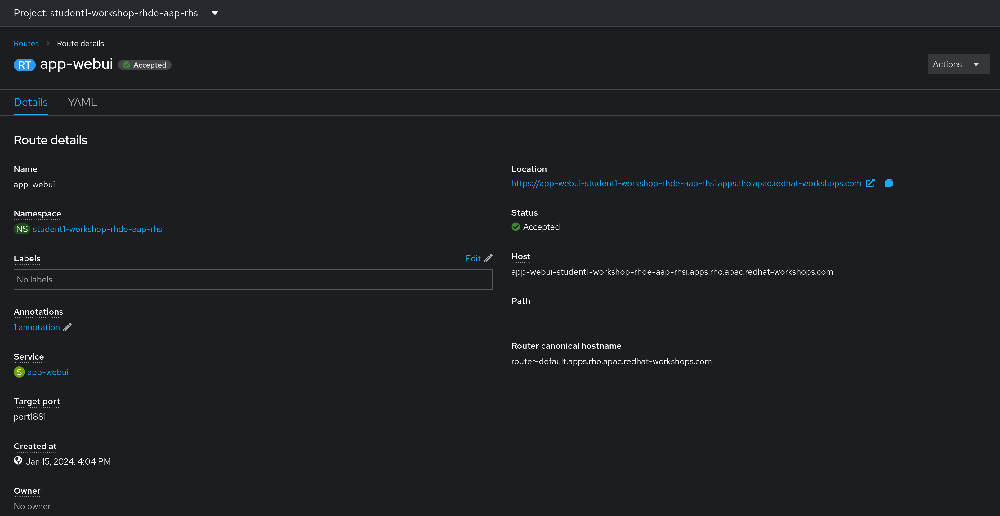
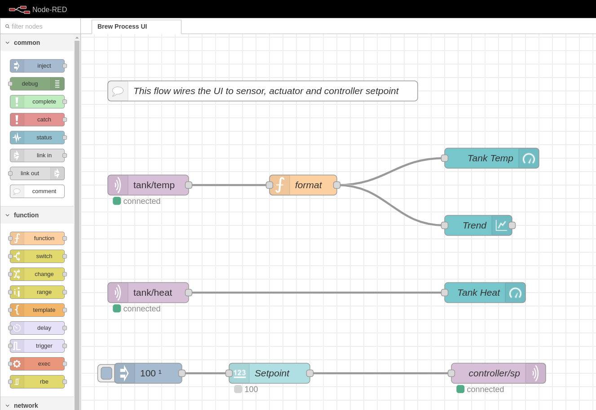
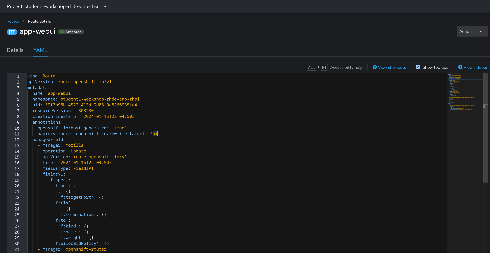
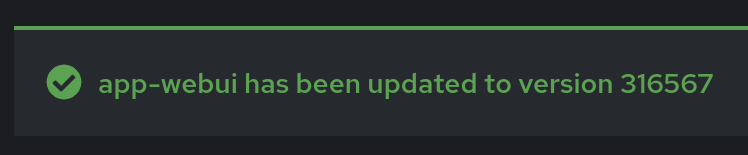
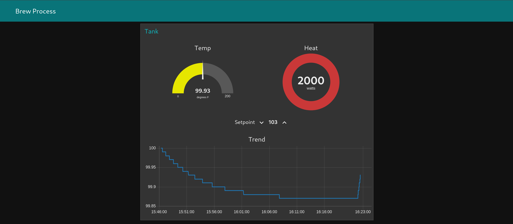

# Workshop Exercise 4.2 - Creating a Route for External Access

## Table of Contents

* [Objective](#objective)
* [Step 1 - Creating a Route](#step-1---creating-a-route)
* [Step 2 - Validating Connectivity](#step-2---validating-connectivity)
* [Step 3 - Adjusting the Route](#step-3---adjusting-the-route)

## Objective

To allow consumption of the application running on the edge device, we can create a route in OpenShift that will leverage the normal ingress then route to the edge devices.

Remember: our applications are running on edge devices outside of the cluster, so latency will be higher than if the application was deployed in the cluster, however we don't need any special network configuration or access rules: we simply need to be able to talk to OpenShift.

### Step 1 - Creating a Route

Return to the OpenShift console, and under the Administration view, navigate to Networking > Routes, and click on the `Create Route` button in the top right corner.

Enter the following information in the form:



Or, if you prefer the straight yaml route:
```yaml
kind: Route
apiVersion: route.openshift.io/v1
metadata:
  name: app-webui
  namespace: student1-workshop-rhde-aap-rhsi
spec:
  host: app-webui-student1-workshop-rhde-aap-rhsi.apps.rho.apac.redhat-workshops.com
  to:
    kind: Service
    name: app-webui
    weight: 100
  port:
    targetPort: port1881
  tls:
    termination: edge
```

> Note:
>
> The yaml above is an example, modify with information from your student pages.

### Step 2 - Validating Connectivity

To confirm everything is working as expected, click on the link under `Location` on the route details page:



Assuming connectivity is working, you will be greeted with this page:



Hey, what gives? This isn't the same web interface as the sample application deployed to our namespace...

### Step 3 - Adjusting the Route

The sample process control application deployment is using an [advanced configuration of a route](https://docs.openshift.com/container-platform/4.14/networking/routes/route-configuration.html#nw-route-specific-annotations_route-configuration) to rewrite the incoming URLs, directing them to the actual webUI instead of the node-RED webUI that shows flows.

This same functionality will work here, even though the backend is running on a remote edge device outside of the cluster, however we'll need to modify the route's yaml to achieve the desired outcome:

From the route details page, click on the `YAML` tab to begin editing the route.



Under `metadata.annotations`, add the following:
```yaml
    haproxy.router.openshift.io/rewrite-target: /ui
```

Ensure your indentation is correct, then click the `Save` button at the bottom of the page. If your yaml is correct, you'll recieve a green check with a note saying the route has been updated to a new version:



> Note:
>
> Your version number will probably be different, this is just an example.

Return to the details page and click on the URL under the `Location` header to test the route again, this time being greeted by the expected web interface for the application:



---
**Navigation**

[Previous Exercise](../4.1-expose-app-webui/)

[Click here to return to the Workshop Homepage](../README.md)
