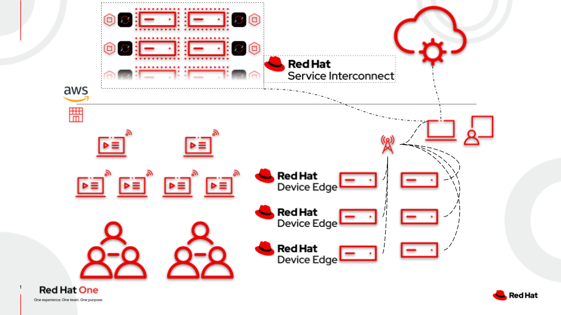

# Red Hat Device Edge Workshop - Using RHSI in Challenging Networks

This workshop focuses on leveraging Red Hat Service Interconnect to handle connectivity in challenging networks, such as ones that do not allow connections that originate from outside the network, or where NAT is involved.

RHSI will be used to establish a connection back to a central management plane, allowing for administration of an edge device and deployment of an application.

## Table of Contents

- [Red Hat Device Edge Workshop - Using RHSI in Challenging Networks](#red-hat-device-edge-workshop---using-rhsi-in-challenging-networks)
  - [Table of Contents](#table-of-contents)
  - [Presentations](#presentations)
  - [Time planning](#time-planning)
  - [Lab Diagram](#lab-diagram)
  - [Section 1 - Investigating the Lab Environment](#section-1---investigating-the-lab-environment)
  - [Section 2 - Linking the Edge Device to the Management Cluster](#section-2---linking-the-edge-device-to-the-management-cluster)
  - [Section 3 - Deploying an Application to the Edge Device](#section-3---deploying-an-application-to-the-edge-device)
  - [Section 4 - Exposing the Application via RHSI](#section-4---exposing-the-application-via-rhsi)
  - [Supplamental Resources](#supplamental-resources)
  - [Instructor Resources](#instructor-resources)

## Presentations

The exercises are self explanatory and guide the participants through the entire lab. All concepts are explained as they are introduced.

Also, have a look at our Ansible Best Practices Deck:
[Ansible Best Practices](../../decks/ansible_best_practices.pdf)

## Time planning

The time required to do the workshops strongly depends on multiple factors: the number of participants, how familiar those are with Linux in general and how much discussions are done in between.

Having said that, this workshop is built to take roughly 2 hours.

## Lab Diagram

## Section 1 - Investigating the Lab Environment

* [Exercise 1.1 - Preflight and Introduction](1.1-preflight)
* [Exercise 1.2 - Accessing the Student Pages](1.2-student-pages)
* [Exercise 1.3 - Edge Device Introduction](1.3-edge-device-intro)
* [Exercise 1.4 - Investigating the Example Workload](1.4-application-intro)
* [Exercise 1.5 - Ansible Controller Introduction](1.5-controller-intro)
* [Exercise 1.6 - Gitea Source Control Introduction](1.6-gitea-intro)
* [Exercise 1.7 - Cloning Your Code Repository](1.7-coding-intro)
* [Exercise 1.8 - Getting Logged In to OpenShift](1.8-ocp-login)
* [Exercise 1.9 - Investigating the Skupper Site](1.9-rhsi-intro)

## Section 2 - Linking the Edge Device to the Management Cluster
* [Exercise 2.1 - Authenticating on our Edge Device](2.1-oc-auth)
* [Exercise 2.2 - Setup for RHSI](2.2-setup-for-rhsi)
* [Exercise 2.3 - Link RHSI Back to Cluster](2.3-link-rhsi)
* [Exercise 2.4 - Exposing SSH and Cockpit WebUI via RHSI](2.4-expose-ssh-cockpit)
* [Exercise 2.5 - Creating a Host in Controller](2.5-controller-host)
* [Exercise 2.6 - Test Edge Device Connectivity](2.6-test-connectivity)

## Section 3 - Deploying an Application to the Edge Device
* [Exercise 3.1 - Creating Automation to Deploy a Containerized Application](3.1-containerized-app-automation)
* [Exercise 3.2 - Deploying the Application via Ansible Controller](3.2-deploying-the-app)

## Section 4 - Exposing the Application via RHSI
* [Exercise 4.1 - Exposing the Web Interface via RHSI](4.1-expose-app-webui)
* [Exercise 4.2 - Creating a Route for External Access](4.2-create-route-for-app-webui)

## Supplamental Resources
* [infra.osbuild](https://github.com/redhat-cop/infra.osbuild)
* [redhat_cop.controller_configuration](https://github.com/redhat-cop/controller_configuration)

## Instructor Resources
* [Instructor Page](instructor)