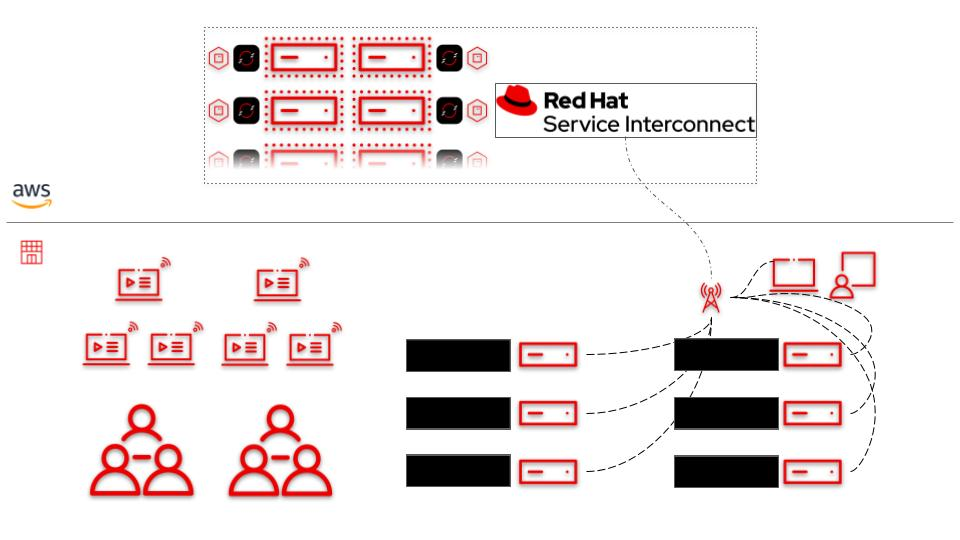

# Red Hat Device Edge Workshop - Using RHSI in Challenging Networks

This workshop focuses on leveraging Red Hat Service Interconnect to handle connectivity in challenging networks, such as ones that do not allow connections that originate from outside the network, or where NAT is involved.

RHSI will be used to establish a connection back to a central management plane, allowing for administration of an edge device and deployment of an application.

## Table of Contents

- [Red Hat Device Edge Workshop - Using RHSI in Challenging Networks](#red-hat-device-edge-workshop---using-rhsi-in-challenging-networks)
  - [Table of Contents](#table-of-contents)
  - [Presentations](#presentations)
  - [Time planning](#time-planning)
  - [Lab Diagram](#lab-diagram)
  - [Section 1 - Investigating the Lab Environment](#section-1---investigating-the-lab-environment)
  - [Section 2 - Connecting the Edge Device via RHSI](#section-2---creating-an-image-via-tha-image-builder-webui))
  - [Section 3 - Exposing the Remote Application](#section-2---creating-an-image-via-tha-image-builder-webui))
  - [Supplamental Resources](#supplamental-resources)
  - [Instructor Resources](#instructor-resources)

## Presentations

The exercises are self explanatory and guide the participants through the entire lab. All concepts are explained as they are introduced.

Also, have a look at our Ansible Best Practices Deck:
[Ansible Best Practices](../../decks/ansible_best_practices.pdf)

## Time planning

The time required to do the workshops strongly depends on multiple factors: the number of participants, how familiar those are with Linux in general and how much discussions are done in between.

Having said that, this workshop is built to take roughly 2 hours.

## Lab Diagram

## Section 1 - Investigating the Lab Environment

* [Exercise 1.1 - Preflight and Introduction](1.1-preflight)
* [Exercise 1.2 - Accessing the Student Pages](1.2-student-pages)
* [Exercise 1.3 - Edge Device Introduction](1.3-edge-device-intro)
* [Exercise 1.4 - Investigating the Example Workload](1.4-application-intro)
* [Exercise 1.5 - Ansible Controller Introduction](1.5-controller-intro)

# TODO BELOW
* [Exercise 1.3 - Investigating Source Control](1.3-source-control-intro)
* [Exercise 1.4 - Investigating Your Edge Device](1.4-device-intro)
* [Exercise 1.6 - Gathering Networking Information](1.6-network-info)
* [Exercise 1.7 - Investigating the Skupper Site](1.7-skupper-site)
* [Exercise 1.7 - Cloning Your Code Repository](1.7-coding-intro)

## Section 2 - Linking the Edge Device to the Management Plane

* [Exercise 2.1 - Reviewing the Workflow to Build Images](2.1-image-builder-workflow)
* [Exercise 2.2 - Building an Image via the WebUI](2.2-build-image-webui)

## Section 3 - Using Ansible Automation Platform to Manage the Edge Device

* [Exercise 3.1 - Reviewing Execution Environments](3.1-execution-environment-review)
* [Exercise 3.2 - Converting Our Image Definition to Code](3.2-image-definition-in-code)
* [Exercise 3.3 - Using the infra.osbuild Collection in a Playbook](3.3-using-collection-in-playbook)
* [Exercise 3.4 - Running Our Playbook through Controller](3.4-aap-image-build)

## Section 4 - Deploying an Applicatoin to the Edge Device

* [Exercise 4.1 - Creating Automation to Deploy a Containerized Application](5.1-containerized-app-automation)
* [Exercise 4.2 - Deploying the Application via Ansible Controller](5.2-deploying-the-app)

## Supplamental Resources
* [infra.osbuild](https://github.com/redhat-cop/infra.osbuild)
* [redhat_cop.controller_configuration](https://github.com/redhat-cop/controller_configuration)

## Instructor Resources
* [Instructor Page](instructor)