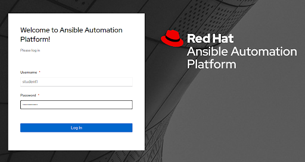
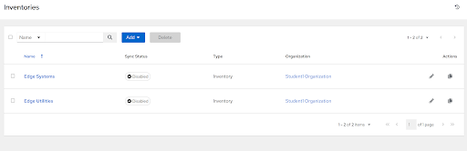

# Workshop Exercise - Investigating Ansible Controller

## Table of Contents

* [Objective](#objective)
* [Step 1 - Logging In](#step-1---logging-in)
* [Step 2 - Your Controller Organization](#step-2---your-controller-organization)
* [Step 3 - Credentials](#step-3---credentials)
* [Step 4 - Project](#step-4---project)
* [Step 5 - Inventories](#step-5---inventories)
* [Step 6 - Job Templates](#step-6---job-templates)
* [Step 7 - Execution Environments](#step-7---execution-environments)

## Objective

In this exercise, we are going to get logged in to Ansible Controller and validate the pre-configured resources.

This exercise will cover

* Logging in to Controller
* Validating pre-configured resources

### Step 1 - Logging In

> Note: If you are using an edge device on-site: your instructor will provide the IP address/DNS entry of the controller instance that will be running locally. Optionally, more information can be found on your student page.

> Note: If you are using Controller in AWS: the login information can be found on your student page.

After entering the URL in a browser, you will be greeted with the Ansible Controller login page. To log in, the username will be "student$(your_student_number)", such as `student1`, and the password is located on your student page.

 
### Step 2 - Your Controller Organization

An organization has been created for you in Ansible Controller, and you have been given administrative permissions over it. This means you can create, edit, modify, and run any of the resources assigned to your organization. It also means that when authenticating to the Ansible Controller API, you'll only see your resources and not those of another student.

Ensure you can view the details and access information of your organization under Organizations > $(Your_Organization) > Details/Access tabs:

### Step 3 - Credentials

Two credentials have been created for you:
1. Gitea Credentials - to be used to sync projects from our code repository. These match the credentials used to log in to the Gitea web interface, which can be found on your student page. More information on Gitea will be provided in the next exercise.
2. Device Credentials - a default set of credentials for connecting to edge devices. These default to `ansible:$(ssh_password)` found on your student page.

> Note: Be sure to save/remember the Device Credentials above, as they've been pre-baked into the edge images used throughout the lab for SSH access.

### Step 4 - Project

A project has been created that links to your source control repository (more info on this in the next excercise). It can be viewed under Projects > Device Edge Codebase:

### Step 5 - Inventories

Two inventories have been created for you:
1. Edge Utilities - systems used to support managing edge devices, and may also contain an edge hypervisor if one is provisioned for this workshop.
2. Edge Systems - where our edge systems will live.

> Note: The Edge Systems inventory is empty right now (Total Hosts = 0), because we haven't built anything yet. During the provisioning process, edge devices should appear in this inventory.

### Step 6 - Job Templates

A sample job template has been created that can be used to test connectivity to edge devices. Feel free to copy or modify this job template during the course of the lab.

### Step 7 - Execution Environments

An execution environment has been created that has all the necessary collections and python libraries built in. This EE is globally available so all students can leverage it.

> Note: The details of this execution environment can be found in the [code repository](https://github.com/redhat-manufacturing/device-edge-workshops/tree/main/execution-environment) for device edge workshops, and are built using [Ansible Builder](https://www.ansible.com/blog/introduction-to-ansible-builder).

---
**Navigation**

[Previous Excercise](../1.1-preflight) | [Next Exercise](../1.3-source-control-intro)

[Click here to return to the Workshop Homepage](../README.md)
