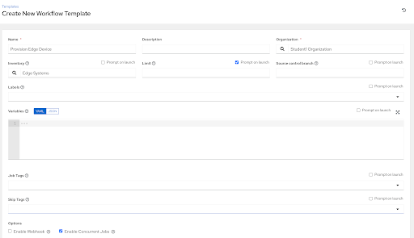
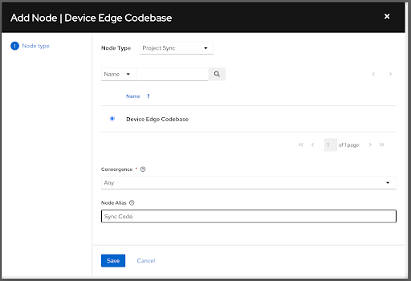
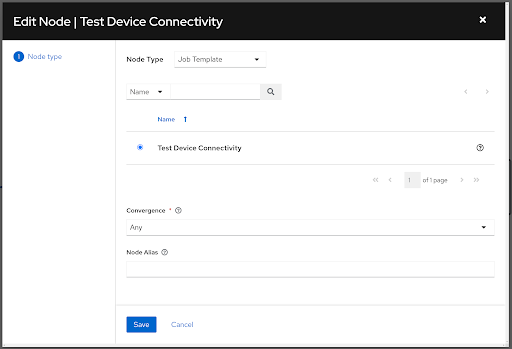
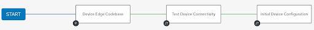

# Workshop Exercise 2.1 - Creating a Provisioning Workflow

## Table of Contents

* [Objective](#objective)
* [Step 1 - Creating a Workflow](#step-1---creating-a-workflow)
* [Step 2 - Adding Workflow Nodes](#step-2---adding-workflow-nodes)
* [Solutions](#solutions)

## Objective

In this exercise, we're going to build a workflow that will fully deploy our edge devices. We want to take several steps automatically when the devices boot and call home, so a workflow makes perfect sense.

The basic idea of a workflow is to link multiple Job Templates together. They may or may not share inventory, playbooks or even permissions. The links can be conditional:

* if job template A succeeds, job template B is automatically executed afterwards
* but in case of failure, job template C will be run.

And the workflows are not even limited to Job Templates, but can also include project or inventory updates.

This enables new applications for Ansible automation controller: different Job Templates can build upon each other.

### Step 1 - Creating a Workflow

Under **Resources**, select the **Templates** page. Once here, click **Add** > **Add workflow template**. Fill in the form with the following information:

<table>
  <tr>
    <th>Parameter</th>
    <th>Value</th>
  </tr>
  <tr>
    <td>Name</td>
    <td>Provision Edge Device</td>
  </tr>
  <tr>
    <td>Organization</td>
    <td>(Your_Student_Organization)</td>
  </tr>
  <tr>
    <td>Inventory</td>
    <td>Edge Systems</td>
  </tr>
  <tr>
    <td>Options</td>
    <td><ul><li>✓ Limit: Prompt on launch</li><li>✓ Enable Concurrent Jobs</li></ul></td>
  </tr>
</table>

Click **Save**

### Step 2 - Adding Workflow Nodes

After saving the workflow, you'll be presented with the workflow visualizer. Click the **Start** button to begin adding nodes.

We're going to add two nodes to our workflow to begin with:
1. Sync our code repo
2. Run the **Test Device Connectivity** job template

These nodes should be connected via an **On-Success** connection in the workflow.

Once you've added the two nodes to the workflow, click the **Save** button in the top right corner.

### Solutions

#### Step 1:

#### Step 2:

##### Sync Code Node:

##### Test Device Connectivity Node:

##### Finished Workflow:

---
**Navigation**

[Previous Exercise](../1.7-coding-intro) | [Next Exercise](../2.2-kickstart-template)

[Click here to return to the Workshop Homepage](../README.md)