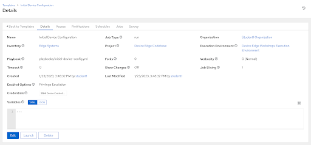

# Workshop Exercise 2.5 - Initial Device Configuration Automation

## Table of Contents

* [Objective](#objective)
* [Step 1 - Writing Our Initial Device Configuration Playbook](#step-1---writing-our-initial-device-configuration-playbook)
* [Step 2 - Creating a Job Template](#step-2---creating-a-job-template)
* [Solutions](#solutions)

## Objective

In this exercise, we're going to create a playbook that does some simple initial configuration of our edge devices. This will get comsumed later by a workflow so our devices are automatically configured correctly when they call home.

Our tasks in the playbook will be:
1. Set the hostname to what the device called home to Ansible Controller with
2. Set a resolver line in /etc/hosts


### Step 1 - Writing Our Initial Device Configuration Playbook

Return to your code repository and create a new playbook in the `playbooks` directory called `initial-device-config.yml`. Enter the following contents:
```yaml
---

- name: do initial device setup
  hosts: all
  tasks:
    - name: set the system hostname
      ansible.builtin.hostname:
        name: "{{ inventory_hostname }}"
    - name: insert line into /etc/hosts
      ansible.builtin.lineinfile:
        path: /etc/hosts
        line: '{{ ansible_default_ipv4.address }} {{ inventory_hostname }} {{ inventory_hostname }}.lcl'
        insertafter: EOF

```

Once complete, push your new playbook up into Gitea.

### Step 2 - Creating a Job Template

> Note:
>
> Be sure to sync your project in Controller before attempting to create this job template.

In the Controller WebUI. under **Resources** > **Templates**, select **Add** > **Add job template** and enter the following information:

<table>
  <tr>
    <th>Parameter</th>
    <th>Value</th>
  </tr>
  <tr>
    <td>Name</td>
    <td>Initial Device Configuration</td>
  </tr>
  <tr>
    <td>Inventory</td>
    <td>Edge Systems</td>
  </tr>
  <tr>
    <td>Project</td>
    <td>Device Edge Codebase</td>
  </tr>
  <tr>
    <td>Execution Environment</td>
    <td>Device Edge Workshops Execution Environment</td>
  </tr>
  <tr>
    <td>Playbook</td>
    <td>playbooks/initial-device-config.yml</td>
  </tr>
  <tr>
    <td>Credentials</td>
    <td><ul><li>✓ Device Credentials</li></ul></td>
  </tr>
  <tr>
    <td>Limit</td>
    <td><li>✓ Prompt on launch</li></td>
  </tr>
   <tr>
    <td>Options</td>
    <td><ul><li>✓ Privilege Escalation</li></ul></td>
  </tr> 
</table>

Remember to click **Save**.

We're not going to run this job now, instead we'll leverage it in the next exercise.

### Solutions



---
**Navigation**

[Previous Exercise](../2.4-build-iso) | [Next Exercise](../2.6-provisioning-workflow)

[Click here to return to the Workshop Homepage](../README.md)