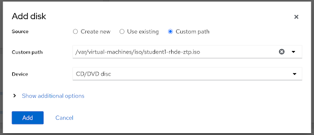
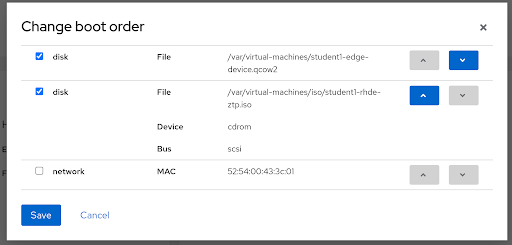
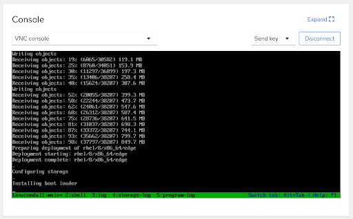

# Workshop Exercise 3.2 - Booting an Edge Virtual Machine

## Table of Contents

* [Objective](#objective)
* [Step 1 - Copy ISO to VM Storage](#step-1---grabbing-the-rhel-boot-iso)
* [Step 2 - Attach ISO to Virtual Machine](#step-2---creating-a-job-template-for-our-playbook)
* [Step 3 - Provisioning our Edge Virtual Machine](#step-3---creating-our-customized-iso)
* [Solutions](#solutions)

## Objective

In this exercise, we're going to attach our customized ISO to our edge virtual machine and provision the system.

Virtual machines have already been created on the edge hypervisor and are awaiting our customized ISO so they can be provisioned.

For a reminder on how to access the Cockpit WebUI, review [exercise 1.4](../1.4-device-intro). For information on connecting to the hypervisor node via SSH, refer to your student page.

### Step 1 - Copying Our Customized ISO to the VM Storage

First, we'll copy our customized ISO to a location where we can attach it to a virtual machine. A directory has been created for us at `/var/virtual-machines/iso`.

From within the `generate-iso` directory, copy your ISO: `sudo cp rhde-ztp.iso /var/virtual-machines/iso/student$(your-student-number)-rhde-ztp.iso`

For example: `sudo cp rhde-ztp.iso /var/virtual-machines/iso/student1-rhde-ztp.iso`

### Step 2 - Attaching the ISO to your Virtual Machine

On the **Virtual machines** tab within Cockpit, select your virtual machine. The naming convention for virtual machines is `student$(your-student-number)-edge-device`, so for example: if you are student 1, your virtual machine is `student1-edge-device`.

Under the **Disks** section, select the **Add disk** button. In the **Add disk** path, enter the following information:
<table>
  <tr>
    <th>Parameter</th>
    <th>Value</th>
  </tr>
  <tr>
    <td>Source</td>
    <td>Custom path</td>
  </tr>
  <tr>
    <td>Custom path</td>
    <td>/var/virtual-machines/iso/student$(your-student-number)-rhde-ztp.iso</td>
  </tr>
  <tr>
    <td>Device</td>
    <td>CD/DVD Disc</td>
  </tr>
</table>

Click **Add**

### Step 3 - Adjusting the Boot Options

Back on the overview page for your virtual machine, in the **Overview** section, click **edit** next to the word **disk** in-line with **Boot order**.

In the **Change boot order** window, ensure that both the first disk (the virtual hard drive) and the cdrom devices are checked, with the virtual disk being the first option, and the cdrom being the second.

Click **Save**

### Step 3 - Power On the Virtual Machine

At this point, we should be able to power on the virtual machine and observe it completely provision itself without our intervention.

Click the **Run** button at the top of the page and observe the process.

### Solutions

---
**Navigation**

[Previous Exercise](../2.4-kickstart-playbook) | [Next Exercise](../3.1-boot-edge-device)

[Click here to return to the Workshop Homepage](../README.md)