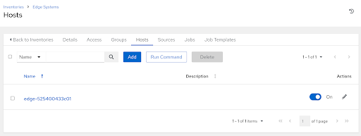
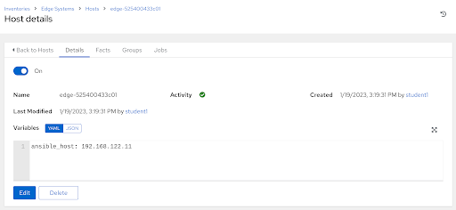
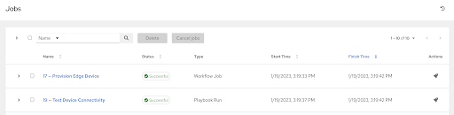
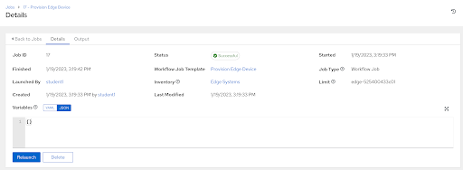

# Workshop Exercise 3.3 - Observing Zero Touch Provisioning

## Table of Contents

* [Objective](#objective)
* [Step 1 - Investigatng Our New Host Entry](#step-1---investigating-our-new-host-entry)
* [Step 2 - Investigating The Workflow Run](#step-2---investigating-the-workflow-run)

## Objective

In this exercise, we'll ensure our devices correctly provisioned without our intervention.

Assuming everything worked correctly, two things should now be present in Ansible Controller:
- A new host in our `Edge Devices` inventory with connection information
- The jobs in our provisioning workflow run

### Step 1 - Investigating Our New Host Entry

Within Ansible Controller, navigate to **Resources** > **Inventories**, and then select our **Edge Systems** inventory. Under the **Hosts** tab, a new entry should have appeared. The name for the device is generated from the MAC address, so the name will be similar to `edge-525400433c01`.



Clicking on the host entry brings up more information about the host. An important piece to note is on the **Details** tab, under the **Variables** section:



Here, we can see that the `ansible_host` variable has been defined with the device's current IP address, which Ansible determined and sent as part of the call home.

For quick review, this part of the playbook contained within our kickstart file handled the population of host details:

```
    - name: create host in inventory {{ controller_inventory }}
      ansible.builtin.uri:
        url: "{{ controller_url }}/inventories/{{ controller_inventory_id }}/hosts/"
        method: POST
        body_format: json
        body:
          name: "edge-{{ ansible_default_ipv4.macaddress | replace(':','') }}"
          variables:
            'ansible_host: {{ ansible_default_ipv4.address }}'
```


### Step 2 - Investigating The Workflow Run

Under the **Jobs** tab, three new jobs should have run: a workflow job, a source control update, and a playbook run.



As part of the Ansible playbook embedded in the kickstart, our previously created workflow was kicked off with a limit of just the device calling home. This can be confirmed by clicking on the Workflow Job and checking out the details tab:



Now that our device is up and has called home, it can be managed centrally via Ansible Controller, which is what we'll be leveraging to deploy our workload to the device.

---
**Navigation**

[Previous Exercise](../3.2-boot-edge-vm) | [Next Exercise](../3.4-rhde-os-intro)

[Click here to return to the Workshop Homepage](../README.md)