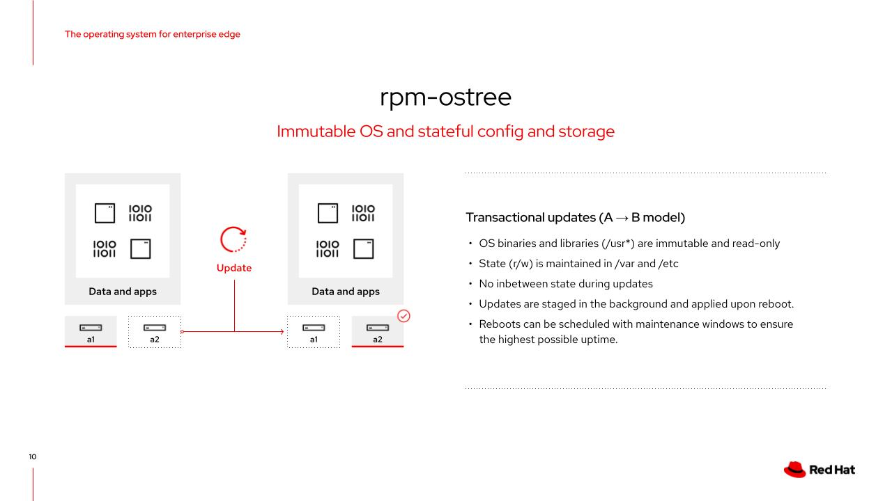

# Workshop Exercise 3.4 - Red Hat Device Edge OS Investigation

## Table of Contents

* [Objective](#objective)
* [Step 1 - Reviewing the Immutable Nature of RHDE](#step-1---reviewing-the-immutable-nature-of-rhde)
* [Step 2 - Investigating The Workflow Run](#step-2---investigating-the-workflow-run)
* [Solutions](#solutions)

## Objective

In this exercise, we'll review the details of RHDE's operating system and, optionally, log in ourselves to view information about the system.

### Step 1 - Reviewing the Immutable Nature of RHDE



Red Hat Device Edge is a partially immutable operating system built on top of rpm-ostree. It gains the benefits of being immutable, such as: no in-between state, read-only sections of the filesystem, while allowing for other functionality to more closely resemble traditional Red Hat Enterprise Linux environments, such as leaving `/var` and `/etc` in a writable and able to save state.

Because of this, the operating system is more suited to edge deployments, and can run many different types of workloads, such as virtual machines, containers, k8s applications, and even bare metal applications, assuming they live in a directory that maintains state.

### Step 2 - Investigating The Workflow Run

The exercise is optional, but if you wish, you can SSH into the edge device like any other system.

> **Note**
>
> For virtualized edge devices, connect to the hypervisor over SSH. Then, attempt to access the edge devices using the IP address discovered in the Ansible Controller inventory variable. Their networking doesn't extend beyond the hypervisor.

A few interesting things to investigate are the greenboot status, rpm-ostree status, and filesystem layout.

Greenboot will display information on login: `Boot Status is GREEN - Health Check SUCCESS`

The `rpm-ostree status` command will print out information about the current running deployment:
```
[ansible@student1-edge-device ~]$ rpm-ostree status
State: idle
Deployments:
* rhel:rhel/8/x86_64/edge
                  Version: 1.0.0 (2023-01-19T18:51:54Z)
```

And finally, looking at the root of the filesystem will show how some common mount points are linked:
```
[ansible@student1-edge-device ~]$ ls -lsah /
total 28K
4.0K drwxr-xr-x.  12 root root 4.0K Jan 19 20:56 .
4.0K drwxr-xr-x.  12 root root 4.0K Jan 19 20:56 ..
   0 lrwxrwxrwx.   2 root root    7 Jan 19 20:56 bin -> usr/bin
   0 drwxr-xr-x.   5 root root   75 Jan 19 20:57 boot
   0 drwxr-xr-x.  20 root root 3.1K Jan 19 20:57 dev
 12K drwxr-xr-x.  80 root root 8.0K Jan 19 20:57 etc
   0 lrwxrwxrwx.   2 root root    8 Jan 19 20:56 home -> var/home
   0 lrwxrwxrwx.   3 root root    7 Jan 19 20:56 lib -> usr/lib
   0 lrwxrwxrwx.   3 root root    9 Jan 19 20:56 lib64 -> usr/lib64
   0 lrwxrwxrwx.   2 root root    9 Jan 19 20:56 media -> run/media
   0 lrwxrwxrwx.   2 root root    7 Jan 19 20:56 mnt -> var/mnt
   0 lrwxrwxrwx.   2 root root    7 Jan 19 20:56 opt -> var/opt
   0 lrwxrwxrwx.   2 root root   14 Jan 19 20:56 ostree -> sysroot/ostree
   0 dr-xr-xr-x. 164 root root    0 Jan 19 20:57 proc
   0 lrwxrwxrwx.   2 root root   12 Jan 19 20:56 root -> var/roothome
   0 drwxr-xr-x.  28 root root  740 Jan 19 20:57 run
   0 lrwxrwxrwx.   2 root root    8 Jan 19 20:56 sbin -> usr/sbin
   0 lrwxrwxrwx.   2 root root    7 Jan 19 20:56 srv -> var/srv
   0 dr-xr-xr-x.  13 root root    0 Jan 19 20:57 sys
   0 drwxr-xr-x.  12 root root  123 Jan 19 20:56 sysroot
4.0K drwxrwxrwt.   9 root root 4.0K Jan 19 22:19 tmp
   0 drwxr-xr-x.  12 root root  155 Jan  1  1970 usr
4.0K drwxr-xr-x.  24 root root 4.0K Jan 19 20:57 var
```

---
**Navigation**

[Previous Exercise](../3.3-ztp-intro) | [Next Exercise](../4.1-bare-metal-image)

[Click here to return to the Workshop Homepage](../README.md)