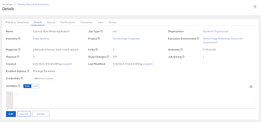

# Workshop Exercise 5.5 - Cleaning Up after the Containerized Application

## Table of Contents

* [Objective](#objective)
* [Step 1 - Creating a Playbook](#step-1---creating-a-playbook)
* [Step 2 - Creating a Job Tempate](#step-2---creating-a-job-template)
* [Step 3 - Running the Job Template](#step-3---running-the-job-template)
* [Solutions](#solutions)

## Objective

To prepare for the next set of exercises, we're going to teardown and cleanup our application deployment. This will feel much simpler than attempting to cleanup the bare metal deployment.

### Step 1 - Creating a Playbook

Return to your code repo and create a playbook in the `playbooks` directory called `cleanup-containerized-app.yml` with the following contents:
```yaml
---

- name: cleanup containerized application deployment
  hosts: all
  tasks:
    - name: teardown kube play
      ansible.builtin.shell:
        cmd: podman play kube --down "/home/{{ ansible_user }}/process-control.yaml"
    - name: remove kube yaml file
      ansible.builtin.file:
        path: "/home/{{ ansible_user }}/process-control.yaml"
        state: absent
    - name: remove images from the system
      containers.podman.podman_image:
        name: "{{ image }}"
        state: absent
      loop:
        - quay.io/device-edge-workshops/process-control-mqtt:1.0.0
        - quay.io/device-edge-workshops/process-control-simulate:1.0.0
        - quay.io/device-edge-workshops/process-control-control:1.0.0
        - quay.io/device-edge-workshops/process-control-ui:1.0.0
      loop_control:
        loop_var: image
    - name: close firewall port
      ansible.posix.firewalld:
        port: 1881/tcp
        zone: public
        permanent: true
        state: disabled
        immediate: true
      become: true

```

This playbook not only stops and removes our application deployment, but also cleans up the images from the local system.

### Step 2 - Creating a Job Template

> Note:
>
> Be sure to sync your project in Controller before attempting to create this job template.

In the Controller WebUI. under **Resources** > **Templates**, select **Add** > **Add job template** and enter the following information:

<table>
  <tr>
    <th>Parameter</th>
    <th>Value</th>
  </tr>
  <tr>
    <td>Name</td>
    <td>Cleanup Containerized Application</td>
  </tr>
  <tr>
    <td>Inventory</td>
    <td>Edge Systems</td>
  </tr>
  <tr>
    <td>Project</td>
    <td>Device Edge Codebase</td>
  </tr>
  <tr>
    <td>Execution Environment</td>
    <td>Device Edge Workshops Execution Environment</td>
  </tr>
  <tr>
    <td>Playbook</td>
    <td>playbooks/cleanup-containerized-app.yml</td>
  </tr>
  <tr>
    <td>Credentials</td>
    <td><li>✓ Device Credentials</li></td>
  </tr>
  <tr>
    <td>Limit</td>
    <td><li>✓ Prompt on launch</li></td>
  </tr>
</table>

Remember to click **Save**.

### Step 3 - Running the Job Template

Now that the job template has been created, click the **Launch** button if you are still within the _Cleanup Containerized Application_ Job Template. Otherwise, click on the rocket ship on the Templates page to launch the job template. Enter your device name when prompted on the limits page. Monitor the output for any errors or issues. However, hopefully the job executes successfully.

As a reminder, the output of jobs can be reviewed on the **Jobs** tab.

Once the playbook completes, you should no longer be able to access the application as it has been uninstalled.

### Solutions

Our systems are now back to a known good, clean state where we can start our deployment again.



---
**Navigation**

[Previous Exercise](../5.4-deploy-containerized-app) | [Next Exercise](../6.1-add-k8s)

[Click here to return to the Workshop Homepage](../README.md)